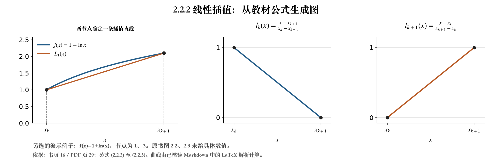

# 《数值分析》第 5 版：Markdown + LaTeX 教材

原书：李庆扬、王能超、易大义《数值分析》第 5 版。本地转录覆盖全部 **322 个原扫描页**，以 **275 个章节条目**组织正文，并索引 **542 个编号公式**；保留 **178 条原书疑误、条件或记号校注**。

每个原页由一位 agent 转录核对，再由另一位 agent 独立回看原图复核。核验记录标明 `human_review: false`，不代表人工审校，也不构成数学绝对无误的保证。原书疑误按原印保留，agent 的解释和推导单列为校注；计算或绘图前应同时读取这些校注。交付与验收状态见 [STATUS.json](STATUS.json) 和下方质量记录。

## 阅读入口

| 用途 | 文件 |
|---|---|
| 全书连续阅读与检索 | [textbook.md](textbook.md) |
| 全书 LaTeX 编译入口 | [textbook.tex](textbook.tex) |
| 排版阅读版 | [textbook.pdf](textbook.pdf) |
| 按章节编号或主题定位 | [章节目录](index/INDEX.md)、[结构化章节索引](index/sections.json) |
| 按公式编号定位 | [公式索引](index/formulas.json) |
| 逐节读取与复用 | [verified/sections/](verified/sections/)：275 份 Markdown 及对应的同编号 LaTeX 文件 |
| 按原扫描页回查 | [逐页转录](verified/pages/)、[原页图像](source-images/)、[原文件清单与哈希](source-manifest.json) |

例如，2.2.2 可直接读取 [Markdown](verified/sections/2.2.2.md) 和 [LaTeX](verified/sections/2.2.2.tex)。章节文件中的来源页码、原图链接与相邻校注用于回查；书页码按原书印字，PDF 页码从扫描文件第一页起计。章节编号与同形的公式编号属于不同索引，检索公式时应明确写“公式”。

## 按章节交给 agent 使用

先在索引中确认编号、标题与来源页，再读取对应章节正文和校注。agent 可以据此处理任意已收录章节的解释、计算或作图请求；原书未提供的函数、节点、参数与数据，应明确标为另选的演示。

**本版本 2.2.1 是“插值多项式的存在唯一性”；2.2.2 是“线性插值与抛物插值”。** 编号与主题冲突时应说明差异，不能改写教材编号。

`tools/lookup.py` 提供全书章节与公式定位。`tools/plot_section.py` 当前仅提供 **2.2.2 的线性插值验收入口**；它不提供其他章节或抛物插值的通用自动绘图功能。其他绘图任务需由 agent 阅读相应章节后另行实现并检查。

在 `book/` 目录执行以下命令，可复现“编号与主题冲突”的定位与线性插值示例：

```sh
.venv-ocr/bin/python tools/lookup.py "根据2.2.1的线性插值画出图"
.venv-ocr/bin/python tools/plot_section.py --request "根据2.2.1的线性插值画出图"
```

程序会明确提示编号冲突，再定位实际的 2.2.2。绘图脚本从当前章节 Markdown 解析 LaTeX 插值公式，并核验插值节点；运行时要求公式核验回执通过且来源哈希匹配。



原书图 2.2、2.3 未给具体函数和数值节点。上图的 $f(x)=1+\ln x$、节点 $1$ 与 $3$ 均由 agent 选取。可读取 [SVG](figures/generated/section-2.2.2-linear.svg)、[绘图记录](quality/plot-acceptance.json)、[插值公式核验](quality/interpolation-symbolic-checks.json) 和 [例题数值核验](quality/remainder-example-checks.json)。

## 核验与来源记录

- [逐页核验回执](quality/pages-review.json)：原图、正文哈希与独立交叉复核记录。
- [章节定位核验](quality/headings-audit.json)、[章节上下文检查](quality/section-context-checks.json)：目录定位和相邻校注的覆盖。
- [原书疑误与条件校注](quality/ERRATA.md)、[结构化校注记录](quality/source-errata.json)：保留原印与 agent 校注的区别。
- [分批 LaTeX 编译与视觉检查](quality/latex-lanes/)、[全书 LaTeX 导出记录](quality/book-latex.json)：编译、数学内容一致性和渲染证据分别记录。
- [最终交付完整性](quality/delivery-checks.json)、[逐节 LaTeX 一致性](quality/sections-latex.json)、[全书数学序列比对](quality/book-math-sequence.json)：核对当前文件与复核回执的哈希、数学片段和校注覆盖。
- [全书 PDF 视觉验收](quality/book-visual.json)、[275 份独立 TeX 编译](quality/sections-compile.json)：全书各页均有对应的视觉证据；全部独立文件通过编译且无缺字。

编译成功、数值检查、逐页视觉核验是不同证据。`ocr/` 保留识别候选，`staging/` 保留分工转录与复核过程；阅读、计算和引用应从上述全书或章节入口开始，必要时回到原扫描核对。

早期六节先导版及其合并 LaTeX 已迁入 [.work/legacy-pilot/](.work/legacy-pilot/README.md)，按迁移时字节保留供追溯。它们不再作为正文入口。后续维护规则见 [AGENTS.md](AGENTS.md)。

## 编译与运行环境

在本目录执行 `xelatex textbook.tex` 两遍，可编译全书；独立小节则在 `verified/sections/` 内同样编译两遍，例如 `xelatex 2.2.2.tex`。图片引用使用相对路径，移动时保留整个书库目录。

本次工具和字体环境见 [build-environment.json](quality/build-environment.json)。读取 Markdown 无需 Python；绘图与检查脚本的依赖记录在 [requirements-reader.txt](requirements-reader.txt)，本机已置于独立 `.venv-ocr` 环境。重新导出全书和小节可运行 `.venv-ocr/bin/python tools/build_verified_latex.py --compile`；重新导出后仍需核对生成的质量回执。
