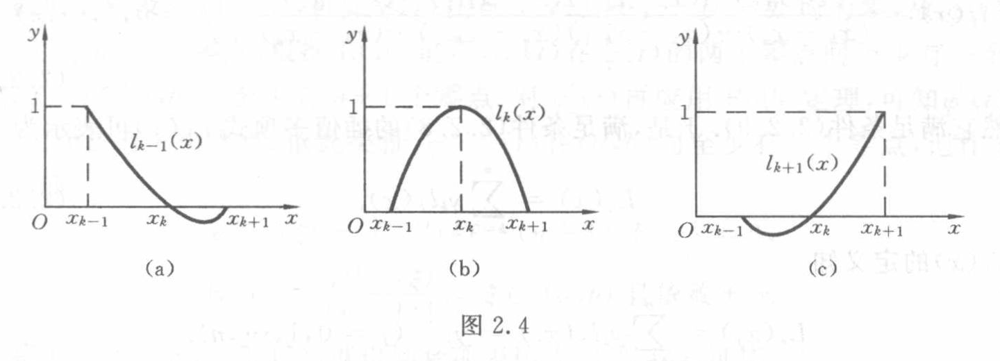

[原页：书页 17／PDF 30](../../../source-images/pdf-030.jpeg)

<!-- source-page: 30 -->

> 页首承接 PDF 29 的二次插值条件；末式展开续 PDF 31。

$$
L_2(x_j)=y_j\qquad(j=k-1,k,k+1).
$$

我们知道，$y=L_2(x)$ 在几何上就是通过三点 $(x_{k-1},y_{k-1})$、$(x_k,y_k)$、$(x_{k+1},y_{k+1})$ 的抛物线。为了求出 $L_2(x)$ 的表达式，可采用基函数方法，此时基函数 $l_{k-1}(x),l_k(x)$ 及 $l_{k+1}(x)$ 是二次函数，且在节点上满足条件

$$
\begin{cases}
l_{k-1}(x_{k-1})=1,\quad l_{k-1}(x_j)=0\quad(j=k,k+1),\\
l_k(x_k)=1,\quad l_k(x_j)=0\quad(j=k-1,k+1),\\
l_{k+1}(x_{k+1})=1,\quad l_{k+1}(x_j)=0\quad(j=k-1,k).
\end{cases}
\tag{2.2.6}
$$

满足条件式（2.2.6）的插值基函数是很容易求出的，例如求 $l_{k-1}(x)$，因它有两个零点 $x_k$ 及 $x_{k+1}$，故可表示为

$$
l_{k-1}(x)=A(x-x_k)(x-x_{k+1}),
$$

其中 $A$ 为待定系数，可由条件 $l_{k-1}(x_{k-1})=1$ 定出，即

$$
A=\frac{1}{(x_{k-1}-x_k)(x_{k-1}-x_{k+1})},
$$

故

$$
l_{k-1}(x)=
\frac{(x-x_k)(x-x_{k+1})}
{(x_{k-1}-x_k)(x_{k-1}-x_{k+1})}.
$$

同理，

$$
l_k(x)=
\frac{(x-x_{k-1})(x-x_{k+1})}
{(x_k-x_{k-1})(x_k-x_{k+1})},
\qquad
l_{k+1}(x)=
\frac{(x-x_{k-1})(x-x_k)}
{(x_{k+1}-x_{k-1})(x_{k+1}-x_k)}.
$$

函数 $l_{k-1}(x),l_k(x),l_{k+1}(x)$ 称为**二次插值基函数**或**抛物插值基函数**，它们在区间 $[x_{k-1},x_{k+1}]$ 上的图形分别如图 2.4(a)、(b)、(c) 所示。

图 2.4（原图）：(a) $l_{k-1}(x)$，(b) $l_k(x)$，(c) $l_{k+1}(x)$，分别在对应节点取 $1$、其他两个节点取 $0$；左右基函数在部分区间为负。三图全部文字标签：$y$、$x$、$O$、$1$、$x_{k-1}$、$x_k$、$x_{k+1}$、$l_{k-1}(x)$、$l_k(x)$、$l_{k+1}(x)$、(a)、(b)、(c)。

利用二次插值基函数 $l_{k-1}(x),l_k(x),l_{k+1}(x)$，立即可得到二次插值多项式

$$
L_2(x)=y_{k-1}l_{k-1}(x)+y_kl_k(x)+y_{k+1}l_{k+1}(x),
\tag{2.2.7}
$$

显然，它满足条件

$$
L_2(x_j)=y_j\qquad(j=k-1,k,k+1).
$$

将上面求得的 $l_{k-1}(x),l_k(x),l_{k+1}(x)$ 代入式（2.2.7），得
