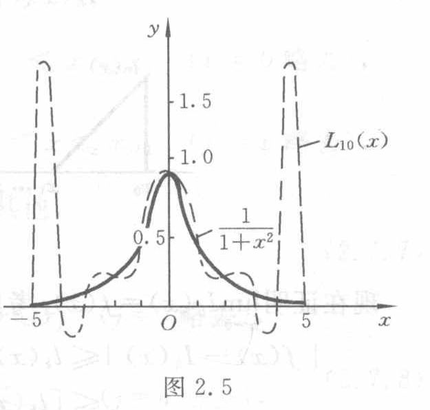

[查看原页](../../../source-images/pdf-046.jpeg)

<!-- source-page: 46 -->

> 本页接上页 2.7.1 正文。

$$L_n(x)=\sum_{j=0}^n\frac{1}{1+x_j^2}\frac{\omega_{n+1}(x)}{(x-x_j)\omega'_{n+1}(x_j)}$$

当 $n\to\infty$ 时只在 $|x|\leqslant3.63$ 内收敛，而在这区间外是发散的。

下面取 $n=10$，根据计算画出 $y=L_{10}(x)$ 及 $y=1/(1+x^2)$ 在 $[-5,5]$ 上的图形，如图 2.5 所示。

从图 2.5 可看到，在 $x=\pm5$ 附近 $L_{10}(x)$ 与 $f(x)=1/(1+x^2)$ 偏离很远，例如，$L_{10}(4.8)=1.804\,38,f(4.8)=0.041\,60$。这说明用高次插值多项式 $L_n(x)$ 近似 $f(x)$ 效果并不好，因而通常不用高次插值，而用低次插值。从该例看到，如果把 $y=1/(1+x^2)$ 在节点 $x=0,\pm1,\pm2,\pm3,\pm4,\pm5$ 处用折线连起来，显然比 $L_{10}(x)$ 逼近 $f(x)$ 好得多。这正是下面要讨论的分段低次插值的出发点。

> 图 2.5（原图）：横轴 $x$，纵轴 $y$，原点 $O$；横轴标有 $-5,5$，纵轴标有 $0.5,1.0,1.5$。两条曲线标签为 $L_{10}(x)$ 与 $\frac{1}{1+x^2}$。虚线插值曲线在两端附近出现明显振荡。

### 2.7.2 分段线性插值

所谓分段线性插值，就是将插值点用折线段连接起来逼近 $f(x)$。设已知节点 $a=x_0<x_1<\cdots<x_n=b$ 上的函数值 $f_0,f_1,\cdots,f_n$，记 $h_k=x_{k+1}-x_k,h=\max_k h_k$。称 $I_h(x)$ 为分段线性插值函数，如果满足：

（1）记 $I_h(x)\in C[a,b]$；

（2）$I_h(x_k)=f_k$（$k=0,1,\cdots,n$）；

（3）$I_h(x)$ 在每个区间 $[x_k,x_{k+1}]$ 上是线性函数，

则由定义可知，$I_h(x)$ 在每个小区间 $[x_k,x_{k+1}]$ 上可表示为

$$I_h(x)=\frac{x-x_{k+1}}{x_k-x_{k+1}}f_k+\frac{x-x_k}{x_{k+1}-x_k}f_{k+1}\quad(x_k\leqslant x\leqslant x_{k+1}).\tag{2.7.1}$$

若用插值基函数表示，则 $I_h(x)$ 在整个区间 $[a,b]$ 上可表示为

$$I_h(x)=\sum_{j=0}^n f_jl_j(x),\tag{2.7.2}$$

其中基函数 $l_j(x)$ 满足条件 $l_j(x_k)=\delta_{jk}$（$j,k=0,1,\cdots,n$），其形式是

$$l_j(x)=\begin{cases}
\displaystyle\frac{x-x_{j-1}}{x_j-x_{j-1}},&x_{j-1}\leqslant x\leqslant x_j\quad(j=0\text{ 略去}),\\[6pt]
\displaystyle\frac{x_j-x_{j+1}}{x-x_{j+1}},&x_j\leqslant x\leqslant x_{j+1}\quad(j=n\text{ 略去}),\\[6pt]
0,&x\in[a,b],\quad x\notin[x_{j-1},x_{j+1}].
\end{cases}\tag{2.7.3}$$

分段线性插值基函数 $l_j(x)$ 只在 $x_j$ 附近不为零，在其他地方均为零，这种性质称为**局部非零性质**，如图 2.6 所示。当 $x\in[x_k,x_{k+1}]$ 时，

> 续页：基函数恒等式和图 2.6 见下一页。

> **校注（agent 补充；原书疑误）**：式（2.7.3）第二分支原扫描确为 $\frac{x_j-x_{j+1}}{x-x_{j+1}}$，此处已原样保留，参见[原式放大裁图](../assets/pdf-046-eq-2-7-3-detail.png)。该式在 $x=x_{j+1}$ 处分母为零，与本页分段线性、连续性及 $l_j(x_{j+1})=0$ 的条件矛盾。按这些条件，第二分支应为 $\frac{x-x_{j+1}}{x_j-x_{j+1}}$。这属于原书疑误，区别于 OCR 另将分母误识为 $x_j-x_{j+1}$。
