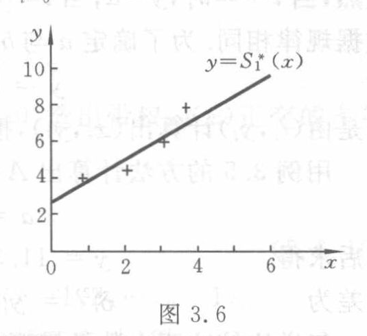

[查看原页](../../../source-images/pdf-080.jpeg)

<!-- source-page: 80 -->

<!-- 续 PDF 79，3.6.1 一般的最小二乘逼近。 -->

由于 $\varphi_0,\varphi_1,\cdots,\varphi_n$ 线性无关，故 $|G|\ne0$，方程组 (3.6.6) 存在唯一的解

$$
a_k=a_k^*\quad(k=0,1,\cdots,n),
$$

从而得到函数 $f(x)$ 的最小二乘解为

$$
S^*(x)=a_0^*\varphi_0(x)+a_1^*\varphi_1(x)+\cdots+a_n^*\varphi_n(x).
$$

可以证明，这样得到的 $S^*(x)$ 对于任何形如式 (3.6.2) 的 $S(x)$，都有

$$
\sum_{i=0}^m\omega(x_i)[S^*(x_i)-f(x_i)]^2\leqslant\sum_{i=0}^m\omega(x_i)^*[S(x_i)-f(x_i)]^2,
$$

故 $S^*(x)$ 确是所求最小二乘解。它的证明与式 (3.3.14) 相似，读者可自己完成。

**例 3.5** 已知一组实验数据如表 3.3 所示，求它的拟合曲线。

**表 3.3**

| $x_i$ | 1 | 2 | 3 | 4 | 5 |
|---|---:|---:|---:|---:|---:|
| $f_i$ | 4 | 4.5 | 6 | 8 | 8.5 |
| $\omega_i$ | 2 | 1 | 3 | 1 | 1 |

**解** 在坐标纸上标出所给数据，如图 3.6 所示。从图 3.6 可看到，各点分布在一条直线附近，故可选择线性函数作拟合曲线。令 $S_1(x)=a_0+a_1x$，这里 $m=4,n=1,\varphi_0(x)=1,\varphi_1(x)=x$，故

$$
(\varphi_0,\varphi_0)=\sum_{i=0}^4\omega_i=8,\quad(\varphi_0,\varphi_1)=(\varphi_1,\varphi_0)=\sum_{i=0}^4\omega_ix_i=22,
$$

$$
(\varphi_1,\varphi_1)=\sum_{i=0}^4\omega_ix_i^2=74,\quad(\varphi_0,f)=\sum_{i=0}^4\omega_if_i=47,
$$

$$
(\varphi_1,f)=\sum_{i=0}^4\omega_ix_if_i=145.5.
$$

由式 (3.6.6) 得方程组

$$
\begin{cases}
8a_0+22a_1=47,\\
22a_0+74a_1=145.5,
\end{cases}
$$

解得

$$
a_0=2.77,\quad a_1=1.13.
$$

于是所求拟合曲线为

$$
S_1^*(x)=2.77+1.13x.
$$

**图 3.6**（原图裁切）。图中以十字标记数据点，并画出拟合直线 $y=S_1^*(x)$。图中文字与符号：$x,y,0$；横轴标值 $2,4,6$，纵轴标值 $2,4,6,8,10$；曲线标签 $y=S_1^*(x)$。

**例 3.6** 在某化学反应过程中，根据实验所得生成物的质量分数与时间的关系如表 3.4 所示，求质量分数 $y$ 与时间 $t$ 的拟合曲线 $y=F(t)$。

**表 3.4**

| $t/\mathrm{min}$ | 1 | 2 | 3 | 4 | 5 | 6 | 7 | 8 | 9 | 10 | 11 | 12 | 13 | 14 | 15 | 16 |
|---|---:|---:|---:|---:|---:|---:|---:|---:|---:|---:|---:|---:|---:|---:|---:|---:|
| $y/\times10^{-3}$ | 4.00 | 6.40 | 8.00 | 8.80 | 9.22 | 9.50 | 9.70 | 9.86 | 10.00 | 10.20 | 10.32 | 10.42 | 10.50 | 10.55 | 10.58 | 10.60 |

**解** 将所给数据标在坐标纸上，如图 3.7 所示。可以看到，质量分数开始时增加较快，后来逐渐减慢，到一定时间就基本稳定在一个水平上，即当 $t\to\infty$ 时，$y$ 趋于某

<!-- 例 3.6 续 PDF 81。 -->

> 校注（agent 补充）：最小二乘不等式右端的 $\omega(x_i)$ 后原书印有上标星号，原式已保留。该星号在权函数定义中没有定义，疑为多余印字；与式 (3.6.3) 的一致写法应为 $\omega(x_i)[S(x_i)-f(x_i)]^2$。见 [原式放大裁切](../assets/p080-minimum-inequality.png)。
