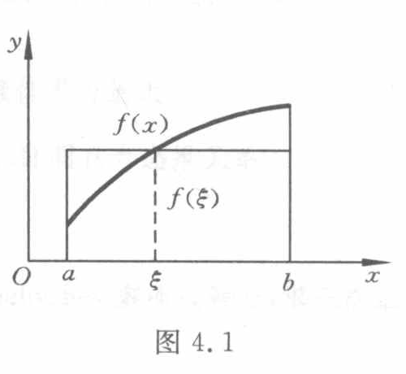

[原页图像](../../../source-images/pdf-093.jpeg)

<!-- source-page: 93 -->

# 第 4 章 数值积分与数值微分

## 4.1 引言

### 4.1.1 数值求积的基本思想

有很多实际问题常常需要计算积分才能求解。有些数值方法，如微分方程和积分方程的求解，也都和积分计算有联系。

依据人们所熟知的微积分基本定理，对于积分 $I=\int_a^b f(x)\,\mathrm{d}x$，只要找到被积函数 $f(x)$ 的原函数 $F(x)$，便有下列 Newton-Leibniz 公式：

$$
\int_a^b f(x)\,\mathrm{d}x=F(b)-F(a).
$$

但实际使用这种求积方法往往有困难，因为大量的被积函数，诸如 $\dfrac{\sin x}{x}$，$\sin x^2$ 等等，找不到用初等函数表示的原函数；另外，当 $f(x)$ 是由测量或数值计算给出的一张数据表时，Newton-Leibniz 公式也不能直接运用。因此有必要研究积分的数值计算问题。

积分中值定理告诉我们，在积分区间 $(a,b)$ 内存在一点 $\xi$，有下式成立：

$$
\int_a^b f(x)\,\mathrm{d}x=(b-a)f(\xi).
$$

就是说，底为 $b-a$ 而高为 $f(\xi)$ 的矩形面积恰等于所求曲边梯形的面积 $I$（见图 4.1）。问题在于点 $\xi$ 的具体位置一般是不知道的，因而难以准确算出 $f(\xi)$ 的值。我们将 $f(\xi)$ 称为区间 $[a,b]$ 上的平均高度。这样，只要对平均高度 $f(\xi)$ 提供一种算法，相应地便获得一种数值求积方法。

图 4.1（原图）。图意说明（agent 补充）：曲线 $f(x)$ 下方从 $a$ 到 $b$ 的曲边梯形，与高为 $f(\xi)$ 的矩形面积相等。图中符号标签：$x$，$y$，$O$，$a$，$\xi$，$b$，$f(x)$，$f(\xi)$。

如果用两端点的“高度” $f(a)$ 与 $f(b)$ 取算术平均作为平均高度 $f(\xi)$ 的近似值，这样导出的求积公式

$$
T=\frac{b-a}{2}[f(a)+f(b)]
\tag{4.1.1}
$$

便是我们所熟悉的梯形公式（几何意义参见图 4.2）。如果改用区间中点 $c=\dfrac{a+b}{2}$ 的

<!-- 本页末句续于 PDF 94 页。章节首页未印出页码；书页 80 由章节目录及相邻页码定位。 -->
