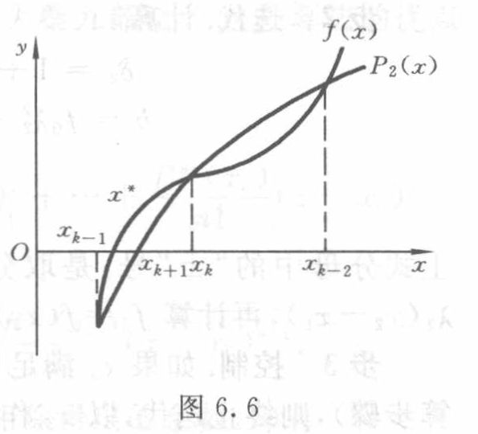

[原页](../../../source-images/pdf-170.jpeg)

<!-- source-page: 170 -->

<!-- 接 PDF169，6.4.2 抛物线法。 -->

代过程称为抛物线法。在几何图形上，这种方法的基本思想是用抛物线 $y=P_2(x)$ 与 $x$ 轴的交点 $x_{k+1}$ 作为所求根 $x^*$ 的近似位置（见图 6.6）。

图 6.6

图意（agent 整理）：原图以抛物线 $P_2(x)$ 近似曲线 $f(x)$，用抛物线与 $x$ 轴的交点作为新近似根。全部标签为 $x,y,O,x^*,x_{k-1},x_{k+1},x_k,x_{k-2},f(x),P_2(x)$。

现在推导抛物线法的计算公式。插值多项式

$$
\begin{aligned}
P_2(x)={}&f(x_k)+f[x_k,x_{k-1}](x-x_k)\\
&+f[x_k,x_{k-1},x_{k-2}](x-x_k)(x-x_{k-1})
\end{aligned}
$$

有两个零点

$$
x_{k+1}=x_k-\frac{2f(x_k)}{\omega\pm\sqrt{\omega^2-4f(x_k)f[x_k,x_{k-1},x_{k-2}]}},
\tag{6.4.3}
$$

其中

$$
\omega=f[x_k,x_{k-1}]+f[x_k,x_{k-1},x_{k-2}](x_k-x_{k-1}).
$$

为了从式（6.4.3）定出一个值 $x_{k+1}$，需要讨论根式前正负号的取舍问题。

在 $x_k,x_{k-1},x_{k-2}$ 三个近似根中，自然假定以 $x_k$ 更接近所求的根 $x^*$，这时，为了保证精度，可以选式（6.4.3）中较接近 $x_k$ 的一个值作为新的近似根 $x_{k+1}$，为此，只要令根式前的符号与 $\omega$ 的符号相同。

**例 6.10** 用抛物线法求解方程 $f(x)=x\mathrm{e}^x-1=0$。

**解** 设用表 6.9 中的前三个值 $x_0=0.5,x_1=0.6,x_2=0.565\,32$ 作为开始值，计算得

$$
\begin{aligned}
f(x_0)&=-0.175\,639,& f(x_1)&=-0.093\,271,\\
f(x_2)&=-0.005\,031,& f[x_1,x_0]&=2.689\,10,\\
f[x_2,x_1]&=2.833\,73,& f[x_2,x_1,x_0]&=2.214\,18,
\end{aligned}
$$

故

$$
\omega=f[x_2,x_1]+f[x_2,x_1,x_0](x_2-x_1)=2.756\,94.
$$

代入式（6.4.8）求得

$$
x_3=x_2-\frac{2f(x_2)}{\omega+\sqrt{\omega^2-4f(x_2)f[x_2,x_1,x_0]}}=0.567\,14.
$$

以上计算表明，抛物线法比弦截法收敛得更快。

事实上，在一定条件下可以证明，对于抛物线法，迭代误差有下列渐近关系式：

$$
\frac{|e_{k+1}|}{|e_k|^{1.840}}\to\left|\frac{f'''(x^*)}{6f'(x^*)}\right|^{0.42},
$$

可见抛物线法也是超线性收敛的，其收敛的阶 $p=1.840$，收敛速度比弦截法更接近于 Newton 法。

下面列出抛物线法的计算步骤。

**步 1** 准备。选定初始近似值 $x_0,x_1,x_2$，并计算 $f(x)$ 相应的值 $f_0,f_1,f_2$，以及

$$
\lambda_2=\frac{x_2-x_1}{x_1-x_0}.
$$

<!-- 算法续至 PDF171。 -->

> 校注（agent 补充）：原页例 6.10 印为 $f(x_1)=-0.093\,271$，此处保留原文。由同页 $x_1=0.6$ 和 $f(x)=x\mathrm{e}^x-1$，计算得 $f(0.6)=0.093\,271\,280\ldots>0$；同时 $[f(0.6)-f(0.5)]/0.1=2.689\,106\ldots$ 与原页列出的差商一致，因此原页该负号疑为误印。原页的“代入式（6.4.8）”也予保留；该段实际使用的零点公式编号是同页（6.4.3）。
