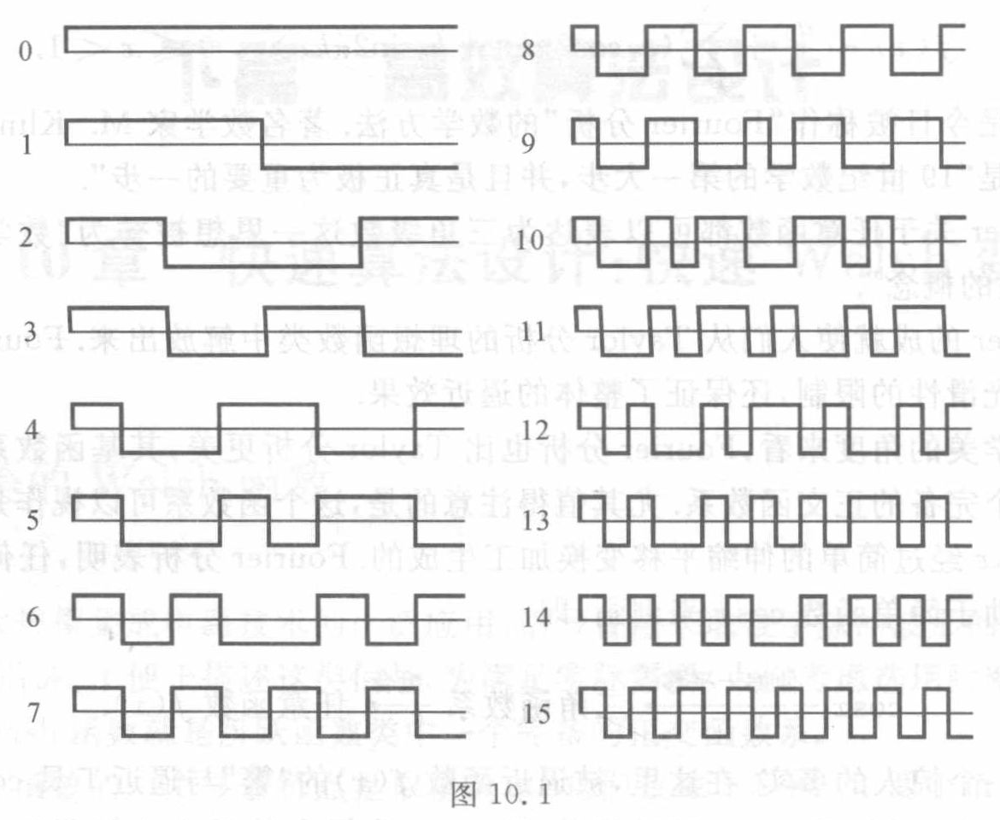

[原页](../../../source-images/pdf-263.jpeg)

<!-- source-page: 263 -->
<!-- 续 PDF 262，10.1.2。 -->

图 10.1

> 图中文字与图意（转录）：左列波形标号依次为 0、1、2、3、4、5、6、7，右列依次为 8、9、10、11、12、13、14、15。各条波形在水平基线上下取两个阶跃值；标号 0 的波形为方波。

怪异与表达式复杂使人们对它望而却步，在提出后的许多年里，它一直默默无闻，不被人们所重视。

直到 20 世纪 60 年代末，人们才惊异地发现，Walsh 函数可应用于信号处理的众多领域，诸如通信、声呐、雷达、图像处理、语音识别、遥感遥测遥控、仪表、医学、天文、地质等等。

“真”是“美”的反光。有着广泛应用的 Walsh 函数美在哪里呢？

### 10.1.3　Walsh 分析的数学美

后文将揭示出一个惊人的事实：表面看起来极其复杂的 Walsh 函数系，竟然是由一个简单得不能再简单的方波 $R(x)=1$ 演化生成的。实际上，从方波 $R(x)$ 出发，经过伸缩、平移的二分手续，即可演化生成 Walsh 函数系。Walsh 函数系是个完备的正交函数系，它可以用来逼近一般的复杂函数。这样，Walsh 逼近有下述路线图：

$$
R(x)=1\xrightarrow[\text{（二分手续）}]{\text{伸缩＋平移}}\text{Walsh 函数系}\xrightarrow{\text{组合}}\text{复杂函数 }f(x).
$$

与 Fourier 分析相比，Walsh 分析更为简洁，它表明：在某种意义上，任何复杂函数 $f(x)$ 都是简单的方波 $R(x)=1$ 二分演化的结果。

综上所述，数学史上近三个世纪提出的三种逼近方法，即 18 世纪初（1715 年）的 Taylor 分析、19 世纪初（1822 年）的 Fourier 分析和 20 世纪初（1923 年）的 Walsh 分析，它们都是数学美的光辉典范，是“百年绝唱三首数学诗”。

这些逼近工具一个比一个更美。Fourier 分析具有深度的数学美，而 Walsh 分析

<!-- 本页末句续 PDF 264。 -->
