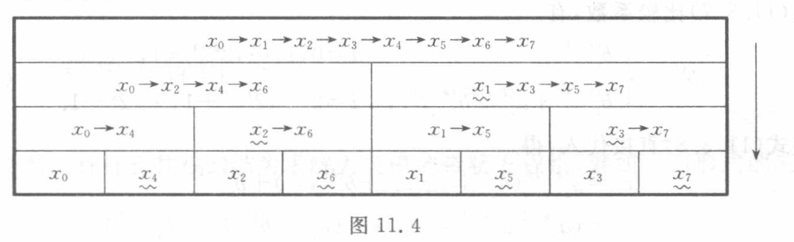

[原页图像](../../../source-images/pdf-286.jpeg)

<!-- source-page: 286 -->
<!-- 接 PDF 285 末尾相关链。 -->

这里步长等于 1。

设将上述相关链按其下标的奇偶拆成两条，则每条子链含 $N_1=N/2$ 节，即

$$
\begin{cases}
x_0\to x_2\to\cdots\to x_{N-2},\\
x_1\to x_3\to\cdots\to x_{N-1}.
\end{cases}
\tag{11.3.2}
$$

这样加工得出的递推问题有两个结果 $x_0,x_1$，且其步长等于 2。这是一种二分手续。

在保持结果数逐步倍增及步长逐步倍增两项基本特征的前提下反复施行这一手续，则二分 $k$ 次后得出 $2^k$ 个结果 $x_i$，$i=0,1,\cdots,2^k-1$，且步长增至 $2^k$，相应地，所给相关链被加工成 $2^k$ 条子链，每条子链含 $N_k=N/2^k$ 节，即

$$
\left\{
\begin{aligned}
&x_0\to x_{2^k}\to\cdots\to x_{N-2^k},\\
&x_1\to x_{2^k+1}\to\cdots\to x_{N-2^k+1},\\
&\qquad\vdots\\
&x_{2^k-1}\to x_{2^{k+1}-1}\to\cdots\to x_{N-1}.
\end{aligned}
\right.
\tag{11.3.3}
$$

如此二分 $n=\log_2 N$ 次后，所给相关链最终退化为每条仅含一节的最简形式

$$
x_0,x_1,\cdots,x_{N-1},
$$

从而得出所求的解。

这种以下标的奇偶分离为特征的二分手续称作奇偶二分。这是最基本的一种二分手续。

对于 $N=8$ 的具体情形，相关链的奇偶二分过程如图 11.4 所示，图中用波纹线标出每一步的新结果。

图 11.4　原图右侧箭头向下，逐层由左至右的全部相关链与波纹线标记如下：

| 层次（由上至下） | 相关链或单节 | 波纹线标出的新结果 |
| --- | --- | --- |
| 初始层 | $x_0\to x_1\to x_2\to x_3\to x_4\to x_5\to x_6\to x_7$ | 无 |
| 第 1 次二分 | $x_0\to x_2\to x_4\to x_6$；$x_1\to x_3\to x_5\to x_7$ | $x_1$ |
| 第 2 次二分 | $x_0\to x_4$；$x_2\to x_6$；$x_1\to x_5$；$x_3\to x_7$ | $x_2,x_3$ |
| 第 3 次二分 | $x_0$；$x_4$；$x_2$；$x_6$；$x_1$；$x_5$；$x_3$；$x_7$ | $x_4,x_6,x_5,x_7$ |

（上表为原图标签与结构的文字转录。）

### 11.3.2　算式的建立

现在运用消元手续具体建立上述奇偶二分法的算式。回到递推问题（11.3.1），利用它的第 $i-1$ 式从其第 $i$ 式中消去 $x_{i-1}$，得

$$
\begin{cases}
x_i=b_i^{(1)},& i=0,1,\\
x_i=a_i^{(1)}x_{i-2}+b_i^{(1)},& i=2,3,\cdots,N-1,
\end{cases}
\tag{11.3.4}
$$

式中

$$
a_i^{(1)}=a_i a_{i-1},\quad i=2,3,\cdots,N-1,
\tag{11.3.5}
$$

<!-- 系数 b_i^(1) 的定义续 PDF 287。 -->
