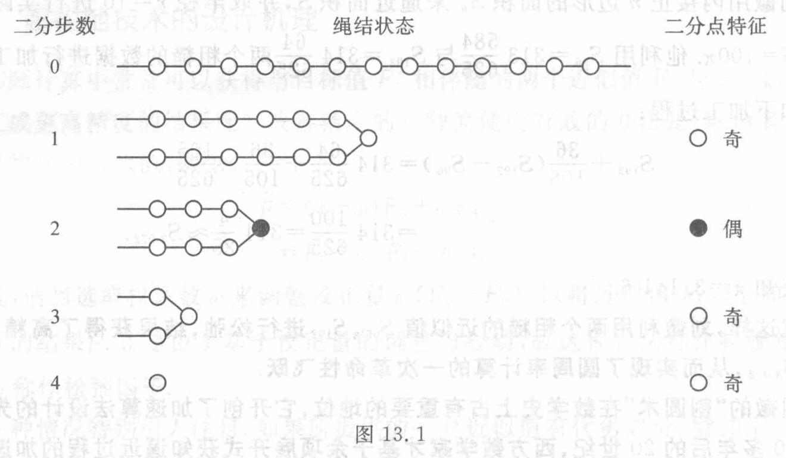

[原页图像](../../../source-images/pdf-315.jpeg)

<!-- source-page: 315 -->

<!-- 承 PDF 314 页末。 -->

（见图 13.1）。设用阴阳二分点来刻画结点数是偶数还是奇数：若结点数为偶数，则二分点是个虚的结点，记作“●”；若结点数为奇数，则二分点是个实的结点，记作“○”。这种**二分手续**取得了“大事化小”的效果。

对二分后的子段又可继续施行上述二分手续，从而产生一个新的二分点 ● 或 ○。这样反复做下去，直到子段上仅含一个结点为止。最终留下的一个结点自然视为二分点 ○。这样，二分过程最终实现了“小事化了”的目标。

绳结的这种二分演化过程如图 13.1 所示。

图 13.1

> 图意及标签转录（据原图）：原图三列为“二分步数”“绳结状态”“二分点特征”。第 0 步为包含 13 个空心结点的直绳；第 1 步将绳对折，两侧各 6 个空心结点，对折处为一个空心结点；第 2 步的两侧各 3 个空心结点，对折处标为实心圆；第 3 步的两侧各 1 个空心结点，对折处为一个空心结点；第 4 步仅余一个空心结点。二分点特征栏的全部标记为：

| 二分步数 | 二分点特征 |
|---|---|
| 0 | （原图留空） |
| 1 | ○ 奇 |
| 2 | ● 偶 |
| 3 | ○ 奇 |
| 4 | ○ 奇 |

在上述二分演化过程中，逐步生成了一个二分点的序列。设将先后生成的二分点从右往左顺序排列，即可生成一个有方向、有层次的虚拟绳结（见图 13.2）。这个虚拟绳结同原先的绳结（见图 13.1）的含义一致，但信息量被大大地压缩了。

图 13.2

> 图意及标签转录（据原图）：箭头指向左方；沿水平绳从左到右的四个结点依次为 ○、○、●、○，其下数字依次为 $1,1,0,1$。

设原先的绳结数为 $N$，则二分过程的信息压缩比

$$
\frac{N}{\log_2N}\longrightarrow+\infty.
$$

一个出人意料的结论是，如果将虚拟绳结的虚实结点 ● 与 ○ 分别赋值 0 与 1，即可得到所求绳结数的二进制数 $(1101)_2=13$。

**摆弄绳结可以孕育出二进制，这是一个奇妙的事实，这一事实表现了中华古算的博大精深。**

### 13.5.2 二分技术的设计机理

二分技术是缩减技术的延伸。
