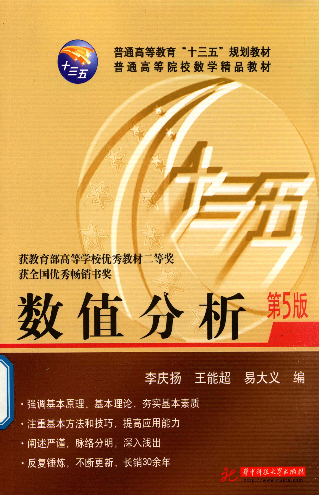

[查看原页](../../../source-images/pdf-001.jpeg)

<!-- source-page: 1 -->

普通高等教育“十三五”规划教材  
普通高等院校数学精品教材

十三五

获教育部高等学校优秀教材二等奖  
获全国优秀畅销书奖

# 数值分析

第 5 版

李庆扬　王能超　易大义　编

- 强调基本原理、基本理论，夯实基本素质
- 注重基本方法和技巧，提高应用能力
- 阐述严谨，脉络分明，深入浅出
- 反复锤炼，不断更新，长销 30 余年

华中科技大学出版社  
[http://www.hustp.com](http://www.hustp.com)

> 版式记录（agent 补充）：本页为封面，无印刷页码。“十三五”也出现在封面徽标及背景装饰中；完整图形与字样见原页。

