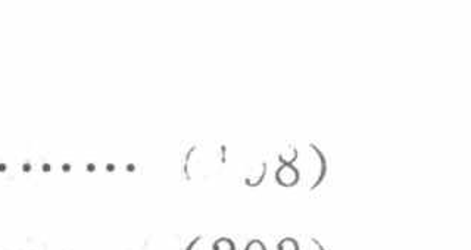

[查看原页](../../../source-images/pdf-011.jpeg)

<!-- source-page: 11 -->

# 目录（续）

> 转录说明（agent 补充）：以下为印刷目录；末列是目录所列的正文书页码。本页底部的目录页码另记在 YAML 中。

| 编号 | 标题 | 书页码 |
|:---|:---|---:|
|  | 习题 | 〔扫描残损；末位可辨为 8〕 |
| 第 8 章 | **解线性方程组的迭代法** | 202 |
| 8.1 | 引言 | 202 |
| 8.2 | Jacobi 迭代法与 Gauss-Seidel 迭代法 | 204 |
| 8.2.1 | Jacobi 迭代法 | 204 |
| 8.2.2 | Gauss-Seidel 迭代法 | 205 |
| 8.3 | 迭代法的收敛性 | 206 |
| 8.4 | 解线性方程组的超松弛迭代法 | 213 |
|  | 小结 | 217 |
|  | 习题 | 217 |
| 第 9 章 | **矩阵的特征值与特征向量计算** | 220 |
| 9.1 | 引言 | 220 |
| 9.2 | 幂法及反幂法 | 222 |
| 9.2.1 | 幂法 | 222 |
| 9.2.2 | 加速方法 | 225 |
| 9.2.3 | 反幂法 | 227 |
| 9.3 | Householder 方法 | 230 |
| 9.3.1 | 引言 | 230 |
| 9.3.2 | 用正交相似变换约化矩阵 | 232 |
| 9.4 | QR 算法 | 237 |
| 9.4.1 | 引言 | 237 |
| 9.4.2 | QR 算法 | 239 |
| 9.4.3 | 带原点位移的 QR 方法 | 242 |
|  | 小结 | 246 |
|  | 习题 | 246 |

## 下篇　高效算法设计

| 编号 | 标题 | 书页码 |
|:---|:---|---:|
| \*第 10 章 | **快速算法设计:快速 Walsh 变换** | 248 |
| 10.1 | 美的 Walsh 函数 | 248 |
| 10.1.1 | 微积分的逼近法 | 248 |
| 10.1.2 | Walsh 函数的复杂性 | 249 |
| 10.1.3 | Walsh 分析的数学美 | 250 |
| 10.2 | Walsh 函数代数化 | 251 |
| 10.2.1 | 时基上的二分集 | 251 |
| 10.2.2 | Walsh 函数的矩阵表示 | 252 |

> 校注（agent 补充）：第 7 章“习题”的目录页码前部残损，末位可辨为 8；不能从本页确认其完整原印数字。正文起始处已回查为 PDF 第 212 页、书页 199，该正文定位不冒充目录原印页码。

[正文“习题”起始页与书页 199](../../../source-images/pdf-212.jpeg)
