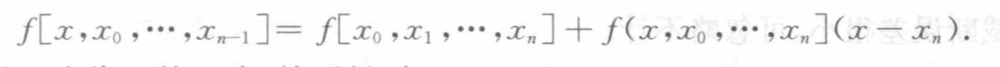

[原页：书页 25／PDF 38](../../source-images/pdf-038.jpeg)

<!-- source-page: 38 -->

> 页首承接 PDF 37 的递推式；本页例 2.3 的计算结果续 PDF 39。

$$
\begin{aligned}
f[x,x_0]&=f[x_0,x_1]+f[x,x_0,x_1](x-x_1),\\
&\vdots\\
f[x,x_0,\cdots,x_{n-1}]&=f[x_0,x_1,\cdots,x_n]+f(x,x_0,\cdots,x_n](x-x_n).
\end{aligned}
$$

只要把后一式代入前一式，就可得到

$$
\begin{aligned}
f(x)={}&f(x_0)+f[x_0,x_1](x-x_0)+f[x_0,x_1,x_2](x-x_0)(x-x_1)+\cdots\\
&+f[x_0,x_1,\cdots,x_n](x-x_0)\cdots(x-x_{n-1})+f[x,x_0,\cdots,x_n]\omega_{n+1}(x)\\
={}&N_n(x)+R_n(x),
\end{aligned}
$$

其中

$$
\begin{aligned}
N_n(x)={}&f(x_0)+f[x_0,x_1](x-x_0)+f[x_0,x_1,x_2](x-x_0)(x-x_1)+\cdots\\
&+f[x_0,x_1,\cdots,x_n](x-x_0)(x-x_1)\cdots(x-x_{n-1}),
\end{aligned}
\tag{2.4.6}
$$

$$
R_n(x)=f(x)-N_n(x)=f[x,x_0,\cdots,x_n]\omega_{n+1}(x).
\tag{2.4.7}
$$

$\omega_{n+1}(x)$ 是由式（2.2.12）定义的。由式（2.4.6）确定的多项式 $N_n(x)$ 显然满足插值条件，且次数不超过 $n$，它就是形如式（2.4.1）的多项式，其系数为

$$
a_k=f[x_0,x_1,\cdots,x_k]\qquad(k=0,1,\cdots,n).
$$

称 $N_n(x)$ 为 **Newton 差商插值多项式**。系数 $a_k$ 就是差商表 2.4 中加横线的各阶差商，它比 Lagrange 插值节省计算量，且便于程序设计。

式（2.4.7）为插值余项，由插值多项式的唯一性知，它与式（2.2.14）是等价的，事实上，利用差商与导数关系式（2.4.5），可由式（2.4.7）推出式（2.2.14）。但式（2.4.7）更有一般性，它对于 $f$ 是由离散点给出的情形或 $f$ 导数不存在时均适用。

**例 2.3** 给出 $f(x)$ 的函数表（见表 2.5 左边两列），求 4 次 Newton 插值多项式，并由此计算 $f(0.596)$ 的近似值。

**表 2.5**

| $x_k$ | $f(x_k)$ | 一阶差商 | 二阶差商 | 三阶差商 | 四阶差商 | 五阶差商 |
|---|---|---|---|---|---|---|
| $0.40$ | $\underline{0.410\,75}$ | | | | | |
| $0.55$ | $0.578\,15$ | $\underline{1.116\,00}$ | | | | |
| $0.65$ | $0.696\,75$ | $1.186\,00$ | $\underline{0.280\,00}$ | | | |
| $0.80$ | $0.888\,11$ | $1.275\,73$ | $0.358\,93$ | $\underline{0.197\,33}$ | | |
| $0.90$ | $1.026\,52$ | $1.384\,10$ | $0.433\,48$ | $0.213\,00$ | $\underline{0.031\,34}$ | |
| $1.05$ | $1.253\,82$ | $1.515\,33$ | $0.524\,93$ | $0.228\,63$ | $0.031\,26$ | $-0.000\,12$ |

**解** 首先根据给定函数表造出差商表（见表 2.5 的右边五列）。

从差商表看到，四阶差商近似常数。故取 4 次插值多项式 $N_4(x)$ 作近似即可。

$$
\begin{aligned}
N_4(x)={}&0.410\,75+1.116(x-0.4)+0.28(x-0.4)(x-0.55)\\
&+0.197\,33(x-0.4)(x-0.55)(x-0.65)\\
&+0.031\,34(x-0.4)(x-0.55)(x-0.65)(x-0.8),
\end{aligned}
$$

### 校注（agent 补充）：CH02A-S01，差商的左括号

本页页首递推式的最后一项，原书印为 $f(x,x_0,\cdots,x_n]$，左右括号不配。本转录保留这一印字。根据定义 2.3、同页后续两式及差商记号，此处应理解为 $f[x,x_0,\cdots,x_n]$；这是原书排印问题，不是 OCR 错误。CH02A-S01 是本 lane 的临时校注编号。

### 校注（agent 补充）：CH02A-S03，表 2.5 的中间舍入

上表按原书印字转录。若把左端两列所给小数作为精确输入，使用差商递推且保留精确分数，则第三个二阶差商为 $0.433466666\cdots$，四阶差商分别为 $0.031238095\cdots$、$0.031428571\cdots$，五阶差商为 $2/6825=0.000293040293\cdots$；它们与表中 $0.43348$、$0.03134$、$0.03126$、$-0.00012$ 不同。

逐列检查表明：表中 $0.43348$ 可以由已舍入的一阶差商重算得到，而 $0.35893$、$0.52493$ 更接近保留未舍入一阶差商的计算；原表的三至五阶差商则能从其已印出的前一列经舍入重算得到。因此，本例高阶差商对中间舍入敏感，不能把这张有限精度表当作精确差商表。此处记录的是原书数值计算的舍入一致性问题，不修改原表。
