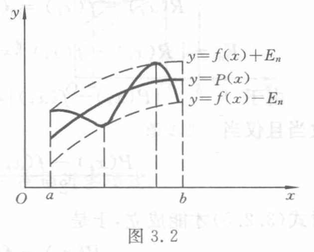

[查看原页](../../source-images/pdf-062.jpeg)

<!-- source-page: 62 -->

定理 3.3 若 $P(x) \in H_n$ 是 $f(x) \in C[a,b]$ 的最佳逼近多项式，则 $P(x)$ 同时存在正、负偏差点.

证明 因 $P(x)$ 是 $f(x)$ 的最佳逼近多项式，故 $\mu = E_n$. 由于 $P(x)$ 在 $[a,b]$ 上总有偏差点存在，故可用反证法求证. 不妨假定只有正偏差点，没有负偏差点，于是，对于一切 $x \in [a,b]$ 都有

$$
P(x) - f(x) > -E_n.
$$

因 $P(x) - f(x)$ 在 $[a,b]$ 上连续，故有最小值大于 $-E_n$，用 $-E_n + 2h$ 表示，其中 $h > 0$. 于是，对于一切 $x \in [a,b]$ 都有

$$
-E_n + 2h \leqslant P(x) - f(x) \leqslant E_n,
$$

$$
-E_n + h \leqslant [P(x) - h] - f(x) \leqslant E_n - h,
$$

即

$$
|[P(x) - h] - f(x)| \leqslant E_n - h.
$$

它表示多项式 $P(x) - h$ 与 $f(x)$ 的偏差小于 $E_n$，与 $E_n$ 是最小偏差的假定矛盾.

同样，可证明只有负偏差点没有正偏差点也是不成立的. 证毕.

定理 3.3 的证明从几何上看是十分明显的. 如图 3.2 所示，考察两曲线

$$
y = f(x) + E_n \quad \text{与} \quad y = f(x) - E_n
$$

在 $[a,b]$ 间形成带状区域，曲线 $y = P(x)$ 在 $[a,b]$ 上就位于这带状区域之间. 定理 3.1 表明，$P(x)$ 的图形应当与这两条曲线至少各接触一次，这是十分明显的. 若不与 $y = f(x) - E_n$ 接触，则可把曲线 $y = P(x)$ 稍向下移动就得到位于曲线 $y = f(x)$ 较窄带状区域内的曲线 $y = P(x) - h$. 下面给出反映最佳逼近多项式特征的 Chebyshev 定理.

图 3.2（原图）。带状区域及逼近曲线示意；标签为 $x$、$y$、$O$、$a$、$b$、$y=f(x)+E_n$、$y=P(x)$、$y=f(x)-E_n$。图内还画有从曲线接触点向横轴延伸的竖向辅助线。

定理 3.4 $P(x) \in H_n$ 是 $f(x) \in C[a,b]$ 的最佳逼近多项式的充分必要条件是 $P(x)$ 在 $[a,b]$ 上至少有 $n+2$ 个轮流为“正”、“负”的偏差点，即有 $n+2$ 个点 $a \leqslant x_1 < x_2 < \cdots < x_{n+2} \leqslant b$，使

$$
\begin{aligned}
P(x_k)-f(x_k)&=(-1)^k\sigma\|P(x)-f(x)\|_\infty,\\
\sigma&=\pm1,\quad k=1,2,\cdots,n+2,
\end{aligned}
\tag{3.2.4}
$$

这样的点组称为 Chebyshev 交错点组.

证明 只证充分性. 假定在 $[a,b]$ 上有 $n+2$ 个点使式 (3.2.4) 成立，要证明 $P(x)$ 是 $f(x)$ 在 $[a,b]$ 上的最佳逼近多项式. 用反证法求证. 若存在 $Q(x) \in H_n, Q(x) \not\equiv P(x)$，使

$$
\| f(x) - Q(x) \|_\infty < \| f(x) - P(x) \|_\infty.
$$

由于 $P(x) - Q(x) = [P(x) - f(x)] - [Q(x) - f(x)]$ 在点 $x_1, x_2, \cdots, x_{n+2}$ 上的符号与 $P(x_k) - f(x_k)$ ($k=1, \cdots, n+2$) 一致，故 $P(x) -$

<!-- 本页末式 P(x)- 续 PDF 63 的 Q(x)。 -->

> 校注（agent 补充，原书疑误）：图 3.2 旁正文印为“定理 3.1 表明”，按原文保留。此段是在解释正、负偏差点同时存在，应指本页定理 3.3；定理 3.1 是 Weierstrass 定理。
