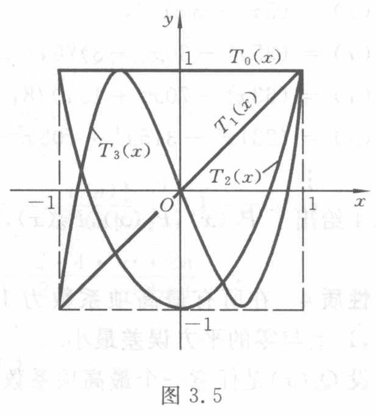

[查看原页](../../source-images/pdf-073.jpeg)

<!-- source-page: 73 -->

$$
Q_n(x) = \tilde{P}_n(x) + \sum_{k=0}^{n-1} a_k \tilde{P}_k(x) ,
$$
于是
$$
(Q_n, Q_n) = \int_{-1}^{1} Q_n^2(x) \mathrm{d}x = (\tilde{P}_n, \tilde{P}_n) + \sum_{k=0}^{n-1} a_k^2 (\tilde{P}_k, \tilde{P}_k) \geqslant (\tilde{P}_n, \tilde{P}_n)
$$
当且仅当 $a_0 = a_1 = \cdots = a_{n-1} = 0$ 时等号才成立，即当 $Q_n(x) \equiv \tilde{P}_n(x)$ 时平方误差最小.

性质 5 $P_n(x)$ 在区间 $(-1, 1)$ 内有 $n$ 个不同的实零点.

### 3.4.3 Chebyshev多项式

当权函数 $\rho(x) = \frac{1}{\sqrt{1-x^2}}$, 区间为 $[-1, 1]$ 时, 由序列 $\{1, x, x^2, \cdots, x^n, \cdots\}$ 正交化得到的正交多项式就是 Chebyshev多项式, 它可表示为
$$
T_n(x) = \cos(n \arccos x), \quad |x| \leqslant 1. \tag{3.4.6}
$$
若令 $x = \cos \theta$, 则
$$
T_n(x) = \cos n \theta, \quad 0 \leqslant \theta \leqslant \pi.
$$
Chebyshev多项式有很多重要性质.

性质 1 递推关系
$$
T_0(x) = 1, \quad T_1(x) = x,
$$
$$
T_{n+1}(x) = 2xT_n(x) - T_{n-1}(x) \quad (n = 1, 2, \cdots). \tag{3.4.7}
$$
这只要由三角恒等式
$$
\cos(n+1)\theta = 2\cos \theta \cos n \theta - \cos(n-1)\theta \quad (n \geqslant 1)
$$
令 $x = \cos \theta$ 即得. 由式(3.4.7)可得表 3.1.

$T_n(x)$ 的函数图形如图 3.5 所示.

表 3.1

| 多项式 | 表达式 |
| --- | --- |
| $T_0(x)$ | $1$ |
| $T_1(x)$ | $x$ |
| $T_2(x)$ | $2x^2-1$ |
| $T_3(x)$ | $4x^3-3x$ |
| $T_4(x)$ | $8x^4-8x^2+1$ |
| $T_5(x)$ | $16x^5-20x^3+5x$ |
| $T_6(x)$ | $32x^6-48x^4+18x^2-1$ |
| $T_7(x)$ | $64x^7-112x^5+56x^3-7x$ |
| $T_8(x)$ | $128x^8-256x^6+160x^4-32x^2+1$ |

图 3.5（原图）。Chebyshev 多项式 $T_0(x)$、$T_1(x)$、$T_2(x)$、$T_3(x)$ 的图形。全部标签：$x$、$y$、$O$、横轴的 $-1$、$1$、纵轴的 $1$、$-1$、$T_0(x)$、$T_1(x)$、$T_2(x)$、$T_3(x)$；在 $x=\pm1$ 处画有辅助线。
