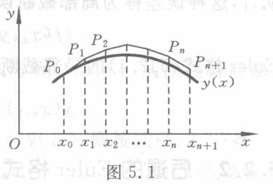
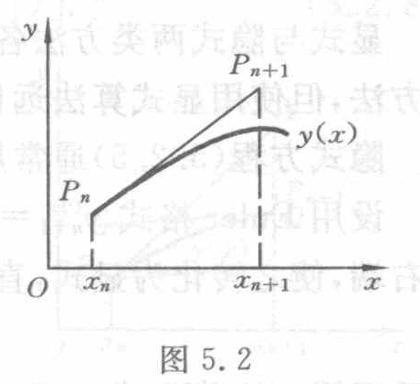

[原页](../../source-images/pdf-120.jpeg)

<!-- source-page: 120 -->
<!-- 承 PDF 119 末句。 -->

进到 $x=x_1$ 上一点 $P_1$，然后再从 $P_1$ 依方向场的方向推进到 $x=x_2$ 上一点 $P_2$，循此前进作出一条折线 $P_0P_1P_2\cdots$（见图 5.1）。

一般地，设已作出该折线的极点 $P_n$，过 $P_n(x_n,y_n)$ 依方向场的方向再推进到 $P_{n+1}(x_{n+1},y_{n+1})$，显然两个极点 $P_n,P_{n+1}$ 的坐标有下列关系：

$$
\frac{y_{n+1}-y_n}{x_{n+1}-x_n}=f(x_n,y_n),
$$

即

$$
y_{n+1}=y_n+hf(x_n,y_n).\tag{5.2.1}
$$

图 5.1（原图）：Euler 折线 $P_0P_1P_2\cdots P_nP_{n+1}$ 与积分曲线 $y(x)$。原图符号标签：$O,x,y,x_0,x_1,x_2,\cdots,x_n,x_{n+1},P_0,P_1,P_2,P_n,P_{n+1},y(x)$。

这就是著名的 **Euler 格式**。若初值 $y_0$ 已知，则依格式 (5.2.1) 可逐步算出

$$
y_1=y_0+hf(x_0,y_0),\qquad y_2=y_1+hf(x_1,y_1),\qquad\cdots.
$$

**例 5.1** 求解初值问题

$$
\begin{cases}
y'=y-2x/y\quad(0<x<1),\\
y(0)=1.
\end{cases}\tag{5.2.2}
$$

**解** 为便于比较，本章将用多种数值方法求解上述初值问题。这里先用 Euler 方法，Euler 格式的具体形式为

$$
y_{n+1}=y_n+h\left(y_n-\frac{2x_n}{y_n}\right).
$$

取步长 $h=0.1$，计算结果如表 5.1 所示。

**表 5.1**

| $x_n$ | $y_n$ | $y(x_n)$ | $x_n$ | $y_n$ | $y(x_n)$ |
|---|---|---|---|---|---|
| 0.1 | 1.1000 | 1.0954 | 0.6 | 1.5090 | 1.4832 |
| 0.2 | 1.1918 | 1.1832 | 0.7 | 1.5803 | 1.5492 |
| 0.3 | 1.2774 | 1.2649 | 0.8 | 1.6498 | 1.6125 |
| 0.4 | 1.3582 | 1.3416 | 0.9 | 1.7178 | 1.6733 |
| 0.5 | 1.4351 | 1.4142 | 1.0 | 1.7848 | 1.7321 |

初值问题 (5.2.2) 有解 $y=\sqrt{1+2x}$，按这个解析式子算出的准确值 $y(x_n)$ 同近似值 $y_n$ 一起列在表 5.1 中，二者相比较可以看出，Euler 方法的精度很差。

还可以通过几何直观来考察 Euler 方法的精度。假设 $y_n=y(x_n)$，即顶点 $P_n$ 落在积分曲线 $y=y(x)$ 上，那么，按 Euler 方法作出的折线 $P_nP_{n+1}$ 便是 $y=y(x)$ 过点 $P_n$ 的切线（见图 5.2）。从图形上看，这样定出的顶点 $P_{n+1}$ 显著地偏离了原来的积分曲线，可见 Euler 方法是相当粗糙的。

图 5.2（原图）：从积分曲线上 $P_n$ 沿切线得到 $P_{n+1}$，与曲线 $y(x)$ 在 $x_{n+1}$ 的值有偏差。原图符号标签：$O,x,y,x_n,x_{n+1},P_n,P_{n+1},y(x)$。

人们常以 Taylor 展开为工具来分析计算公式的

<!-- 本页末句续 PDF 121。 -->
