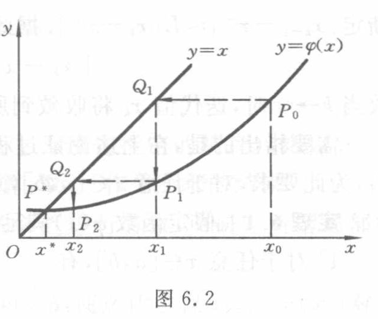

[原页](../../source-images/pdf-158.jpeg)

<!-- source-page: 158 -->

<!-- 接 PDF157，6.2.1 迭代过程的收敛性。 -->

就是要确定曲线 $y=\varphi(x)$ 与直线 $y=x$ 的交点 $P^*$（见图 6.2）。对于 $x^*$ 的某个近似值 $x_0$，在曲线 $y=\varphi(x)$ 上可确定一点 $P_0$，它以 $x_0$ 为横坐标，而纵坐标则等于 $\varphi(x_0)=x_1$。过 $P_0$ 引平行 $x$ 轴的直线，设交直线 $y=x$ 于点 $Q_1$，然后过 $Q_1$ 再作平行于 $y$ 轴的直线，它与曲线 $y=\varphi(x)$ 的交点记作 $P_1$，则点 $P_1$ 的横坐标为 $x_1$，纵坐标等于 $\varphi(x_1)=x_2$。按图 6.2 中箭头所示的路径继续进行下去，在曲线 $y=\varphi(x)$ 上得到点列 $P_1,P_2,\cdots$，其横坐标分别为依公式 $x_{k+1}=\varphi(x_k)$ 求得的迭代值 $x_1,x_2,\cdots$。如果点列 $\{P_k\}$ 趋于点 $P^*$，则相应的迭代值 $x_k$ 收敛到所求的根 $x^*$。

图 6.2

图意（agent 整理）：原图用曲线 $y=\varphi(x)$、直线 $y=x$ 和带箭头的水平、竖直折线显示迭代过程。全部文字标签为 $x,y,O,x^*,x_2,x_1,x_0,P^*,P_2,P_1,P_0,Q_2,Q_1,y=x,y=\varphi(x)$。

**例 6.3** 求方程

$$
f(x)=x^3-x-1=0
\tag{6.2.3}
$$

在 $x_0=1.5$ 附近的根 $x^*$。

**解** 设将方程（6.2.3）改写成 $x=\sqrt[3]{x+1}$ 的形式，据此建立迭代公式

$$
x_{k+1}=\sqrt[3]{x_k+1},\quad k=0,1,2,\cdots.
$$

表 6.3 记录了各步迭代的结果。可以看到，如果仅取六位数字，那么结果 $x_7$ 与 $x_8$ 完全相同，这时可以认为 $x_7$ 实际上已满足方程（6.2.3），即为所求的根。

表 6.3

| $k$ | $x_k$ | $k$ | $x_k$ |
|---|---|---|---|
| $0$ | $1.5$ | $5$ | $1.324\,76$ |
| $1$ | $1.357\,21$ | $6$ | $1.324\,73$ |
| $2$ | $1.330\,86$ | $7$ | $1.324\,72$ |
| $3$ | $1.325\,88$ | $8$ | $1.324\,72$ |
| $4$ | $1.324\,94$ |  |  |

应当指出，迭代法的效果并不是总能令人满意的。譬如，设依方程（6.2.3）的另一种等价形式 $x=x^3-1$，建立迭代公式 $x_{k+1}=x_k^3-1$，迭代初值仍取 $x_0=1.5$，则有

$$
x_1=2.375,\quad x_2=12.39.
$$

继续迭代下去已经没有必要，因为结果显然会越来越大，不可能趋于某个极限。称这种不收敛的迭代过程是发散的。一个发散的迭代过程，纵使进行了上千百次迭代，其结果也是毫无价值的。

再考察一般情形。设方程 $x=\varphi(x)$ 在区间 $(a,b)$ 内有根 $x^*$，则保证迭代过程 $x_{k+1}=\varphi(x_k)$ 收敛的条件可表述为：存在定数 $0<L<1$，使对于任意 $x\in[a,b]$ 成立

$$
|\varphi'(x)|\leqslant L.
\tag{6.2.4}
$$

事实上，由微分中值定理

$$
x_{k+1}-x^*=\varphi(x_k)-\varphi(x^*)=\varphi'(\xi)(x_k-x^*),
$$

其中 $\xi$ 是 $x^*$ 与 $x_k$ 之间某一点，当 $x_k\in[a,b]$ 时 $\xi\in[a,b]$。因此利用条件（6.2.4）可以

<!-- 本页正文续至 PDF159。 -->
