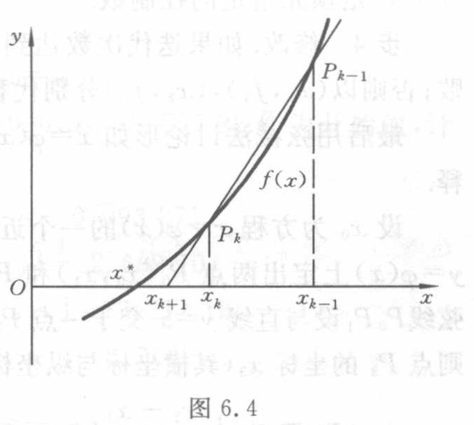

[原页](../../source-images/pdf-168.jpeg)

<!-- source-page: 168 -->

<!-- 接 PDF167，6.4 弦截法与抛物线法。 -->

的近似根 $x_{k+1}$，这就确定了一个迭代过程，记迭代函数为 $\varphi$，且

$$
x_{k+1}=\varphi(x_k,x_{k-1},\cdots,x_{k-r}).
$$

下面具体考察 $r=1$（弦截法）和 $r=2$（抛物线法）两种情形。

### 6.4.1 弦截法

设 $x_k,x_{k-1}$ 是 $f(x)=0$ 的近似根，利用 $f(x_k),f(x_{k-1})$ 构造一次插值多项式 $P_1(x)$，并用 $P_1(x)=0$ 的根作为 $f(x)=0$ 的新的近似根 $x_{k+1}$。由于

$$
P_1(x)=f(x_k)+\frac{f(x_k)-f(x_{k-1})}{x_k-x_{k-1}}(x-x_k),
\tag{6.4.1}
$$

因此有

$$
x_{k+1}=x_k-\frac{f(x_k)}{f(x_k)-f(x_{k-1})}(x_k-x_{k-1}).
\tag{6.4.2}
$$

这样导出的迭代公式（6.4.2）可以看作 Newton 公式 $x_{k+1}=x_k-\dfrac{f(x_k)}{f'(x_k)}$ 中的导数 $f'(x)$ 用差商 $\dfrac{f(x_k)-f(x_{k-1})}{x_k-x_{k-1}}$ 取代的结果。

现在解释这种迭代过程的几何意义。如图 6.4 所示，曲线 $y=f(x)$ 上横坐标为 $x_k,x_{k-1}$ 的点分别记作 $P_k,P_{k-1}$，则弦线 $P_kP_{k-1}$ 的斜率等于差商值 $\dfrac{f(x_k)-f(x_{k-1})}{x_k-x_{k-1}}$，其方程是

$$
f(x_k)+\frac{f(x_k)-f(x_{k-1})}{x_k-x_{k-1}}(x-x_k)=0.
$$

因此，按式（6.4.2）求得的 $x_{k+1}$ 实际上是弦线 $P_kP_{k-1}$ 与 $x$ 轴交点的横坐标。这种算法因此而称为弦截法。

图 6.4

图意（agent 整理）：曲线上的 $P_k,P_{k-1}$ 所连弦线与横轴交于横坐标 $x_{k+1}$ 的点。全部标签为 $x,y,O,x^*,x_{k+1},x_k,x_{k-1},P_k,P_{k-1},f(x)$。

弦截法与切线法（Newton 法）都是线性化方法，但二者有本质的区别。切线法在计算 $x_{k+1}$ 时只用到前一步的值 $x_k$，而弦截法（见式（6.4.2））在求 $x_{k+1}$ 时要用到前面两步的结果 $x_k,x_{k-1}$，因此使用这种方法必须先给出两个开始值 $x_0,x_1$。

**例 6.9** 用弦截法解方程

$$
f(x)=x\mathrm{e}^x-1=0.
$$

**解** 设取 $x_0=0.5,x_1=0.6$ 作为开始值，用弦截法求得的结果如表 6.9 所示，比较例 6.7 Newton 法的计算结果可以看出，弦截法的收敛速度也是相当快的。

表 6.9

| $k$ | $x_k$ |
|---|---|
| $0$ | $0.5$ |
| $1$ | $0.6$ |
| $2$ | $0.565\,32$ |
| $3$ | $0.567\,09$ |
| $4$ | $0.567\,14$ |

下述定理断言，弦截法具有超线性的收敛性。

**定理 6.4** 假设 $f(x)$ 在根 $x^*$ 的邻域 $\Delta:|x-x^*|\leqslant\delta$ 内具有二阶连续导数，且对于任意

<!-- 本页正文续至 PDF169。 -->

> 校注（agent 补充）：几何解释中原书称“其方程是”，随后印出的却是 $P_1(x)=0$，已照录。弦线本身的方程为 $y=P_1(x)$；原式表达的是弦线与 $x$ 轴交点的条件，与随后求 $x_{k+1}$ 的用途一致。
