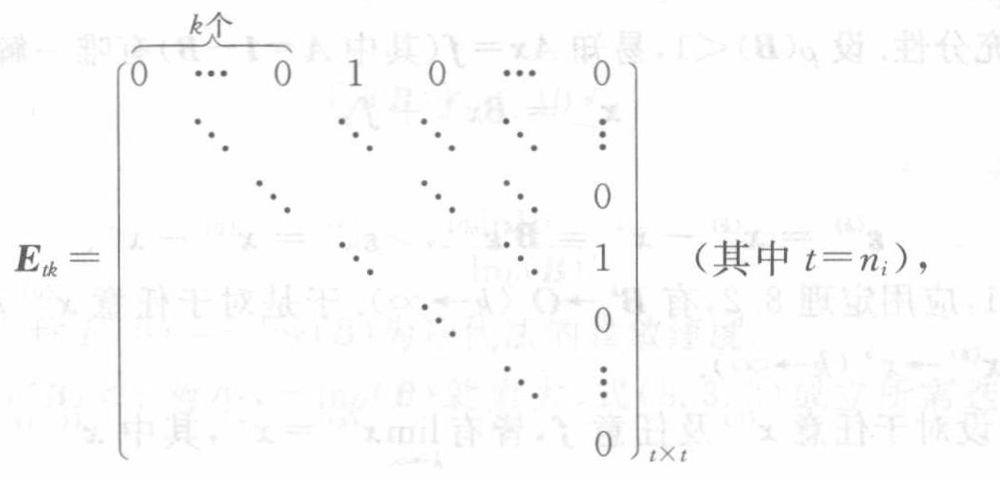

[原页图像](../../source-images/pdf-220.jpeg)

<!-- source-page: 220 -->

**定理 8.1**　$\lim\limits_{k\to\infty}A_k=A$ 的充要条件是 $\|A_k-A\|\to0$（$k\to\infty$）。证明过程留给读者进行。

由 8.1 节知，要考虑序列 $\{x^{(k)}\}$ 的收敛性，就要研究 $B$ 在什么条件下误差向量趋于零向量，即

$$
\varepsilon^{(k)}=x^{(k)}-x^*=B^k\varepsilon^{(0)}\to0\quad(k\to\infty).
$$

**定理 8.2**　设 $B=(b_{ij})_{n\times n}$，则 $B^k\to O$（$k\to\infty$）的充要条件是 $\rho(B)<1$。

**证明**　由矩阵 $B$ 的 Jordan 标准形，存在非奇异矩阵 $P$，使

$$
P^{-1}BP=\begin{bmatrix}
J_1&&&\\
&J_2&&\\
&&\ddots&\\
&&&J_r
\end{bmatrix}\equiv J,\quad
\text{其中 }J_i=\begin{bmatrix}
\lambda_i&1&&&\\
&\lambda_i&1&&\\
&&\ddots&\ddots&\\
&&&\ddots&1\\
&&&&\lambda_i
\end{bmatrix}_{n_i\times n_i},
$$

其中 $\sum\limits_{i=1}^r n_i=n$。显然 $B=PJP^{-1}$，故

$$
B^k=PJ^kP^{-1},
$$

其中

$$
J^k=\begin{bmatrix}
J_1^k&&&\\
&J_2^k&&\\
&&\ddots&\\
&&&J_r^k
\end{bmatrix}\quad(k=1,2,\cdots).
$$

于是

$$
B^k\to O\quad(k\to\infty)\iff J^k\to O\quad(k\to\infty),
$$

$$
J^k\to O\quad(k\to\infty)\iff J_i^k\to O\quad(k\to\infty)\quad(i=1,2,\cdots,r).
$$

引进记号

$$
E_{tk}=\left[\begin{array}{ccccccc}
\multicolumn{3}{c}{\overbrace{0\quad\cdots\quad0}^{k\text{个}}}&1&0&\cdots&0\\
&\ddots&&\ddots&\ddots&\ddots&\vdots\\
&&\ddots&&\ddots&\ddots&0\\
&&&\ddots&&\ddots&1\\
&&&&\ddots&&0\\
&&&&&\ddots&\vdots\\
&&&&&&0
\end{array}\right]_{t\times t}\quad\text{（其中 }t=n_i\text{）},
$$

原图矩阵符号标签：$E_{tk}$，首行前 $k$ 个元素为零（括注“$k$ 个”），随后为 $1,0,\cdots,0$；第 $k$ 条上副对角线为 $1$，其余为零；矩阵尺寸 $t\times t$，其中 $t=n_i$。

一般有 $(E_{t1})^k=E_{tk}$，当 $k\geqslant t$ 时 $E_{tk}=O$。由于

$$
J_i=\begin{bmatrix}
\lambda_i&&&&\\
&\lambda_i&&&\\
&&\ddots&&\\
&&&\ddots&\\
&&&&\lambda_i
\end{bmatrix}
+\begin{bmatrix}
0&1&&&\\
&0&1&&\\
&&\ddots&\ddots&\\
&&&\ddots&1\\
&&&&0
\end{bmatrix}
=\lambda_i I+E_{t1},
$$

<!-- 本页定理8.2证明续下页。 -->
