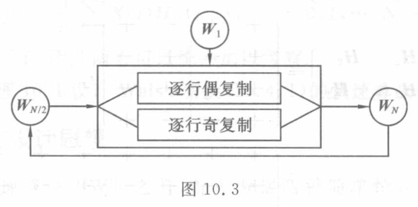

<!-- source-page: 267 -->

### 10.3.3　Walsh 阵的演化机制

Walsh 阵的演化方式从属于二分演化模式。事实上，这里从初态 $W_1=[+]$ 出发，将 $W_{N/2}$ 加工成 $W_N$ 的二分手续如下。

（1）分裂手续。

<!-- 分裂手续的具体公式续 PDF 268。 -->

<!-- source-page: 268 -->

[原页](../../source-images/pdf-268.jpeg)

<!-- source-page: 268 -->
<!-- 续 PDF 267，10.3.3 的（1）分裂手续。 -->

对 $W_{N/2}$ 的每一行 $W_{N/2}(i)$ 分别施行偶复制与奇复制，生成两个 $N$ 维向量 $[W_{N/2}(i)\mathrel{\vdots}\ddot W_{N/2}(i)]$ 与 $[W_{N/2}(i)\mathrel{\vdots}\dot W_{N/2}(i)]$。

（2）合成手续。

将 $W_{N/2}$ 的每一行按上述分裂手续扩展为相邻的两个 $N$ 维向量，从而将 $W_{N/2}$ 扩展成为一个 $N$ 阶方阵

$$
W_N=\begin{pmatrix}
\vdots&\vdots\\
W_{N/2}(i)\mathrel{\vdots}&\ddot W_{N/2}(i)\\
W_{N/2}(i)\mathrel{\vdots}&\dot W_{N/2}(i)\\
\vdots&\vdots
\end{pmatrix},
$$

如此反复地做下去。这种二分演化机制如图 10.3 所示。如 10.1.2 小节所看到的，Walsh 函数的表达式很复杂，直接利用表达式生成 Walsh 函数很困难。然而依据上述镜像行复制的演化方式，一蹴而就地派生出一个又一个 Walsh 方阵，从而得到一族又一族 Walsh 函数。Walsh 函数的数目是逐族倍增的，这是一种快速生成算法。

图 10.3

> 图中文字与图意（转录）：初态 $W_1$ 从上方进入；$W_{N/2}$ 分成“逐行偶复制”和“逐行奇复制”两路，合成为 $W_N$；$W_N$ 经下方反馈线返回 $W_{N/2}$。

