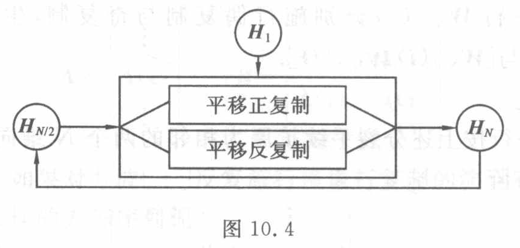

<!-- source-page: 265 -->

## 10.3　Walsh 阵的二分演化

现在的问题是，能否设计出某种简单的二分手续，以将方波 $W_1=[+]$ 逐步演化

<!-- 本页末句续 PDF 266。 -->

<!-- source-page: 266 -->

[原页](../../source-images/pdf-266.jpeg)

<!-- source-page: 266 -->
<!-- 续 PDF 265，10.3。 -->

生成各阶 Walsh 方阵，即

$$
W_1\Rightarrow W_2\Rightarrow W_4\Rightarrow W_8\Rightarrow\cdots.
$$

这里箭头“$\Rightarrow$”表示所要设计的二分演化手续。

二分手续应当是简单而有效的。对于矩阵演化，什么样的演化手续最为简单呢？

### 10.3.1　矩阵的对称性复制

就矩阵演化来说，最为简单的演化手续是对称性复制。这种演化手续易于在计算机上实现，而且有丰富的文化内涵。

大自然的基本设计是美的，美意味着简单，美意味着对称。本节所考察的对称性分镜像对称与平移对称两种，它们在某种意义上互为反对称。镜像对称又分偶对称与奇对称，平移对称又分正对称与反对称。此外，矩阵的复制对象分矩阵行与矩阵块两种情况，这样，Walsh 方阵的对称性复制可考虑表 10.1 所列的四种方案。

表 10.1

| 对称性 | 复制对象：矩阵行 | 复制对象：矩阵块 |
|---|---|---|
| 镜像对称 | 镜像行复制 | 镜像块复制 |
| 平移对称 | 平移行复制 | 平移块复制 |

人们自然关心，矩阵的上述几种对称性复制技术能否充当二分演化技术，以逐步演化生成各种 Walsh 方阵呢？

答案是令人振奋的。事实上，表 10.1 所列的四种对称性复制技术全能充当 Walsh 演化的二分手续。后文将着重考察其中的两种。

### 10.3.2　Walsh 阵的演化生成

首先考察表 10.1 中镜像行复制的演化方式。考察某个方阵 $A$，用 $A(i)$ 表示其第 $i$ 行，对 $A(i)$ 施行偶复制与奇复制，分别生成向量 $[A(i)\mathrel{\vdots}\ddot A(i)]$ 与 $[A(i)\mathrel{\vdots}\dot A(i)]$。

例如，设 $A(i)=[+\ -]$，则

$$
[A(i)\mathrel{\vdots}\ddot A(i)]=[+\ -\mathrel{\vdots}-\ +],
$$

$$
[A(i)\mathrel{\vdots}\dot A(i)]=[+\ -\mathrel{\vdots}+\ -].
$$

进一步，若 $A(i)=[+\ -\mathrel{\vdots}+\ -]$，则

$$
[A(i)\mathrel{\vdots}\ddot A(i)]=[+\ -\ +\ -\mathrel{\vdots}-\ +\ -\ +],
$$

$$
[A(i)\mathrel{\vdots}\dot A(i)]=[+\ -\ +\ -\mathrel{\vdots}+\ -\ +\ -].
$$

如果对方阵 $A$ 的每一行先后施行偶复制与奇复制两种复制手续，即可生成一个阶数倍增的方阵 $B$，这种演化手续称作**镜像行复制**，即

<!-- 本页末公式续 PDF 267。 -->

<!-- source-page: 267 -->

[原页](../../source-images/pdf-267.jpeg)

<!-- source-page: 267 -->
<!-- 续 PDF 266，10.3.2。 -->

$$
A=\begin{pmatrix}\vdots\\A(i)\\\vdots\end{pmatrix}
\longrightarrow B=\begin{pmatrix}
\vdots\\
A(i)\mathrel{\vdots}\ddot A(i)\\
A(i)\mathrel{\vdots}\dot A(i)\\
\vdots
\end{pmatrix}.
$$

人们自然会问，如果对方波 $[+]$ 反复施行镜像行复制的演化手续，使其阶数逐步倍增，将会生成什么样的方阵序列呢？

1 阶方阵 $[+]$ 仅有一行（一列），对它施行偶复制与奇复制，分别生成 $[+\mathrel{\vdots}+]$ 与 $[+\mathrel{\vdots}-]$，两者合成在一起，结果生成一个 2 阶方阵

$$
[+]\longrightarrow\begin{pmatrix}+&+\\+&-\end{pmatrix}.
$$

对所生成的 2 阶方阵的两行 $[+\ +]$ 与 $[+\ -]$ 分别施行镜像复制的偶复制与奇复制，进一步生成一个 4 阶方阵

$$
\begin{pmatrix}+&+\\+&-\end{pmatrix}\longrightarrow
\begin{pmatrix}
+&+&+&+\\
+&+&-&-\\
+&-&-&+\\
+&-&+&-
\end{pmatrix}.
$$

继续对所生成的 4 阶方阵施行镜像行复制，获得如下 8 阶方阵，即

$$
\begin{pmatrix}
+&+&+&+\\
+&+&-&-\\
+&-&-&+\\
+&-&+&-
\end{pmatrix}\longrightarrow
\begin{pmatrix}
+&+&+&+&+&+&+&+\\
+&+&+&+&-&-&-&-\\
+&+&-&-&-&-&+&+\\
+&+&-&-&+&+&-&-\\
+&-&-&+&+&-&-&+\\
+&-&-&+&-&+&+&-\\
+&-&+&-&-&+&-&+\\
+&-&+&-&+&-&+&-
\end{pmatrix}.
$$

<!-- 排版说明：原页中演化所得的 4 阶、8 阶方阵每两行之间有一条分组虚线；上式保留全部元素及其行列顺序。 -->

上述方阵与 10.2.2 小节列出的 Walsh 方阵相比较，两者完全一致。可以证明，从方波 $[+]$ 出发，运用镜像行复制的演化技术可以生成 Walsh 方阵序列。这个 Walsh 方阵等价于 10.1.2 小节的原始定义。

Walsh 方阵有多种排序方式。镜像行复制生成的 Walsh 方阵特别称作 **Walsh 阵**。

### 10.3.3　Walsh 阵的演化机制

Walsh 阵的演化方式从属于二分演化模式。事实上，这里从初态 $W_1=[+]$ 出发，将 $W_{N/2}$ 加工成 $W_N$ 的二分手续如下。

（1）分裂手续。

<!-- 分裂手续的具体公式续 PDF 268。 -->

<!-- source-page: 268 -->

[原页](../../source-images/pdf-268.jpeg)

<!-- source-page: 268 -->
<!-- 续 PDF 267，10.3.3 的（1）分裂手续。 -->

对 $W_{N/2}$ 的每一行 $W_{N/2}(i)$ 分别施行偶复制与奇复制，生成两个 $N$ 维向量 $[W_{N/2}(i)\mathrel{\vdots}\ddot W_{N/2}(i)]$ 与 $[W_{N/2}(i)\mathrel{\vdots}\dot W_{N/2}(i)]$。

（2）合成手续。

将 $W_{N/2}$ 的每一行按上述分裂手续扩展为相邻的两个 $N$ 维向量，从而将 $W_{N/2}$ 扩展成为一个 $N$ 阶方阵

$$
W_N=\begin{pmatrix}
\vdots&\vdots\\
W_{N/2}(i)\mathrel{\vdots}&\ddot W_{N/2}(i)\\
W_{N/2}(i)\mathrel{\vdots}&\dot W_{N/2}(i)\\
\vdots&\vdots
\end{pmatrix},
$$

如此反复地做下去。这种二分演化机制如图 10.3 所示。如 10.1.2 小节所看到的，Walsh 函数的表达式很复杂，直接利用表达式生成 Walsh 函数很困难。然而依据上述镜像行复制的演化方式，一蹴而就地派生出一个又一个 Walsh 方阵，从而得到一族又一族 Walsh 函数。Walsh 函数的数目是逐族倍增的，这是一种快速生成算法。

图 10.3

> 图中文字与图意（转录）：初态 $W_1$ 从上方进入；$W_{N/2}$ 分成“逐行偶复制”和“逐行奇复制”两路，合成为 $W_N$；$W_N$ 经下方反馈线返回 $W_{N/2}$。

### 10.3.4　Hadamard 阵的演化生成

上述镜像行复制的演化方式能否进一步简化呢？

从研究者的角度来说，平移对称比镜像对称更易于接受，而矩阵块比矩阵行更易于把握，现在进一步考察表 10.1 所列的平移块复制的演化方式。

考察某个方阵 $A$，直接对它施行平移正复制与平移反复制，分别生成 $[A\mathrel{\vdots}A]$ 与 $[A\mathrel{\vdots}-A]$，两者合成在一起，得阶数倍增的方阵

$$
B=\begin{pmatrix}A&A\\A&-A\end{pmatrix}.
$$

这种演化方式称作**平移块复制**。

仍然从方波 $[+]$ 出发，反复施行平移块复制的演化方式，所生成的一系列方阵称作 **Hadamard 阵**。$N$ 阶 Hadamard 阵记作 $H_N$。特别地，$H_1=[+]$。

显然，Hadamard 阵的演化机制同样从属于二分演化模式，如图 10.4 所示。

按平移块复制的演化方式，如果将 $H_N$ 对分为 4 块，则其左上、右上与左下三块均为 $H_{N/2}$，而其右下则为 $-H_{N/2}$，即 Hadamard 阵有形式简单的递推表达式

<!-- 本页末公式续 PDF 269。 -->

<!-- source-page: 269 -->

[原页](../../source-images/pdf-269.jpeg)

<!-- source-page: 269 -->
<!-- 续 PDF 268，10.3.4。 -->

图 10.4

> 图中文字与图意（转录）：初态 $H_1$ 从上方进入；$H_{N/2}$ 分成“平移正复制”和“平移反复制”两路，合成为 $H_N$；$H_N$ 经下方反馈线返回 $H_{N/2}$。

$$
H_N=\begin{pmatrix}H_{N/2}&H_{N/2}\\H_{N/2}&-H_{N/2}\end{pmatrix},\quad N=2,4,8,\cdots.
\tag{10.3.1}
$$

可见，Hadamard 阵的演化过程是简单的。事实上，从方波 $[+]$ 出发，按式（10.3.1）反复施行演化手续，有

$$
H_1=[+],
$$

$$
H_2=\begin{pmatrix}H_1&H_1\\H_1&-H_1\end{pmatrix}=\begin{pmatrix}+&+\\+&-\end{pmatrix},
$$

$$
H_4=\begin{pmatrix}H_2&H_2\\H_2&-H_2\end{pmatrix}=\begin{pmatrix}
+&+&+&+\\
+&-&+&-\\
+&+&-&-\\
+&-&-&+
\end{pmatrix},
$$

$$
H_8=\begin{pmatrix}H_4&H_4\\H_4&-H_4\end{pmatrix}=\begin{pmatrix}
+&+&+&+&+&+&+&+\\
+&-&+&-&+&-&+&-\\
+&+&-&-&+&+&-&-\\
+&-&-&+&+&-&-&+\\
+&+&+&+&-&-&-&-\\
+&-&+&-&-&+&-&+\\
+&+&-&-&-&-&+&+\\
+&-&-&+&-&+&+&-
\end{pmatrix}.
$$

<!-- 排版说明：原页 H_4、H_8 的元素阵用横、竖虚线各对分为四块；上式保留全部元素及其行列顺序。 -->

如此继续下去，可以证明，这样演化生成的 Hadamard 阵同样是一种 Walsh 方阵。这里的 Hadamard 阵同 Walsh 阵相比较，两者只是行（列）的排序方式不同而已。

进一步考察矩阵元素的递推关系。前已指出，如果将矩阵 $H_N$ 对分为 4 块，则其左上、右上与左下 3 块均为 $H_{N/2}$，而右下块则为 $-H_{N/2}$。记 $H_N(i,j)$ 为矩阵 $H_N$ 第 $i$ 行第 $j$ 列的元素，则上下两组**平移对** $(i,j)$、$(i,N/2+j)$ 与 $(N/2+i,j)$、$(N/2+i,N/2+j)$ 的矩阵元素有定理 10.1 所述的关系。

**定理 10.1**　对于 $0\leqslant i,j\leqslant N/2-1$，有

$$
\begin{aligned}
H_N(i,j)&=H_N(i,N/2+j)=H_N(N/2+i,j)\\
&=-H_N(N/2+i,N/2+j)=H_{N/2}(i,j).
\end{aligned}
$$

<!-- source-page: 270 -->

[原页](../../source-images/pdf-270.jpeg)

<!-- source-page: 270 -->
<!-- 续 10.3.4。 -->

现在基于 Hadamard 阵的上述表达式设计 Walsh 变换的快速算法 FWT。FWT 的设计同样从属于二分演化模式。

---

## 相关原页校注（agent 补充）

以下校注来自本节覆盖的原页，可能也涉及同页相邻小节；原文照录与校正说明分开保留。

### 原书 PDF 页 270 的校注

[完整原页转录](../pages/pdf-270.md) · [原页图像](../../source-images/pdf-270.jpeg)

校注记录：CH10-E002。

> 校注（agent 补充，CH10-E002）：原文“对称正交阵”照录。依本章未归一化的 $\pm1$ 元素定义，$H_N^\mathsf{T}H_N=NI$，$N>1$ 时并非通常定义下满足 $Q^\mathsf{T}Q=I$ 的正交矩阵；准确地说其行列两两正交，$H_N/\sqrt N$ 才是正交矩阵。原页逆变换中的 $1/N$ 因子与该定义一致。本项是原书术语疑误，不是 OCR 错误。

## 本节覆盖原页的校注记录

下列记录按原页关联，含同页相邻小节的校注；计算时同时读取上文校注和完整原页。

- `CH10-E002`：原书 PDF 页 270
