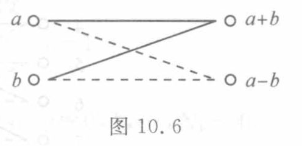
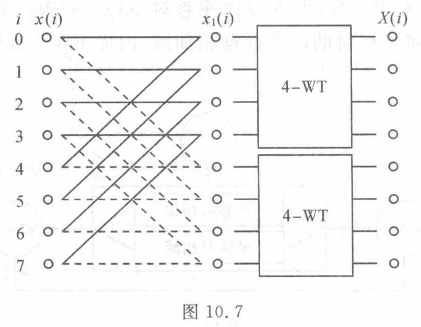
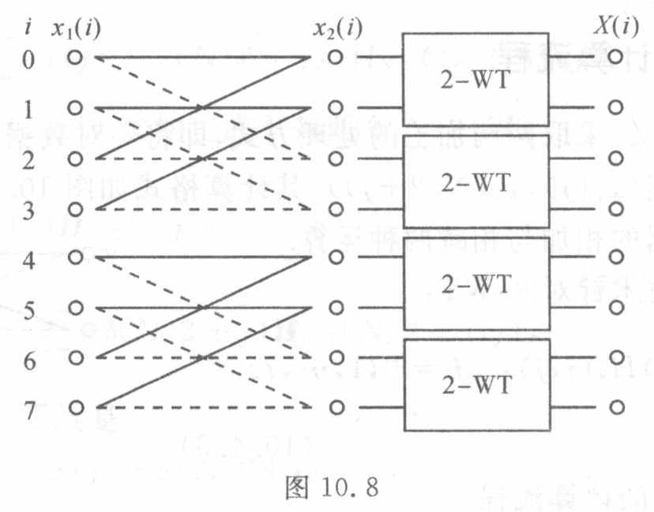
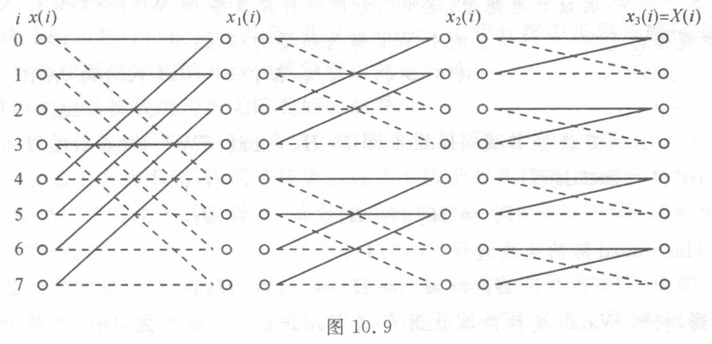

<!-- source-page: 272 -->

### 10.4.3　FWT 的计算流程

二分手续（10.4.2）采取两两加工的处理方式，即将一对数据 $(x(j),x(N/2+j))$ 加工成一对新的数据 $(x_1(j),x_1(N/2+j))$，其计算格式如图 10.6 所示。这里分别用实线与虚线区分数据的相加与相减两种运算。

图 10.6

> 图中文字与图意（转录）：左端输入从上到下为 $a$、$b$，右端输出从上到下为 $a+b$、$a-b$。输入至上方输出的两条线为实线，输入至下方输出的两条线为虚线，形成交叉的两两计算格式。

现在运用二分技术针对 8-WT：

$$
X(i)=\sum_{j=0}^{7}x(j)H_8(i,j),\quad i=0,1,\cdots,7.
\tag{10.4.3}
$$

具体显示前述 FWT 的计算流程。

**步 1**　施行 $N=8$ 的二分手续（10.4.2），即

$$
x_1(0)=x(0)+x(4),\quad x_1(4)=x(0)-x(4),
$$

<!-- 步 1 的后续算式续 PDF 273。 -->

> 校注（agent 补充）：原页“使问题的的规模减半”重复“的”，上文照录。

<!-- source-page: 273 -->

[原页](../../source-images/pdf-273.jpeg)

<!-- source-page: 273 -->
<!-- 续 PDF 272，10.4.3 步 1。 -->

$$
\begin{aligned}
x_1(1)&=x(1)+x(5),& x_1(5)&=x(1)-x(5),\\
x_1(2)&=x(2)+x(6),& x_1(6)&=x(2)-x(6),\\
x_1(3)&=x(3)+x(7),& x_1(7)&=x(3)-x(7),
\end{aligned}
$$

将所给 8-WT 加工成 2 个 4-WT。借助于图 10.6 的计算格式，这一演化步骤如图 10.7 所示。

图 10.7

> 图中文字与图意（转录）：从左到右的列标为 $i$、$x(i)$、$x_1(i)$、$X(i)$。$i$ 的行标为 0、1、2、3、4、5、6、7；两组模块均标为 4-WT。第一个加工阶段将行对 $(0,4)$、$(1,5)$、$(2,6)$、$(3,7)$ 相加减，所得 $x_1(i)$ 的前四项、后四项分别接入一个 4-WT，右端输出 $X(i)$。

**步 2**　对 2 个 4-WT 分别施行 $N=4$ 的二分手续（10.4.2），即

$$
\begin{aligned}
x_2(0)&=x_1(0)+x_1(2),& x_2(2)&=x_1(0)-x_1(2),\\
x_2(1)&=x_1(1)+x_1(3),& x_2(3)&=x_1(1)-x_1(3)
\end{aligned}
$$

与

$$
\begin{aligned}
x_2(4)&=x_1(4)+x_1(6),& x_2(6)&=x_1(4)-x_1(6),\\
x_2(5)&=x_1(5)+x_1(7),& x_2(7)&=x_1(5)-x_1(7),
\end{aligned}
$$

进一步加工出关于数据 $\{x_2(j)\}$ 的 4 个 2-WT。这一演化步如图 10.8 所示。

图 10.8

> 图中文字与图意（转录）：从左到右的列标为 $i$、$x_1(i)$、$x_2(i)$、$X(i)$。$i$ 的行标为 0、1、2、3、4、5、6、7；四组模块均标为 2-WT。该阶段将行对 $(0,2)$、$(1,3)$、$(4,6)$、$(5,7)$ 相加减，所得 $x_2(i)$ 每两项接入一个 2-WT，右端输出 $X(i)$。

**步 3**　再对每个 2-WT 分别施行二分手续，即

<!-- 步 3 的算式续 PDF 274。 -->

<!-- source-page: 274 -->

[原页](../../source-images/pdf-274.jpeg)

<!-- source-page: 274 -->
<!-- 续 PDF 273，10.4.3 步 3。 -->

$$
\begin{aligned}
x_3(0)&=x_2(0)+x_2(1),& x_3(1)&=x_2(0)-x_2(1),\\
x_3(2)&=x_2(2)+x_2(3),& x_3(3)&=x_2(2)-x_2(3),\\
x_3(4)&=x_2(4)+x_2(5),& x_3(5)&=x_2(4)-x_2(5),\\
x_3(6)&=x_2(6)+x_2(7),& x_3(7)&=x_2(6)-x_2(7).
\end{aligned}
$$

加工得出关于数据 $\{x_3(i)\}$ 的 8 个 1-WT，即得所求结果：

$$
X(i)=x_3(i),\quad i=0,1,\cdots,7.
$$

上述算法 FWT，其计算模型与输入数据同步进行加工，在将计算模型从 8-WT 加工成 1-WT 的同时，输入数据被加工成输出结果 $\{X(i)\}$。综合上述各步即得 FWT 的数据加工流程图 10.9。

图 10.9

> 图中文字与图意（转录）：列标依次为 $i$、$x(i)$、$x_1(i)$、$x_2(i)$、$x_3(i)=X(i)$，行标为 0、1、2、3、4、5、6、7。第一阶段配对 $(0,4)$、$(1,5)$、$(2,6)$、$(3,7)$；第二阶段配对 $(0,2)$、$(1,3)$、$(4,6)$、$(5,7)$；第三阶段配对 $(0,1)$、$(2,3)$、$(4,5)$、$(6,7)$。每对按图 10.6 的实线相加、虚线相减计算，三步后由 $x_3(i)$ 得到 $X(i)$。

---

## 相关原页校注（agent 补充）

以下校注来自本节覆盖的原页，可能也涉及同页相邻小节；原文照录与校正说明分开保留。

### 原书 PDF 页 274 的校注

[完整原页转录](../pages/pdf-274.md) · [原页图像](../../source-images/pdf-274.jpeg)

校注记录：CH10-E004。

> 校注（agent 补充，CH10-E004）：式（10.4.4）原印 $l=1,2,\cdots,2^k$，上文照录。此式用 $(l-1)N_{k-1}$ 定位第 $k-1$ 步的数据段，该步只有 $2^{k-1}$ 段，因此上限应为 $2^{k-1}$。例如 $N=8,k=1$ 时，按原印取 $l=2$ 会访问从索引 8 开始的数据，越过 $0,\ldots,7$。本页前文用于描述第 $k$ 步结果分段数的 $2^k$ 则正确。下一页算法 10.1 引用此式，也受该范围疑误影响。[原式放大裁片](../assets/ch10/erratum-p274-range.png)。

## 本节覆盖原页的校注记录

下列记录按原页关联，含同页相邻小节的校注；计算时同时读取上文校注和完整原页。

- `CH10-E003`：原书 PDF 页 272
- `CH10-E004`：原书 PDF 页 274
