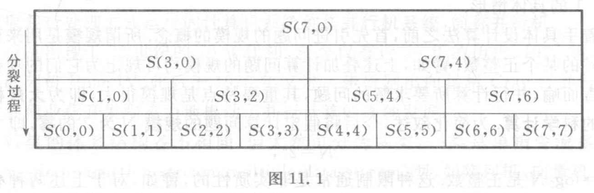
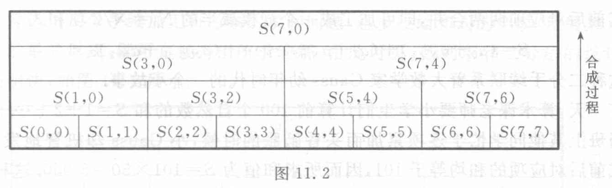
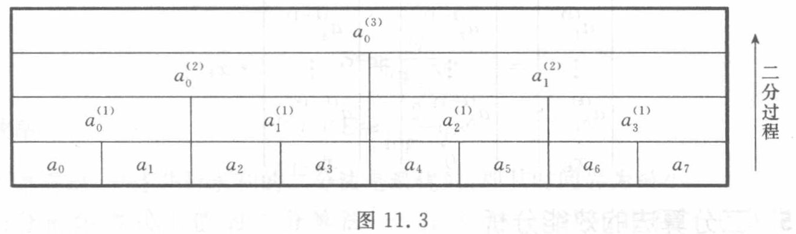
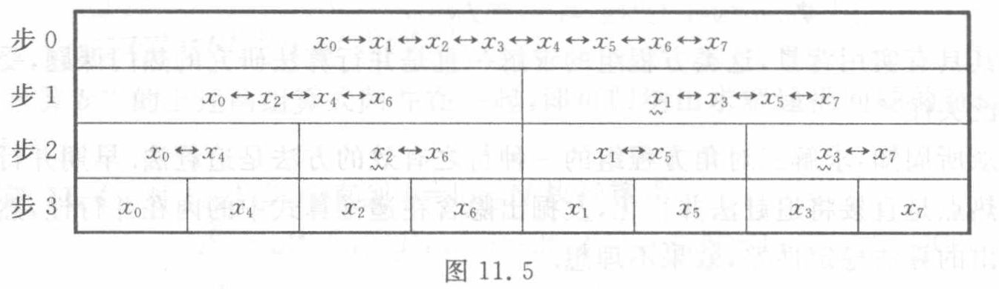

<!-- source-page: 276 -->

# \*第 11 章　并行算法设计：递推计算并行化

从世界上第一台电子计算机的问世至今仅有六七十年，在这短短的时间里，计算机的基本元件从电子管、晶体管发展到了大规模集成电路，计算机的运算速度以指数形式迅速增长。然而人们对高性能计算的需求是永无止境的，在诸如能源、气象、军事、人工智能和生命科学等许多领域，都迫切要求提供性能更高、速度更快的新型计算机系统。

今天，计算机系统正面临深刻的变革，传统的 von Neumann 格局已经被突破，采用并行化结构的并行机正日益普及，并且在科学与工程计算中正发挥着越来越重要的作用。计算机系统结构的并行化蕴涵着提高运算速度和增加信息存储量的巨大潜力，计算机的更新换代展现出无限美好的前景。

新一代的计算机——并行机系统迫切要求提供算法上的支持。并行机与传统计算机的数据加工方式不同，因而传统算法往往不适于在并行机上运用。科学计算的实践表明，如果一个算法的并行性差，就会使并行机的效率大幅度下降，甚至从亿次机降为百万次机。

需要强调的是，并行算法的设计与并行机的研制具有同等重要性。正如一位著名学者所尖锐指出的：没有好的并行算法的支撑，超级计算机只是一堆“超级废铁”。

计算机发展的并行化趋势，必然会促使算法设计的并行化。随着并行机系统的日益普及，学习和研究适应并行机系统的并行算法，已是科学计算工作者的当务之急。

## 11.1　什么是并行计算

### 11.1.1　一则寓言故事

20 世纪 80 年代初国产银河巨型机问世，国内掀起一股并行算法热。究竟什么是并行计算呢？这里先讲一个生动的寓言故事。

相传很久很久以前，有一个年轻的国王名叫川行，是个数学天才。川行爱上了邻国聪颖美丽且爱好数学的公主邱比郑南。

川行差人前往邻国求婚。公主答应了这桩婚事，但提出了一项先决条件，她要亲自考核一下川行的数学才能。公主的考题是，针对一个 15 位数求出它的真因子。

接到试题之后，川行立即忙碌起来，一个数接一个数地试算。川行有数学才能，算得很快，然而由于 15 位数的真因子可能是个 8 位数，找出全部真因子要花费上亿次

<!-- 本页末句续 PDF 277。 -->

<!-- source-page: 277 -->

[原页图像](../../source-images/pdf-277.jpeg)

<!-- source-page: 277 -->
<!-- 接 PDF 276 末句。 -->

整数除法，总的计算量大得惊人。

川行感到很为难。这是一道“大数分解”的数学难题，如何才能尽快地找出它的答案呢？

川行有个足智多谋的宰相名叫孔幻士。孔幻士提出了一个计谋：将全国老百姓按军、师、团、营、连、排、班、兵 8 个等级编号，每 10 个兵组成 1 班，10 个班为 1 排，10 个排为 1 连……10 个师为 1 军，10 个军全归川行统帅。这样，在编的每个老百姓都有一个 8 位十进制的编号。完成这种编制以后，通知全国老百姓用自己的编号去除公主给出的 15 位数，能除尽的立即上报，给予重奖。这样很快找出了所有的真因子，而川行则依靠全国老百姓的帮助赢得了公主的爱情。

这则寓言浅显易懂，但意味深长。公主“邱比郑南”是“求比证难”的谐音。大数分解问题的可解性不言而喻，但具体求解却很困难。国王“川行”是“串行”的谐音。串行计算的效率很低，往往不能承担大规模的计算工程。宰相“孔幻士”则是“空换时”的谐音，其含义是，并行计算的设计思想是用扩大空间、增加处理机台数为代价来换取计算时间的节省。“空换时”是并行计算的基本策略。

这则故事所涉及的大数分解问题有重大的学术价值，求解这类问题的计算量随着“大数”的增大而急剧增长。譬如，计算一个 155 位数的真因子，如果用串行算法进行计算，即使用每秒亿次的巨型机去承担，也得要连续工作上万年。当然这是没有实际意义的。1990 年 6 月 20 日美国报道了一则消息：贝尔实验室用 1 000 台处理机并行计算，仅仅花费了几个月的时间，就成功地找出一个 155 位数的 3 个真因子，它们分别是 7 位数、49 位数和 99 位数。这是科学计算的一项重大突破。当年我国《科技日报》评价这项成就为“1990 年世界十大科技成就之一”。

### 11.1.2　同步并行算法的设计策略

采取并行处理方式运行的计算机系统称作并行机系统，简称并行机。

并行机出现于 20 世纪的 70 年代初，至今仅有近 50 年的历史。1972 年，美国研制成功阵列机 Illiac IV，此后于 1976 年又进一步研制出向量机 Cray-1。并行机的更新换代和商业化开发强有力地推动了并行计算的蓬勃发展。

并行机的体系结构各不相同，但大致可分为两类：一类是单指令流多数据流 SIMD（single instruction stream, multiple data stream）型，如阵列机、向量机；另一类是多指令流多数据流 MIMD（multiple instruction stream, multiple data stream）型，称作多处理机。

针对 SIMD 与 MIMD 两类并行机系统，并行算法大致分为同步与异步两类。本章仅研究同步并行算法。

所谓同步性，是指不同处理机在同一时刻针对不同数据执行同一种操作。同步并行计算的典型例子是向量计算。

<!-- source-page: 278 -->

[原页图像](../../source-images/pdf-278.jpeg)

<!-- source-page: 278 -->

同步并行计算的基本策略是“分而治之”。所谓分而治之，就是将所考察的计算问题分裂成若干较小的子问题，并将这些子问题映射到多台处理机上去各自完成，然后再将分散的结果拼装成所求的解。

**值得指出的是，在同步并行算法设计时，“分而治之”的设计原则往往被误解为整体上的先分后治，而将“分”与“治”两个环节截然分开。这种算法设计技术就是所谓的倍增技术。**

**其实，在并行计算过程中，“分”与“治”是矛盾的两个方面，它们既是对立的，又是统一的。基于这种理解我们推荐了同步并行算法设计的二分技术。**

需要强调的是，为避免局限于具体的机器特征而束缚了并行算法的研究，人们提出了理想计算机的概念。“理想化”的假设包括：任何时刻可以使用任意多台处理机，任何时刻有任意多个主存单元可供使用，处理机同主存间的数据通信时间可以忽略不计。

## 11.2　叠加计算

叠加计算是一类最简单、最基本的计算模型。本章所研究的叠加计算包括数列求和

$$
S=\sum_{i=0}^{N-1}a_i
\tag{11.2.1}
$$

与多项式求值

$$
P=\sum_{i=0}^{N-1}a_i x^i.
\tag{11.2.2}
$$

上述两种叠加计算模型之间有着紧密的联系。事实上，和式（11.2.1）是式（11.2.2）取 $x=1$ 的具体情形。

在着手具体设计算法之前，首先引进问题的规模的概念。所谓规模是用来刻画问题“大小”的某个正整数。譬如，上述叠加计算问题的规模均可定为它们的项数 $N$。

不言而喻，并行计算所要求解的问题，其重要特点是规模很大，即为大规模或超大规模的科学计算。为简化叙述，今后将假定计算问题的规模 $N$ 为 2 的幂，即

$$
N=2^n,
$$

式中，$n=\log_2 N$ 是正整数。这种限制通常是非实质性的，譬如，对于上述两种叠加计算，只要适当地补充几个零系数 $a_i$，总可以将规模 $N$ 扩充为 $N=2^n$ 的形式。后文将会看到，这种扩充对于算法运行时间的影响几乎可以忽略不计。本章所考察的其他计算问题也可作类似的处理。

### 11.2.1　倍增技术

有些学者认为，倍增技术是设计同步并行算法的一项基本技术。这项设计技术反

<!-- 本页末句续 PDF 279。 -->

<!-- source-page: 279 -->

[原页图像](../../source-images/pdf-279.jpeg)

<!-- source-page: 279 -->
<!-- 接 PDF 278 末句。 -->

复地将计算问题分裂成具有同等规模的两个子问题。在问题逐步分裂的过程中，子问题的个数是逐步倍增的，倍增法因此而得名。

倍增法的设计基于这样的考虑，如果将各个子问题适当地映射到多台处理机上，即可实现计算过程的并行化。

现在就用简单的数列求和问题（11.2.1）考察倍增技术的设计原理和设计方法。为此，引进和式

$$
S(i,j)=\sum_{k=j}^{i}a_k.
$$

显然，问题（11.2.1）的已给数据与所求结果均可用这种和式来表达：

$$
\begin{gathered}
a_i=S(i,i),\quad i=0,1,\cdots,N-1;\\
S=S(N-1,0).
\end{gathered}
$$

倍增法的设计过程含分裂与合成两个环节。分裂过程将所给和式 $S(N-1,0)$ 逐步“一分为二”，从而拆成若干个子和式。这种分裂过程的特点是，子和式的个数是逐步倍增的。

$$
\begin{aligned}
S(N-1,0)
&=S\left(N-1,\frac{N}{2}\right)+S\left(\frac{N}{2}-1,0\right)\\
&=S\left(N-1,\frac{3}{4}N\right)+S\left(\frac{3}{4}N-1,\frac{N}{2}\right)+S\left(\frac{N}{2}-1,\frac{N}{4}\right)+S\left(\frac{N}{4}-1,0\right)\\
&=\cdots.
\end{aligned}
$$

由于在和式二分的上述过程中，每个子和式的项数逐次减半，因而最终可拆成每段仅含两项的最简形式

$$
S(N-1,0)=S(N-1,N-2)+S(N-3,N-4)+\cdots+S(1,0).
$$

图 11.1 取 $N=8$ 自顶向下地描述了倍增法的分裂过程。

图 11.1　原图的“分裂过程”箭头自上向下。各层由左至右的符号标签为：

| 层次（由上至下） | 原图中的子和式 |
| --- | --- |
| 1 | $S(7,0)$ |
| 2 | $S(3,0)$，$S(7,4)$ |
| 3 | $S(1,0)$，$S(3,2)$，$S(5,4)$，$S(7,6)$ |
| 4 | $S(0,0)$，$S(1,1)$，$S(2,2)$，$S(3,3)$，$S(4,4)$，$S(5,5)$，$S(6,6)$，$S(7,7)$ |

每个上层区间对应下层相邻的两个子区间。（本段及上表为原图标签与结构的文字转录。）

将所给和式拆成若干个子和式后，可将这些子和式分配给各台处理机去并行计算。问题在于，基于这些子和式的计算，如何得出所求的结果呢？

倍增法的合成过程是将所拆出的各个子和式的值再逐步“合二为一”，最后归并出所给和式的值。这种归并过程的特点是数据量逐次减半。图 11.2 自底向上地描述了倍增法的合成过程。

<!-- source-page: 280 -->

[原页图像](../../source-images/pdf-280.jpeg)

<!-- source-page: 280 -->

图 11.2　原图“合成过程”箭头自下向上。各层从左至右的符号标签为：

| 层次（由上至下） | 原图中的子和式 |
| --- | --- |
| 1 | $S(7,0)$ |
| 2 | $S(3,0)$，$S(7,4)$ |
| 3 | $S(1,0)$，$S(3,2)$，$S(5,4)$，$S(7,6)$ |
| 4 | $S(0,0)$，$S(1,1)$，$S(2,2)$，$S(3,3)$，$S(4,4)$，$S(5,5)$，$S(6,6)$，$S(7,7)$ |

每层中相邻的两个子区间向上合成为一个区间。（本段及上表为原图标签与结构的文字转录。）

现在列出倍增法的算法步骤（图 11.2）。

倍增法的第 1 步是利用所给的 $N$ 个数据（它们均可视为一项和式）$a_i=S(i,i)$ 求出 2 项和式的值，而得出 $N_1=N/2$ 个中间结果：

$$
S(2i+1,2i)=S(2i+1,2i+1)+S(2i,2i),\quad i=0,1,\cdots,N_1-1.
$$

第 2 步再用两项和式求出 4 项和式的值，而有 $N_2=N/4$ 个中间结果：

$$
S(4i+3,4i)=S(4i+3,4i+2)+S(4i+1,4i),\quad i=0,1,\cdots,N_2-1.
$$

保持和式项数逐步倍增，而数据量则为逐次减半这个特征，其第 $k$ 步所承担的工作是，用 $2^{k-1}$ 项和式求出 $2^k$ 项和式的值，从而得出 $N_k=N/2^k$ 个中间结果：

$$
\begin{gathered}
S(2^ki+2^k-1,2^ki)=S(2^ki+2^k-1,2^ki+2^{k-1})+S(2^ki+2^{k-1}-1,2^ki),\\
i=0,1,\cdots,N_k-1.
\end{gathered}
\tag{11.2.3}
$$

如此做 $n=\log_2 N$ 步即可得出所求的和值：

$$
S(N-1,0)=S(N-1,N_1)+S(N_1-1,0).
$$

综上所述，数列求和（11.2.1）的倍增法可表述为算法 11.1。

**算法 11.1**　对 $k=1,2,\cdots$ 直到 $n=\log_2 N$ 执行算式（11.2.3），则所求的和值为 $S=S(N-1,0)$。

倍增法的分裂过程是反复将和式一分为二，在这一过程中，子和式的个数是逐步倍增的；与此相反，其合成过程是反复将数据合二为一，在合成过程中，数据量则为逐次减半。正是由于倍增法的分裂过程与合成过程相对峙，这种技术不便于实际运用。

### 11.2.2　二分手续

为使并行算法设计的原理与方法简单而和谐，这里推荐一种设计技术——二分技术。

**二分技术的设计原理是，反复地将所给计算问题加工成规模减半的同类问题，直到规模足够小（通常当规模为 1）时直接得出问题的解。**

**需要强调的是，与倍增技术不同，二分技术不是着眼于问题的分裂，而是立足于问题的加工。今后所说的二分手续，是指将问题规模减半的加工手续。**

譬如，对于 $N$ 项和式

$$
S=\sum_{i=0}^{N-1}a_i,
$$

<!-- 本页论述续 PDF 281。 -->

<!-- source-page: 281 -->

[原页图像](../../source-images/pdf-281.jpeg)

<!-- source-page: 281 -->
<!-- 接 PDF 280 的和式。 -->

若将其前后对应项两两合并，即可加工成一个规模减半的 $N_1=N/2$ 项和式

$$
S=(a_0+a_{N-1})+(a_1+a_{N-2})+\cdots+(a_{N/2-1}+a_{N/2}).
$$

这种二分手续联系着大数学家 Gauss 幼年时代的一个小故事。

有一天，算术课老师要小学生们计算前 100 个自然数的和 $S=1+2+\cdots+99+100$。当班上其他同学忙于逐项累加而头昏脑胀的时候，小 Gauss 却机智地发现，所给和式前后对应项的和均等于 101，因而所求和值为 $S=101\times50=5\,050$。这种简捷的快速算法可以视作二分手续的巧妙应用。

### 11.2.3　数列求和的二分法

再考察所给和式（10.2.1），容易看出，如果将其奇偶项两两合并，即可使其规模变成 $N_1=N/2$，即

$$
S=\sum_{i=0}^{N_1-1}(a_{2i}+a_{2i+1})=\sum_{i=0}^{N_1-1}a_i^{(1)}.
$$

为此，所要施行的运算手续是

$$
a_i^{(1)}=a_{2i}+a_{2i+1},\quad i=0,1,\cdots,N_1-1.
$$

注意到这样加工出的求和问题

$$
S=\sum_{i=0}^{N_1-1}a_i^{(1)}
$$

与所给问题（10.2.1）属于同一类型，所不同的只是规模缩减了一半，因此上述加工手续是一种二分手续。

反复施行这种二分手续，二分 $k$ 次后和式的项数压缩成 $N_k=N/2^k$，即

$$
S=\sum_{i=0}^{N_k-1}a_i^{(k)},
$$

式中

$$
a_i^{(k)}=a_{2i}^{(k-1)}+a_{2i+1}^{(k-1)},\quad i=0,1,\cdots,N_k-1.
\tag{11.2.4}
$$

这样二分 $n=\log_2 N$ 次后，所给和式最终退化为一项，从而直接得出所求的和值 $S$。于是有数列求和的二分算法 11.2。

**算法 11.2**　对 $k=1,2,\cdots$ 直到 $n=\log_2 N$ 执行算式（11.2.4），结果有

$$
S=a_0^{(n)}.
$$

这一算法显然可以向量化。事实上，算式（11.2.4）可以表为向量形式：

$$
\begin{pmatrix}
a_0^{(k)}\\
a_1^{(k)}\\
\vdots\\
a_{N_k-1}^{(k)}
\end{pmatrix}
=
\begin{pmatrix}
a_0^{(k-1)}\\
a_2^{(k-1)}\\
\vdots\\
a_{N_{k-1}-2}^{(k-1)}
\end{pmatrix}
+
\begin{pmatrix}
a_1^{(k-1)}\\
a_3^{(k-1)}\\
\vdots\\
a_{N_{k-1}-1}^{(k-1)}
\end{pmatrix}.
$$

> 校注（agent 补充，CH11-E001）：本页两处回引均印作“（10.2.1）”，已照录；从本节的数列求和定义及上下文判断，应回引本章的式（11.2.1）。这是原书交叉引用疑误，不是 OCR 改写。

<!-- source-page: 282 -->

[原页图像](../../source-images/pdf-282.jpeg)

<!-- source-page: 282 -->

反复运用二分手续加工所考察的求和问题，逐步压缩和式的规模，最终加工成规模为 1 的最简形式，即可直接得出所求的解。由此可见，数列求和二分法的设计过程简洁而明快，如图 11.3 所示。

图 11.3　原图“二分过程”箭头自下向上。各层从左至右的符号标签为：

| 层次（由下至上） | 原图中的数据 |
| --- | --- |
| 初始层 | $a_0$，$a_1$，$a_2$，$a_3$，$a_4$，$a_5$，$a_6$，$a_7$ |
| 第 1 次二分 | $a_0^{(1)}$，$a_1^{(1)}$，$a_2^{(1)}$，$a_3^{(1)}$ |
| 第 2 次二分 | $a_0^{(2)}$，$a_1^{(2)}$ |
| 第 3 次二分 | $a_0^{(3)}$ |

每次将相邻两格合为上层的一格。（本段及上表为原图标签与结构的文字转录。）

应当指出的是，上面提供的两个算法——算法 11.1 和算法 11.2，尽管思路不同，繁简互异，但却是殊途同归。事实上，式（11.2.4）与式（11.2.3）得出的是同样的结果：

$$
a_i^{(k)}=S(2^ki+2^k-1,2^ki).
$$

### 11.2.4　多项式求值的二分法

进一步讨论多项式求值问题。仿照数列求和的做法，将所给多项式（11.2.2）的奇偶项两两合并，得

$$
P=\sum_{i=0}^{N_1-1}(a_{2i}+a_{2i+1}x)x^{2i}.
$$

若令

$$
\begin{cases}
a_i^{(1)}=a_{2i}+a_{2i+1}x,\quad i=0,1,\cdots,N_1-1,\\
x_1=x^2,
\end{cases}
$$

则有

$$
P=\sum_{i=0}^{N_1-1}a_i^{(1)}x_1^i.
$$

这样加工得出的是一个以 $x_1$ 为变元的多项式，它与所给多项式（11.2.2）的类型相同，只是规模压缩了一半，因此上述手续是一项二分手续。

重复这种手续，二分 $k$ 次后所给多项式被加工成

$$
P=\sum_{i=0}^{N_k-1}a_i^{(k)}x_k^i,
$$

这里

$$
\begin{cases}
a_i^{(k)}=a_{2i}^{(k-1)}+a_{2i+1}^{(k-1)}x_{k-1},\quad i=0,1,\cdots,N_k-1,\\
x_k=x_{k-1}^2.
\end{cases}
\tag{11.2.5}
$$

这样二分 $n=\log_2 N$ 次，最终得出的系数 $a_0^{(n)}$ 即为所求多项式的值 $P$。于是，多项式求值问题（11.2.2）有多项式求值的二分算法 11.3。

**算法 11.3**　对 $k=1,2,\cdots$ 直到 $n=\log_2 N$ 执行算式（11.2.5），结果有

<!-- 算法 11.3 的结果公式续 PDF 283。 -->

<!-- source-page: 283 -->

[原页图像](../../source-images/pdf-283.jpeg)

<!-- source-page: 283 -->
<!-- 接 PDF 282 算法 11.3。 -->

$$
P=a_0^{(n)}.
$$

上述算法同样可以向量化，事实上，算式（11.2.5）可表为向量化形式：

$$
\begin{pmatrix}
a_0^{(k)}\\
a_1^{(k)}\\
\vdots\\
a_{N_k-1}^{(k)}\\
x_k
\end{pmatrix}
=
\begin{pmatrix}
a_0^{(k-1)}\\
a_2^{(k-1)}\\
\vdots\\
a_{N_{k-1}-2}^{(k-1)}\\
0
\end{pmatrix}
+
\begin{pmatrix}
a_1^{(k-1)}\\
a_3^{(k-1)}\\
\vdots\\
a_{N_{k-1}-1}^{(k-1)}\\
x_{k-1}
\end{pmatrix}\cdot x_{k-1}.
$$

### 11.2.5　二分算法的效能分析

评价一种并行算法，人们首先关心的是它的算法复杂性，即算法的运行时间（时间复杂性）与所要提供的处理机台数（空间复杂性）。并行算法设计的基本思想是用增加处理机台数的办法来换取算法运行时间的节省。处理机台数充分多时的最少运行时间称作算法的时间界，而算法的运行时间达到时间界时所需提供的（最少的）处理机台数则称作处理机台数界。

为简化分析，今后将假定每台处理机的算术运算（无论是加减还是乘除）的操作时间相同，均取单位时间。这样，在估算算法的运行时间时，只要针对各并行步骤统计运算次数即可。

对于所考察的某个并行算法，记 $T^*$ 为算法的时间界，$P^*$ 为处理机台数界，另记 $T_1$ 为串行算法的运行时间，将

$$
S=\frac{T_1}{T^*}
$$

称作该并行算法的加速比，而将

$$
E=\frac{T_1}{P^*T^*}
$$

称作其效率。

加速比与效率是评估一种并行算法的“得”与“失”的两项重要指标。加速比 $S$ 表示该并行算法在运行时间方面的节省；注意到 $P^*T^*$ 表示并行算法的总计算量，而 $T_1$ 则表示串行算法的计算量，因而效率 $E$ 刻画了该并行算法在计算量方面的损耗。

现在分析前述几种二分算法的时间界与处理机台数界。

首先考察数列求和的二分算法——算法 11.2。令式（11.2.4）的各个系数 $a_i^{(k)}$ 并行计算，则其每一步含一次运算（加法），故其时间界为

$$
T^*=n=\log_2 N.
$$

然而，为使每个 $a_i^{(k)}$ 能并行计算，第 $k$ 步按式（11.2.4）需提供 $N_k=N/2^k$ 台处理机，因此算法 11.2 的处理机台数界为

<!-- 本页末句与处理机台数界公式续 PDF 284。 -->

<!-- source-page: 284 -->

[原页图像](../../source-images/pdf-284.jpeg)

<!-- source-page: 284 -->
<!-- 接 PDF 283 的处理机台数界。 -->

$$
P^*=\max_{1\le k\le n}\frac{N}{2^k}=\frac{N}{2}.
$$

注意到数列求和问题（11.2.1）的串行算法的运行时间 $T_1=N-1$，算法 11.2 的加速比

$$
S\approx\frac{N}{\log_2 N},
$$

而其效率

$$
E\approx\frac{2}{\log_2 N}.
$$

不难看出，上述并行求和的二分法是最优的，即其时间界为最小。

再分析多项式求值的二分算法——算法 11.3。首先注意一个事实：算式（11.2.5）中的 $x_k$ 可与 $a_i^{(k)}$ 并行计算，为此只要将式 $x_k=x_{k-1}^2$ 改写成

$$
x_k=0+x_{k-1}\cdot x_{k-1}
$$

的形式。这样，算法 11.3 的每一步需做 2 次运算（一次乘法与一次加法），因而其时间界为

$$
T^*=2\log_2 N.
$$

此外，为使 $a_i^{(k)}$ 与 $x_k$ 按式（11.2.5）并行计算，第 $k$ 步需处理机 $N/2^k$ 台，因此算法 11.3 的处理机台数界为

$$
P^*=\max_{1\le k\le n}\frac{N}{2^k}=\frac{N}{2}.
$$

注意到多项式求值的串行算法（秦九韶-Horner 算法）需做 $T_1=2(N-1)$ 次运算，易知算法 11.3 的加速比及效率均与算法 11.2 相同，仍为

$$
S\approx\frac{N}{\log_2 N},\quad E\approx\frac{2}{\log_2 N}.
$$

### 11.2.6　二分算法的基本特征

本小节从最简单的计算模型——叠加计算入手，考察并行计算的二分算法的基本特征。

在设计原理上，并行的二分算法与串行的递推算法，两者的设计过程都是计算模型不断演化的过程，其区别在于，串行递推算法的规模逐次减 1，而并行二分算法的规模则为逐次减半。例如，累加求和算法的加工过程为

$N$ 项和式 $\to$ $N-1$ 项和式 $\to$ $N-2$ 项和式 $\to\cdots\to$ 1 项和式，

而二分求和算法的加工过程是

$N$ 项和式 $\Rightarrow$ $N/2$ 项和式 $\Rightarrow$ $N/4$ 项和式 $\Rightarrow\cdots\Rightarrow$ 1 项和式。

可见，串行算法与并行算法的设计思想是一脉相承的，后者可以视作是前者的延伸与发展。

从算法的结构来看，并行的二分算法与串行递推算法均具有递归结构，即将复杂

<!-- 本页末句续 PDF 285。 -->

> 校注（agent 补充，CH11-E002）：多项式算法的处理机计数按原书照录。上一页的向量形式同时更新 $N_k$ 个系数及 $x_k$，共有 $N_k+1$ 个分量；在原书所述每个分量完全同步执行一次乘法和一次加法的安排下，处理机数应计入计算 $x_k$ 的额外一台。原书此处写 $N/2^k$，可能省略了常数项或依赖未说明的调度，属处理机台数界的疑误；未据此改动原式。

<!-- source-page: 285 -->

[原页图像](../../source-images/pdf-285.jpeg)

<!-- source-page: 285 -->
<!-- 接 PDF 284 末句。 -->

计算归结为简单计算的重复。譬如数列求和计算，是将多项求和归结为简单的二项求和的重复，而多项式求值是将高次式求值归结为简单的一次式求值的重复，等等。对串行算法这里所谓“重复”意味着循环，而并行算法所指的“重复”则综合采取串行与并行两种处理方式。

从算法效能的角度来看，串行算法与并行算法各有所长，前者拥有高效率，而后者则具有高速度。不过，并行算法的高速度是以处理机台数的增加为代价的。

## 11.3　一阶线性递推

设计串行算法的一项基本技术是递推化。递推计算采取逐步推进的方式，其每一步计算都要用到前面几步的信息。正是由于这种时序性，递推计算的并行化似乎存在实质性的困难。

设计递推计算问题的并行算法，有些学者采用了倍增技术，这种设计技术从展开式入手展示了递推问题内在的并行性。

与倍增技术不同，本节所推荐的二分技术将直接开发递推算式本身的并行性，因而设计思想更简明，使用方法更简便。这种算法设计技术可广泛应用于众多类型的递推问题。

本小节着重研究一阶线性递推问题，即寻求数列 $x_i$，$i=0,1,\cdots,N-1$，使之满足

$$
\begin{cases}
x_0=b_0,\\
x_i=a_i x_{i-1}+b_i,\quad i=1,2,\cdots,N-1,
\end{cases}
\tag{11.3.1}
$$

式中，系数 $a_i,b_i$ 为已给。

值得指出的是，只要引进矩阵和向量的记号，总可以将高阶线性递推归结为上述一阶线性递推的情形。

### 11.3.1　相关链的二分手续

为了便于刻画二分法的设计思想，首先引进相关链的概念。由于递推关系式反映了变元之间的相关性和时序性，一组有序的相关变元可抽象地表述为如下形式的相关链：

$$
\cdots\to x_{i-j}\to x_i\to\cdots,
$$

其中相邻两元素 $x_i$ 与 $x_{i-j}$ 的下标之差 $j$ 称作间距。如果相关链各节的间距为定值，则将其称作步长。

对应于递推问题（11.3.1）的相关链有 $N$ 节，即

$$
x_0\to x_1\to\cdots\to x_{N-1},
$$

<!-- 本页关于相关链的论述续 PDF 286。 -->

<!-- source-page: 286 -->

[原页图像](../../source-images/pdf-286.jpeg)

<!-- source-page: 286 -->
<!-- 接 PDF 285 末尾相关链。 -->

这里步长等于 1。

设将上述相关链按其下标的奇偶拆成两条，则每条子链含 $N_1=N/2$ 节，即

$$
\begin{cases}
x_0\to x_2\to\cdots\to x_{N-2},\\
x_1\to x_3\to\cdots\to x_{N-1}.
\end{cases}
\tag{11.3.2}
$$

这样加工得出的递推问题有两个结果 $x_0,x_1$，且其步长等于 2。这是一种二分手续。

在保持结果数逐步倍增及步长逐步倍增两项基本特征的前提下反复施行这一手续，则二分 $k$ 次后得出 $2^k$ 个结果 $x_i$，$i=0,1,\cdots,2^k-1$，且步长增至 $2^k$，相应地，所给相关链被加工成 $2^k$ 条子链，每条子链含 $N_k=N/2^k$ 节，即

$$
\left\{
\begin{aligned}
&x_0\to x_{2^k}\to\cdots\to x_{N-2^k},\\
&x_1\to x_{2^k+1}\to\cdots\to x_{N-2^k+1},\\
&\qquad\vdots\\
&x_{2^k-1}\to x_{2^{k+1}-1}\to\cdots\to x_{N-1}.
\end{aligned}
\right.
\tag{11.3.3}
$$

如此二分 $n=\log_2 N$ 次后，所给相关链最终退化为每条仅含一节的最简形式

$$
x_0,x_1,\cdots,x_{N-1},
$$

从而得出所求的解。

这种以下标的奇偶分离为特征的二分手续称作奇偶二分。这是最基本的一种二分手续。

对于 $N=8$ 的具体情形，相关链的奇偶二分过程如图 11.4 所示，图中用波纹线标出每一步的新结果。

图 11.4　原图右侧箭头向下，逐层由左至右的全部相关链与波纹线标记如下：

| 层次（由上至下） | 相关链或单节 | 波纹线标出的新结果 |
| --- | --- | --- |
| 初始层 | $x_0\to x_1\to x_2\to x_3\to x_4\to x_5\to x_6\to x_7$ | 无 |
| 第 1 次二分 | $x_0\to x_2\to x_4\to x_6$；$x_1\to x_3\to x_5\to x_7$ | $x_1$ |
| 第 2 次二分 | $x_0\to x_4$；$x_2\to x_6$；$x_1\to x_5$；$x_3\to x_7$ | $x_2,x_3$ |
| 第 3 次二分 | $x_0$；$x_4$；$x_2$；$x_6$；$x_1$；$x_5$；$x_3$；$x_7$ | $x_4,x_6,x_5,x_7$ |

（上表为原图标签与结构的文字转录。）

### 11.3.2　算式的建立

现在运用消元手续具体建立上述奇偶二分法的算式。回到递推问题（11.3.1），利用它的第 $i-1$ 式从其第 $i$ 式中消去 $x_{i-1}$，得

$$
\begin{cases}
x_i=b_i^{(1)},& i=0,1,\\
x_i=a_i^{(1)}x_{i-2}+b_i^{(1)},& i=2,3,\cdots,N-1,
\end{cases}
\tag{11.3.4}
$$

式中

$$
a_i^{(1)}=a_i a_{i-1},\quad i=2,3,\cdots,N-1,
\tag{11.3.5}
$$

<!-- 系数 b_i^(1) 的定义续 PDF 287。 -->

<!-- source-page: 287 -->

[原页图像](../../source-images/pdf-287.jpeg)

<!-- source-page: 287 -->
<!-- 接 PDF 286 系数定义。 -->

$$
b_i^{(1)}=
\begin{cases}
b_i,& i=0,\\
b_i+a_i b_{i-1},& i=1,2,\cdots,N-1.
\end{cases}
\tag{11.3.6}
$$

容易看出，式（11.3.4）可按下标的奇偶拆成两个规模减半的子问题，即

$$
\begin{cases}
x_0=b_0^{(1)},\\
x_{2i}=a_{2i}^{(1)}x_{2i-2}+b_{2i}^{(1)},\quad i=1,2,\cdots,N_1-1;
\end{cases}
$$

$$
\begin{cases}
x_1=b_1^{(1)},\\
x_{2i+1}=a_{2i+1}^{(1)}x_{2i-1}+b_{2i+1}^{(1)},\quad i=1,2,\cdots,N_1-1.
\end{cases}
$$

它们分别对应于形如式（11.3.2）的奇偶相关链。

前已指出，二分 $k$ 步后加工得出的相关链式（11.3.3）含有 $2^k$ 个结果 $x_i$，$i=0,1,\cdots,2^k-1$，且其步长增至 $2^k$，因此其相应的递推问题具有如下形式：

$$
\begin{cases}
x_i=b_i^{(k)},& i=0,1,\cdots,2^k-1,\\
x_i=a_i^{(k)}x_{i-2^k}+b_i^{(k)},& i=2^k,2^k+1,\cdots,N-1.
\end{cases}
\tag{11.3.7}
$$

为了导出系数 $a_i^{(k)},b_i^{(k)}$ 的计算公式，回到前一步加工得出的递推问题：

$$
\begin{cases}
x_i=b_i^{(k-1)},& i=0,1,\cdots,2^{k-1}-1,\\
x_i=a_i^{(k-1)}x_{i-2^{k-1}}+b_i^{(k-1)},& i=2^{k-1},2^{k-1}+1,\cdots,N-1.
\end{cases}
\tag{11.3.8}
$$

显然，据此可得出 $2^{k-1}$ 个新结果

$$
x_i=a_i^{(k-1)}b_{i-2^{k-1}}^{(k-1)}+b_i^{(k-1)},\quad i=2^{k-1},2^{k-1}+1,\cdots,2^k-1,
$$

与式（11.3.7）比较系数，有

$$
b_i^{(k)}=
\begin{cases}
b_i^{(k-1)},& i=0,1,\cdots,2^{k-1}-1,\\
b_i^{(k-1)}+a_i^{(k-1)}b_{i-2^{k-1}}^{(k-1)},& i=2^{k-1},2^{k-1}+1,\cdots,2^k-1.
\end{cases}
\tag{11.3.9}
$$

又将式（11.3.8）直接代入，得

$$
\begin{aligned}
x_i
&=a_i^{(k-1)}\left(a_{i-2^{k-1}}^{(k-1)}x_{i-2^k}+b_{i-2^{k-1}}^{(k-1)}\right)+b_i^{(k-1)}\\
&=\left(a_i^{(k-1)}a_{i-2^{k-1}}^{(k-1)}\right)x_{i-2^k}+\left(a_i^{(k-1)}b_{i-2^{k-1}}^{(k-1)}+b_i^{(k-1)}\right).
\end{aligned}
$$

再与式（11.3.7）比较系数，知

$$
\left\{
\begin{aligned}
a_i^{(k)}&=a_i^{(k-1)}a_{i-2^{k-1}}^{(k-1)},\\
b_i^{(k)}&=b_i^{(k-1)}+a_i^{(k-1)}b_{i-2^{k-1}}^{(k-1)},
\end{aligned}
\right.
\quad i=2^k,2^k+1,\cdots,N-1.
$$

将计算 $b_i^{(k)}$ 的上述两组算式归并在一起，即可归纳出求解递推问题的奇偶二分算法 11.4。

**算法 11.4**　对 $k=1,2,\cdots$ 直到 $n=\log_2 N$ 执行算式

$$
a_i^{(k)}=a_i^{(k-1)}a_{i-2^{k-1}}^{(k-1)},\quad i=2^k,2^{k+1},\cdots,N-1;
\tag{11.3.10}
$$

$$
b_i^{(k)}=
\begin{cases}
b_i^{(k-1)},& i=0,1,\cdots,2^{k-1}-1,\\
b_i^{(k-1)}+a_i^{(k-1)}b_{i-2^{k-1}}^{(k-1)},& i=2^{k-1},2^{k-1}+1,\cdots,N-1,
\end{cases}
\tag{11.3.11}
$$

<!-- 算法 11.4 的结果公式续 PDF 288。 -->

> 校注（agent 补充，CH11-E003）：式（11.3.10）中的下标序列确实印为 $i=2^k,2^{k+1},\cdots,N-1$，已按放大原图照录。与本页上方推导及式（11.3.7）的逐个下标范围比较，此处第二项疑应为 $2^k+1$，而不是 $2^{k+1}$；属于原书排印疑误。

<!-- source-page: 288 -->

[原页图像](../../source-images/pdf-288.jpeg)

<!-- source-page: 288 -->
<!-- 接 PDF 287 算法 11.4。 -->

则 $x_i=b_i^{(n)}$，$i=0,1,\cdots,N-1$ 即为所求。

### 11.3.3　二分算法的效能分析

考察奇偶二分法的算法 11.4。按式（11.3.10）、式（11.3.11），每一步需做两次运算（乘法、加法各一次），共做 $n=\log_2 N$ 步，故其时间界为

$$
T^*=2\log_2 N.
$$

再考察该算法的第 $k$ 步。为使每个系数 $a_i^{(k)},b_i^{(k)}$ 各有一台处理机去独立计算，则按式（11.3.10）、式（11.3.11）计算所需的处理机台数为

$$
P_k=(N-2^k)+(N-2^{k-1})=2N-3\times2^{k-1}.
$$

因此，该算法的处理机台数界为

$$
P^*=\max_{1\le k\le n}P_k\approx2N.
$$

注意到一阶线性递推问题串行计算的运行时间 $T_1=2(N-1)$，可知奇偶二分法的加速比

$$
S=\frac{T_1}{T^*}\approx\frac{N}{\log_2 N},
$$

而其效率

$$
E=\frac{S}{P^*}\approx\frac{1}{2\log_2 N}.
$$

这一算法同叠加计算的二分法（11.2.5 小节）具有相同的加速比，只是效率降低了。

## 11.4　三对角方程组

科学与工程计算往往归结为求解大规模的带状方程组，譬如下列形式的三对角方程组：

$$
\begin{cases}
b_0x_0+c_0x_1=f_0,\\
a_ix_{i-1}+b_ix_i+c_ix_{i+1}=f_i,\quad i=1,2,\cdots,N-2,\\
a_{N-1}x_{N-2}+b_{N-1}x_{N-1}=f_{N-1}.
\end{cases}
\tag{11.4.1}
$$

由于其具有实用背景，这类方程组的求解一直是并行算法研究的热门课题，受到人们的广泛关注。

众所周知，求解三对角方程组的一种行之有效的方法是追赶法。早期并行算法研究的热点是直接将追赶法并行化，发掘出隐含在递推算式中的内在并行性，然而这样设计出的算法稳定性差，效果不理想。

以下运用二分技术设计求解三对角方程（11.4.1）的并行算法。为便于描述算法，仍然假定 $N=2^n$，$n$ 为正整数。

<!-- source-page: 289 -->

[原页图像](../../source-images/pdf-289.jpeg)

<!-- source-page: 289 -->

### 11.4.1　相关链的二分手续

对于所给方程组（11.4.1），其每个变元 $x_i$ 与“左邻”$x_{i-1}$、“右舍”$x_{i+1}$ 相关联，设将其相关性

$$
a_ix_{i-1}+b_ix_i+c_ix_{i+1}=f_i
$$

抽象地表达为如下形式的相关链：

$$
x_{i-1}\leftrightarrow x_i\leftrightarrow x_{i+1}.
$$

这样，所给方程组（11.4.1）可抽象地表达为

$$
x_0\leftrightarrow x_1\leftrightarrow\cdots\leftrightarrow x_{N-1},
$$

其步长等于 1。

假设通过某种手续，可将上列相关链按下标的奇偶拆成两条，即

$$
\begin{gathered}
x_0\leftrightarrow x_2\leftrightarrow\cdots\leftrightarrow x_{N-2},\\
x_1\leftrightarrow x_3\leftrightarrow\cdots\leftrightarrow x_{N-1},
\end{gathered}
$$

则这样加工出的两条子链，其步长均等于 2。在保持链数逐步倍增及步长逐步倍增两项基本特征的前提下反复施行这一手续，则二分 $k$ 步后加工出 $2^k$ 条子链，其步长均等于 $2^k$，即

$$
\left\{
\begin{aligned}
&x_0\leftrightarrow x_{2^k}\leftrightarrow\cdots\leftrightarrow x_{N-2^k},\\
&x_0\leftrightarrow x_{2^k+1}\leftrightarrow\cdots\leftrightarrow x_{N-2^k+1},\\
&\qquad\vdots\\
&x_{2^k-1}\leftrightarrow x_{2^{k+1}-1}\leftrightarrow\cdots\leftrightarrow x_{N-1}.
\end{aligned}
\right.
\tag{11.4.2}
$$

如此二分 $n=\log_2 N$ 次，所给相关链最终被加工成每条仅含一节的最简形式

$$
x_0,x_1,\cdots,x_{N-1},
$$

从而得出所求的解。

下面再就 $N=8$ 的情形具体描述上述加工方案。对于方程组

$$
\begin{cases}
b_0x_0+c_0x_1=f_0,\\
a_ix_{i-1}+b_ix_i+c_ix_{i+1}=f_i,\quad i=1,2,\cdots,6,\\
a_7x_6+b_7x_7=f_7,
\end{cases}
\tag{11.4.3}
$$

其相关链的加工过程如图 11.5 所示。

图 11.5　原图逐层的步数标签、相关链与波纹线符号如下：

| 原图步数标签 | 从左至右的相关链或单节 | 波纹线标记 |
| --- | --- | --- |
| 步 0 | $x_0\leftrightarrow x_1\leftrightarrow x_2\leftrightarrow x_3\leftrightarrow x_4\leftrightarrow x_5\leftrightarrow x_6\leftrightarrow x_7$ | 无 |
| 步 1 | $x_0\leftrightarrow x_2\leftrightarrow x_4\leftrightarrow x_6$；$x_1\leftrightarrow x_3\leftrightarrow x_5\leftrightarrow x_7$ | $x_1$ |
| 步 2 | $x_0\leftrightarrow x_4$；$x_2\leftrightarrow x_6$；$x_1\leftrightarrow x_5$；$x_3\leftrightarrow x_7$ | $x_2,x_3$ |
| 步 3 | $x_0$；$x_4$；$x_2$；$x_6$；$x_1$；$x_5$；$x_3$；$x_7$ | 无 |

（上表为原图标签与结构的文字转录。）

具体地说，其第 1 步将所给方程组（11.4.3）加工成两个子系统：

<!-- 第 1 步的两个子系统续 PDF 290。 -->

> 校注（agent 补充，CH11-E004）：式（11.4.2）第二行的首项在原图中印为 $x_0$，已照录。按照前文奇偶拆分、该行后续下标以及式（11.3.3）的相同链结构，此首项疑应为 $x_1$；属于原书排印疑误。

<!-- source-page: 290 -->

[原页图像](../../source-images/pdf-290.jpeg)

<!-- source-page: 290 -->
<!-- 接 PDF 289 的两个子系统。 -->

$$
\begin{cases}
b_0^{(1)}x_0+c_0^{(1)}x_2=f_0^{(1)},\\
a_2^{(1)}x_0+b_2^{(1)}x_2+c_2^{(1)}x_4=f_2^{(1)},\\
a_4^{(1)}x_2+b_4^{(1)}x_4+c_4^{(1)}x_6=f_4^{(1)},\\
a_6^{(1)}x_4+b_6^{(1)}x_6=f_6^{(1)};
\end{cases}
$$

$$
\begin{cases}
b_1^{(1)}x_1+c_1^{(1)}x_3=f_1^{(1)},\\
a_3^{(1)}x_0+b_3^{(1)}x_3+c_3^{(1)}x_4=f_3^{(1)},\\
a_5^{(1)}x_2+b_5^{(1)}x_5+c_5^{(1)}x_6=f_5^{(1)},\\
a_7^{(1)}x_4+b_7^{(1)}x_7=f_7^{(1)}.
\end{cases}
$$

它们分别对应于相关链 $x_0\leftrightarrow x_2\leftrightarrow x_4\leftrightarrow x_6$ 与 $x_1\leftrightarrow x_3\leftrightarrow x_5\leftrightarrow x_7$（见图 11.5）。重复这种二分手续，第 2 步进一步加工出 4 个子系统：

$$
\begin{cases}
b_0^{(2)}x_0+c_0^{(2)}x_4=f_0^{(2)},\\
a_4^{(2)}x_0+b_4^{(2)}x_4=f_4^{(2)};
\end{cases}
\qquad
\begin{cases}
b_2^{(2)}x_2+c_2^{(2)}x_6=f_2^{(2)},\\
a_6^{(2)}x_2+b_6^{(2)}x_6=f_6^{(2)};
\end{cases}
$$

$$
\begin{cases}
b_1^{(2)}x_1+c_1^{(2)}x_5=f_1^{(2)},\\
a_5^{(2)}x_1+b_5^{(2)}x_5=f_5^{(2)};
\end{cases}
\qquad
\begin{cases}
b_3^{(2)}x_3+c_3^{(2)}x_7=f_3^{(2)},\\
a_7^{(2)}x_3+b_7^{(2)}x_7=f_7^{(2)}.
\end{cases}
$$

它们分别对应于相关链 $x_0\leftrightarrow x_4$，$x_2\leftrightarrow x_6$，$x_1\leftrightarrow x_5$，$x_3\leftrightarrow x_7$。最后，第 3 步将所给方程组（11.4.3）加工成如下形式：

$$
b_i^{(3)}x_i=f_i^{(3)},\quad i=0,1,\cdots,7.
$$

它对应于 8 条仅含一节的子链

$$
x_0,x_1,\cdots,x_7,
$$

从而立即得出所求的解

$$
x_i=f_i^{(3)}/b_i^{(3)},\quad i=0,1,\cdots,7.
$$

### 11.4.2　算式的建立

现在运用消元手续具体建立上述奇偶二分法的算式。

回到一般形式的三对角方程组（11.4.3），利用它的第 $i-1$ 个方程和第 $i+1$ 个方程从其第 $i$ 个方程中消去变元 $x_{i-1}$ 和 $x_{i+1}$（不言而喻，其首尾两个方程需做特殊处理），结果加工得出

$$
\begin{cases}
b_i^{(1)}x_i+c_i^{(1)}x_{i+2}=f_i^{(1)},& i=0,1,\\
a_i^{(1)}x_{i-2}+b_i^{(1)}x_i+c_i^{(1)}x_{i+2}=f_i^{(1)},& i=2,3,\cdots,N-3,\\
a_i^{(1)}x_{i-2}+b_i^{(1)}x_i=f_i^{(1)},& i=N-2,N-1,
\end{cases}
$$

式中

$$
a_i^{(1)}=-a_i a_{i-1}/b_{i-1},\quad i=2,3,\cdots,N-1,
$$

<!-- 其他系数定义续 PDF 291。 -->

> 校注（agent 补充，CH11-E005）：本页第 1 步的第二个（奇数下标）子系统中，原书依次印有 $a_3^{(1)}x_0$、$c_3^{(1)}x_4$、$a_5^{(1)}x_2$、$c_5^{(1)}x_6$、$a_7^{(1)}x_4$，已据放大原图照录。按该页明确给出的奇数相关链，其变元依次应为 $x_1,x_5,x_3,x_7,x_5$；这里五个偶数下标与奇数子系统不相容，属原书下标疑误。

> 校注（agent 补充，CH11-E006）：11.4.2 开头将“一般形式的三对角方程组”回引为（11.4.3），已照录。式（11.4.3）是 $N=8$ 的示例，一般形式在式（11.4.1）；此处疑为原书交叉引用错误。

<!-- source-page: 291 -->

[原页图像](../../source-images/pdf-291.jpeg)

<!-- source-page: 291 -->
<!-- 接 PDF 290 的系数定义。 -->

$$
b_i^{(1)}=
\begin{cases}
b_i-c_i a_{i+1}/b_{i+1},& i=0,1,\\
b_i-a_i c_{i-1}/b_{i-1}-c_i a_{i+1}/b_{i+1},& i=2,3,\cdots,N-3,\\
b_i-a_i c_{i-1}/b_{i-1},& i=N-2,N-1,
\end{cases}
$$

$$
c_i^{(1)}=-c_i c_{i+1}/b_{i+1},\quad i=0,1,\cdots,N-3,
$$

$$
f_i^{(1)}=
\begin{cases}
f_i-c_i f_{i+1}/b_{i+1},& i=0,1,\\
f_i-a_i f_{i-1}/b_{i-1}-c_i f_{i+1}/b_{i+1},& i=2,3,\cdots,N-3,\\
f_i-a_i f_{i-1}/b_{i-1},& i=N-2,N-1.
\end{cases}
$$

可以看出，上述消元手续的特点在于，它从奇（偶）数编号的方程中消去偶（奇）数编号的变元，从而将下标为奇、偶的变元相互分离开来。也就是说，将所给方程组（11.4.3）加工成下标分别为奇、偶的两个子系统：

$$
\begin{cases}
b_0^{(1)}x_0+c_0^{(1)}x_2=f_0^{(1)},\\
a_{2i}^{(1)}x_{2i-2}+b_{2i}^{(1)}x_{2i}+c_{2i}^{(1)}x_{2i+2}=f_{2i}^{(1)},\quad i=1,2,\cdots,N/2-1,\\
a_{N-2}^{(1)}x_{N-4}+b_{N-2}^{(1)}x_{N-2}=f_{N-2}^{(1)};
\end{cases}
$$

$$
\begin{cases}
b_1^{(1)}x_1+c_1^{(1)}x_3=f_1^{(1)},\\
a_{2i+1}^{(1)}x_{2i-1}+b_{2i+1}^{(1)}x_{2i+1}+c_{2i+1}^{(1)}x_{2i+3}=f_{2i+1}^{(1)},\quad i=1,2,\cdots,N/2-1,\\
a_{N-1}^{(1)}x_{N-3}+b_{N-1}^{(1)}x_{N-1}=f_{N-1}^{(1)}.
\end{cases}
$$

可见，上述消元手续是一项奇偶二分手续。反复施行这种二分手续加工 $k$ 步，其相关链如式（11.4.2）所示，相应地，所给方程组（11.4.3）被加工成如下形式：

$$
\begin{cases}
b_i^{(k)}x_0+c_i^{(k)}x_{i+2^k}=f_i^{(k)},& i=0,1,\cdots,2^k-1,\\
a_i^{(k)}x_{i-2^k}+b_i^{(k)}x_i+c_i^{(k)}x_{i+2^k}=f_i^{(k)},& i=2^k,2^k+1,\cdots,N-2^k-1,\\
a_i^{(k)}x_{i-2^k}+b_i^{(k)}x_i=f_i^{(k)},& i=N-2^k,N-2^k+1,\cdots,N-1.
\end{cases}
$$

仿照 10.3.2 小节关于一阶线性递推的处理方法，不难导出如下算式：

$$
a_i^{(k)}=-a_i^{(k-1)}a_{i-2^{k-1}}^{(k-1)}/b_{i-2^{k-1}}^{(k-1)},\quad i=2^k,2^k+1,\cdots,N-1,
$$

$$
b_i^{(k)}=
\left\{
\begin{aligned}
&b_i^{(k-1)}-c_i^{(k-1)}a_{i+2^{k-1}}^{(k-1)}/b_{i+2^{k-1}}^{(k-1)},\quad i=0,1,\cdots,2^k-1,\\
&b_i^{(k-1)}-a_i^{(k-1)}c_{i-2^{k-1}}^{(k-1)}/b_{i-2^{k-1}}^{(k-1)}-c_i^{(k-1)}a_{i+2^{k-1}}^{(k-1)}/b_{i+2^{k-1}}^{(k-1)},\\
&\qquad i=2^k,2^k+1,\cdots,N-2^k-1,\\
&b_i^{(k-1)}-a_i^{(k-1)}c_{i-2^{k-1}}^{(k-1)}/b_{i-2^{k-1}}^{(k-1)},\\
&\qquad i=N-2^k,N-2^k+1,\cdots,N-1,
\end{aligned}
\right.
$$

$$
c_i^{(k)}=-c_i^{(k-1)}c_{i+2^{k-1}}^{(k-1)}/b_{i+2^{k-1}}^{(k-1)},\quad i=0,1,\cdots,N-2^k-1,
$$

<!-- f_i^(k) 的分段定义续 PDF 292。 -->

> 校注（agent 补充，CH11-E006）：本页关于一般 $N$ 阶方程组的两处回引仍印为（11.4.3），已照录，一般形式实际见式（11.4.1）；“10.3.2 小节关于一阶线性递推”亦按原书照录，该主题与本章 11.3.2 相符。这些属于原书交叉引用疑误。

> 校注（agent 补充，CH11-E007）：本页 $b_i^{(1)},f_i^{(1)}$ 的边界分段及后续 $b_i^{(k)}$（下一页还有 $f_i^{(k)}$）按原书照录，但与所述同时消去左右邻元的手续不一致。例如在分母非零的前提下，消去第 1 行方程中的 $x_0,x_2$ 应给出 $b_1^{(1)}=b_1-a_1c_0/b_0-c_1a_2/b_2$ 和 $f_1^{(1)}=f_1-a_1f_0/b_0-c_1f_2/b_2$；原书将 $i=1$ 列入仅含右邻消元项的第一分支，漏去了左邻贡献。$i=N-2$ 同样漏去右邻贡献。一般 $k$ 步分段采用新步长 $2^k$ 作为消元边界，亦需复核；当 $k=n$ 时首尾分支还发生重叠并出现越界下标。这是原书边界公式疑误，未据此修订正文。

> 校注（agent 补充，CH11-E008）：两个奇偶子系统的中间行范围均印为 $i=1,2,\cdots,N/2-1$，已照录。取上界时分别出现 $x_N$、$x_{N+1}$，并与单列的末行重复；按该分段写法，中间行的上界疑应为 $N/2-2$。

> 校注（agent 补充，CH11-E009）：二分 $k$ 步后的分段方程首行印为 $b_i^{(k)}x_0$，已据放大原图照录。其范围包含多个 $i$，与本节各行的中心变元应为 $x_i$ 不一致，疑应为 $b_i^{(k)}x_i$。

<!-- source-page: 292 -->

[原页图像](../../source-images/pdf-292.jpeg)

<!-- source-page: 292 -->
<!-- 接 PDF 291 的 f_i^(k) 系数。 -->

$$
f_i^{(k)}=
\left\{
\begin{aligned}
&f_i^{(k-1)}-c_i^{(k-1)}f_{i+2^{k-1}}^{(k-1)}/b_{i+2^{k-1}}^{(k-1)},\quad i=0,1,\cdots,2^k-1,\\
&f_i^{(k-1)}-a_i^{(k-1)}f_{i-2^{k-1}}^{(k-1)}/b_{i-2^{k-1}}^{(k-1)}-c_i^{(k-1)}f_{i+2^{k-1}}^{(k-1)}/b_{i+2^{k-1}}^{(k-1)},\\
&\qquad i=2^k,2^k+1,\cdots,N-2^k-1,\\
&f_i^{(k-1)}-a_i^{(k-1)}f_{i-2^{k-1}}^{(k-1)}/b_{i-2^{k-1}}^{(k-1)},\\
&\qquad i=N-2^k,N-2^k+1,\cdots,N-1.
\end{aligned}
\right.
$$

容易看出，按照上述二分消元手续加工 $n=\log_2 N$ 步，所给方程组最终退化为下列形式：

$$
b_i^{(n)}x_i=f_i^{(n)},\quad i=0,1,\cdots,N-1,
$$

因此有算法 10.5。

**算法 10.5**　对 $k=1,2,\cdots$ 直到 $n=\log_2 N$ 执行上述算式，则

$$
x_i=f_i^{(n)}/b_i^{(n)},\quad i=0,1,\cdots,N-1,
$$

即为方程组（11.4.1）的解。

## 小结

我们生活在一个巨变的时代。并行机的出现，使科学计算领域发生了翻天覆地的变化。一个并行机系统可能拥有成千上万台处理机。面对这样一个全新的计算平台，人们感到迷茫。国外一些权威专家强调，并行算法是一门“全新”的算法，在设计过程中必须彻底摆脱传统算法设计思想的“束缚”。“串行”与“并行”难道是水火不容、不可调和的吗？

本章侧重于同步并行算法的研究。所展示的研究成果表明，串行算法与并行算法是一脉相承的。

在众多形形色色的计算模型中，数列求和无疑是最简单的。本章以这种简单模型作为并行算法设计的源头，透过它阐述并行算法设计的基本策略与基本特征。

数列求和是一个累加过程，它具有时序性与递推性。事实上，累加求和

$$
\begin{cases}
S_0=a_0,\\
S_i=S_{i-1}+a_i,\quad i=1,2,\cdots,N-1,
\end{cases}
$$

本质上是个递推过程

$$
S_0\to S_1\to\cdots\to S_{N-1}.
$$

我们看到，数列求和的二分算法将这种递推过程加工成如图 11.3 所示的递推结构。由此可见，递推不是串行算法的专利，并行算法进一步强化了递推结构。

然而无可非议的是，递推计算是并行算法设计的困难所在。前人提出的倍增技术试图绕开这个难点，而将递推关系式转化为某种累算形式的展开式来处理。这种“节外生枝”的处理方法增加了问题的复杂性。

与此不同，本章所推荐的二分技术直接开发递推算式内在的并行性。借助于形象

<!-- 小结末段续 PDF 293。 -->

> 校注（agent 补充，CH11-E006）：本页“因此有算法 10.5”及算法标题均印为 10.5，已照录。按本章算法 11.1—11.4 的连续编号，此算法疑应编号 11.5；属于原书编号疑误。

> 校注（agent 补充，CH11-E007）：本页 $f_i^{(k)}$ 的分段定义延续上一页系数更新的边界问题，原式已完整保留。尤其 $k=n$ 时首、尾范围重叠，公式还可能引用越界的邻元系数；相关直接消元对照见 PDF 291 的校注。

<!-- source-page: 293 -->

[原页图像](../../source-images/pdf-293.jpeg)

<!-- source-page: 293 -->
<!-- 接 PDF 292 小结末段。 -->

直观的相关链，二分法着眼于二分手续的设计。

需要指出的是，在介绍并行算法时，本章尽量回避算法的简单罗列，力图通过一些典型算法揭示同步并行算法的二分技术的有效性。运用二分技术可以设计出一系列优秀的并行算法。笔者所在的华中科技大学并行计算研究所，在 20 世纪 80 年代中期曾针对国产银河巨型机研制成功了一个“线性代数二分法软件包”。

## 本节覆盖原页的校注记录

下列记录按原页关联，含同页相邻小节的校注；计算时同时读取上文校注和完整原页。

- `CH11-E001`：原书 PDF 页 281
- `CH11-E002`：原书 PDF 页 284
- `CH11-E003`：原书 PDF 页 287
- `CH11-E004`：原书 PDF 页 289
- `CH11-E005`：原书 PDF 页 290
- `CH11-E006`：原书 PDF 页 290, 291, 292
- `CH11-E007`：原书 PDF 页 291, 292
- `CH11-E008`：原书 PDF 页 291
- `CH11-E009`：原书 PDF 页 291
