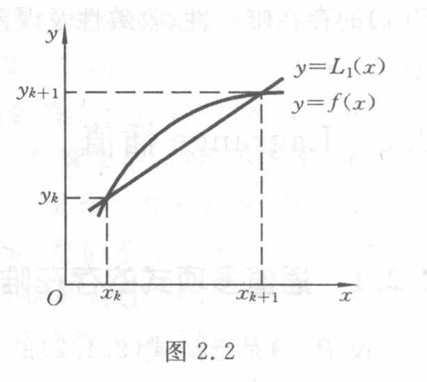
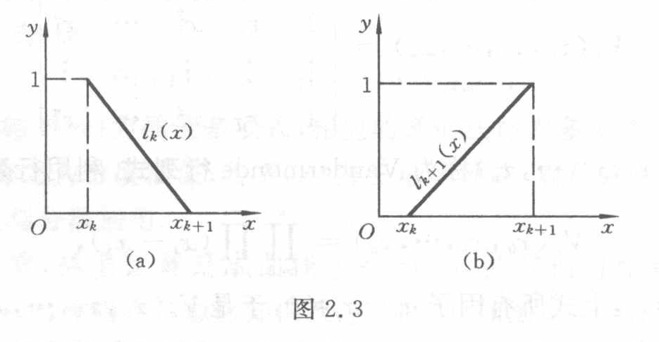

<!-- source-page: 28 -->

## 2.2 Lagrange 插值

### 2.2.1 插值多项式的存在唯一性

设 $P(x)$ 是形如式（2.1.2）的插值多项式，用 $H_n$ 代表所有次数不超过 $n$ 的多项式集合，于是 $P(x)\in H_n$（符号 $\in$ 表示属于）。所谓插值多项式 $P(x)$ 存在唯一，就是指在集合 $H_n$ 中有且只有一个 $P(x)$ 满足式（2.1.1）。由式（2.1.1）可得

$$
\begin{cases}
a_0+a_1x_0+\cdots+a_nx_0^n=y_0,\\
a_0+a_1x_1+\cdots+a_nx_1^n=y_1,\\
\qquad\qquad\vdots\\
a_0+a_1x_n+\cdots+a_nx_n^n=y_n.
\end{cases}
\tag{2.2.1}
$$

这是一个关于 $a_0,a_1,\cdots,a_n$ 的 $n+1$ 元线性方程组。要证明插值多项式的存在唯一，只要证明方程组（2.2.1）的解存在唯一，也就是证明方程组（2.2.1）的系数行列式

$$
V_n(x_0,x_1,\cdots,x_n)=
\begin{vmatrix}
1 & x_0 & x_0^2 & \cdots & x_0^n\\
1 & x_1 & x_1^2 & \cdots & x_1^n\\
\vdots & \vdots & \vdots & & \vdots\\
1 & x_n & x_n^2 & \cdots & x_n^n
\end{vmatrix}
\tag{2.2.2}
$$

不为零，其中 $V_n(x_0,x_1,\cdots,x_n)$ 称为 Vandermonde 行列式。利用行列式性质可得

$$
V_n(x_0,x_1,\cdots,x_n)
=\prod_{i=1}^{n}\prod_{j=0}^{i-1}(x_i-x_j),
$$

由于 $i\ne j$ 时 $x_i\ne x_j$，上式所有因子 $x_i-x_j\ne0$，于是 $V_n(x_0,x_1,\cdots,x_n)\ne0$，故方程组（2.2.1）存在唯一的一组解 $a_0,a_1,\cdots,a_n$。以上论述可写成如下定理。

**定理 2.1** 满足条件式（2.1.1）的插值多项式（2.1.2）存在唯一。

<!-- source-page: 29 -->

[原页：书页 16／PDF 29](../../source-images/pdf-029.jpeg)

<!-- source-page: 29 -->

### 2.2.2 线性插值与抛物插值

从定理 2.1 的证明可看到，要求插值多项式 $P(x)$，可以通过求方程组（2.2.1）的解 $a_0,a_1,\cdots,a_n$ 得到。但这样做不但计算复杂，且难以得到 $P(x)$ 的简单表达式。为了求得便于使用的简单的插值多项式 $P(x)$，先讨论 $n=1$ 的情形。

假定已知区间 $[x_k,x_{k+1}]$ 的端点处的函数值 $y_k=f(x_k)$，$y_{k+1}=f(x_{k+1})$，要求线性插值多项式 $L_1(x)$，使它满足

$$
L_1(x_k)=y_k,\qquad L_1(x_{k+1})=y_{k+1}.
$$

$y=L_1(x)$ 的几何意义就是通过两点 $(x_k,y_k)$ 和 $(x_{k+1},y_{k+1})$ 的直线，如图 2.2 所示。$L_1(x)$ 的表达式可由几何意义直接给出，即

$$
L_1(x)=y_k+\frac{y_{k+1}-y_k}{x_{k+1}-x_k}(x-x_k)
\quad\text{（点斜式）},
\tag{2.2.3}
$$

$$
L_1(x)=\frac{x_{k+1}-x}{x_{k+1}-x_k}y_k
+\frac{x-x_k}{x_{k+1}-x_k}y_{k+1}
\quad\text{（两点式）}.
\tag{2.2.4}
$$

图 2.2（原图）：直线 $y=L_1(x)$ 与曲线 $y=f(x)$ 在两节点相交。全部文字标签：$y$、$x$、$O$、$x_k$、$x_{k+1}$、$y_k$、$y_{k+1}$、$y=L_1(x)$、$y=f(x)$。

由两点式方程看出，$L_1(x)$ 是由两个线性函数

$$
l_k(x)=\frac{x-x_{k+1}}{x_k-x_{k+1}},
\qquad
l_{k+1}(x)=\frac{x-x_k}{x_{k+1}-x_k}
$$

的线性组合得到的，其系数分别为 $y_k$ 及 $y_{k+1}$，即

$$
L_1(x)=y_kl_k(x)+y_{k+1}l_{k+1}(x).
\tag{2.2.5}
$$

显然，$l_k(x)$ 及 $l_{k+1}(x)$ 也是线性插值多项式，在节点 $x_k$ 及 $x_{k+1}$ 上满足条件

$$
l_k(x_k)=1,\quad l_k(x_{k+1})=0,\quad
l_{k+1}(x_k)=0,\quad l_{k+1}(x_{k+1})=1.
$$

称函数 $l_k(x)$ 及 $l_{k+1}(x)$ 为**一次插值基函数**或**线性插值基函数**，它们的图形分别如图 2.3(a)、(b) 所示。

图 2.3（原图）：(a) $l_k(x)$ 在 $x_k$ 处为 $1$，在 $x_{k+1}$ 处为 $0$；(b) $l_{k+1}(x)$ 在 $x_k$ 处为 $0$，在 $x_{k+1}$ 处为 $1$。两图全部文字标签：$y$、$x$、$O$、$1$、$x_k$、$x_{k+1}$、$l_k(x)$、$l_{k+1}(x)$、(a)、(b)。

下面讨论 $n=2$ 的情况。假定插值节点为 $x_{k-1},x_k,x_{k+1}$，要求二次插值多项式 $L_2(x)$，使它满足

> 页末插值条件续 PDF 30。

<!-- source-page: 30 -->

[原页：书页 17／PDF 30](../../source-images/pdf-030.jpeg)

<!-- source-page: 30 -->

> 页首承接 PDF 29 的二次插值条件；末式展开续 PDF 31。

$$
L_2(x_j)=y_j\qquad(j=k-1,k,k+1).
$$

我们知道，$y=L_2(x)$ 在几何上就是通过三点 $(x_{k-1},y_{k-1})$、$(x_k,y_k)$、$(x_{k+1},y_{k+1})$ 的抛物线。为了求出 $L_2(x)$ 的表达式，可采用基函数方法，此时基函数 $l_{k-1}(x),l_k(x)$ 及 $l_{k+1}(x)$ 是二次函数，且在节点上满足条件

$$
\begin{cases}
l_{k-1}(x_{k-1})=1,\quad l_{k-1}(x_j)=0\quad(j=k,k+1),\\
l_k(x_k)=1,\quad l_k(x_j)=0\quad(j=k-1,k+1),\\
l_{k+1}(x_{k+1})=1,\quad l_{k+1}(x_j)=0\quad(j=k-1,k).
\end{cases}
\tag{2.2.6}
$$

满足条件式（2.2.6）的插值基函数是很容易求出的，例如求 $l_{k-1}(x)$，因它有两个零点 $x_k$ 及 $x_{k+1}$，故可表示为

$$
l_{k-1}(x)=A(x-x_k)(x-x_{k+1}),
$$

其中 $A$ 为待定系数，可由条件 $l_{k-1}(x_{k-1})=1$ 定出，即

$$
A=\frac{1}{(x_{k-1}-x_k)(x_{k-1}-x_{k+1})},
$$

故

$$
l_{k-1}(x)=
\frac{(x-x_k)(x-x_{k+1})}
{(x_{k-1}-x_k)(x_{k-1}-x_{k+1})}.
$$

同理，

$$
l_k(x)=
\frac{(x-x_{k-1})(x-x_{k+1})}
{(x_k-x_{k-1})(x_k-x_{k+1})},
\qquad
l_{k+1}(x)=
\frac{(x-x_{k-1})(x-x_k)}
{(x_{k+1}-x_{k-1})(x_{k+1}-x_k)}.
$$

函数 $l_{k-1}(x),l_k(x),l_{k+1}(x)$ 称为**二次插值基函数**或**抛物插值基函数**，它们在区间 $[x_{k-1},x_{k+1}]$ 上的图形分别如图 2.4(a)、(b)、(c) 所示。

图 2.4（原图）：(a) $l_{k-1}(x)$，(b) $l_k(x)$，(c) $l_{k+1}(x)$，分别在对应节点取 $1$、其他两个节点取 $0$；左右基函数在部分区间为负。三图全部文字标签：$y$、$x$、$O$、$1$、$x_{k-1}$、$x_k$、$x_{k+1}$、$l_{k-1}(x)$、$l_k(x)$、$l_{k+1}(x)$、(a)、(b)、(c)。

利用二次插值基函数 $l_{k-1}(x),l_k(x),l_{k+1}(x)$，立即可得到二次插值多项式

$$
L_2(x)=y_{k-1}l_{k-1}(x)+y_kl_k(x)+y_{k+1}l_{k+1}(x),
\tag{2.2.7}
$$

显然，它满足条件

$$
L_2(x_j)=y_j\qquad(j=k-1,k,k+1).
$$

将上面求得的 $l_{k-1}(x),l_k(x),l_{k+1}(x)$ 代入式（2.2.7），得

<!-- source-page: 31 -->

[原页：书页 18／PDF 31](../../source-images/pdf-031.jpeg)

<!-- source-page: 31 -->

> 页首续 PDF 30 的式（2.2.7）展开；页末公式续 PDF 32。

$$
\begin{aligned}
L_2(x)={}&y_{k-1}
\frac{(x-x_k)(x-x_{k+1})}
{(x_{k-1}-x_k)(x_{k-1}-x_{k+1})}\\
&+y_k
\frac{(x-x_{k-1})(x-x_{k+1})}
{(x_k-x_{k-1})(x_k-x_{k+1})}\\
&+y_{k+1}
\frac{(x-x_{k-1})(x-x_k)}
{(x_{k+1}-x_{k-1})(x_{k+1}-x_k)}.
\end{aligned}
$$

### 2.2.3 Lagrange 插值多项式

上面对 $n=1$ 及 $n=2$ 的情况，得到了一次与二次插值多项式 $L_1(x)$ 及 $L_2(x)$，它们分别由式（2.2.5）和式（2.2.7）表示。这种用插值基函数表示的方法容易推广到一般情形。下面讨论通过 $n+1$ 个节点 $x_0<x_1<\cdots<x_n$ 的 $n$ 次插值多项式 $L_n(x)$，假定它满足条件

$$
L_n(x_j)=y_j\qquad(j=0,1,\cdots,n).
\tag{2.2.8}
$$

为了构造 $L_n(x)$，先定义 $n$ 次插值基函数。

**定义 2.2** 若 $n$ 次多项式 $l_j(x)$（$j=0,1,\cdots,n$）在 $n+1$ 个节点 $x_0<x_1<\cdots<x_n$ 上满足条件

$$
l_j(x_k)=
\begin{cases}
1,&k=j,\\
0,&k\ne j
\end{cases}
\qquad(j,k=0,1,\cdots,n),
\tag{2.2.9}
$$

就称这 $n+1$ 个 $n$ 次多项式 $l_0(x),l_1(x),\cdots,l_n(x)$ 为节点 $x_0,x_1,\cdots,x_n$ 上的 **$n$ 次插值基函数**。

$n=1$ 及 $n=2$ 时的情况前面已经讨论。用类似的推导方法，可得到 $n$ 次插值基函数为

$$
l_k(x)=
\frac{(x-x_0)\cdots(x-x_{k-1})(x-x_{k+1})\cdots(x-x_n)}
{(x_k-x_0)\cdots(x_k-x_{k-1})(x_k-x_{k+1})\cdots(x_k-x_n)}
\quad(k=0,1,\cdots,n).
\tag{2.2.10}
$$

显然它满足条件（2.2.9）。于是，满足条件（2.2.8）的插值多项式 $L_n(x)$ 可表示为

$$
L_n(x)=\sum_{k=0}^{n}y_kl_k(x).
\tag{2.2.11}
$$

由 $l_k(x)$ 的定义知

$$
L_n(x_j)=\sum_{k=0}^{n}y_kl_k(x_j)=y_j
\qquad(j=0,1,\cdots,n).
$$

形如式（2.2.11）的插值多项式 $L_n(x)$ 称为 **Lagrange 插值多项式**，而式（2.2.5）和式（2.2.7）是其 $n=1$ 和 $n=2$ 的特殊情形。若引入记号

$$
\omega_{n+1}(x)=(x-x_0)(x-x_1)\cdots(x-x_n),
\tag{2.2.12}
$$

容易求得

$$
\omega'_{n+1}(x_k)
=(x_k-x_0)\cdots(x_k-x_{k-1})(x_k-x_{k+1})\cdots(x_k-x_n),
$$

于是式（2.2.11）可改写成

<!-- source-page: 32 -->

[原页：书页 19／PDF 32](../../source-images/pdf-032.jpeg)

<!-- source-page: 32 -->

> 页首接 PDF 31；页末线性插值余项续 PDF 33。

$$
L_n(x)=\sum_{k=0}^{n}y_k
\frac{\omega_{n+1}(x)}
{(x-x_k)\omega'_{n+1}(x_k)}.
\tag{2.2.13}
$$

注意，$n$ 次插值多项式 $L_n(x)$ 通常是次数为 $n$ 的多项式，特殊情况次数可能小于 $n$。例如，通过三点 $(x_0,y_0),(x_1,y_1),(x_2,y_2)$ 的二次插值多项式 $L_2(x)$，如果三点共线，则 $y=L_2(x)$ 就是一直线，而不是抛物线，这时 $L_2(x)$ 是一次式。

### 2.2.4 插值余项

若在 $[a,b]$ 上用 $L_n(x)$ 近似 $f(x)$，则其截断误差为 $R_n(x)=f(x)-L_n(x)$，$R_n(x)$ 也称为插值多项式的余项或插值余项。关于插值余项估计有以下定理。

**定理 2.2** 设 $f^{(n)}(x)$ 在 $[a,b]$ 上连续，$f^{(n+1)}(x)$ 在 $(a,b)$ 内存在，节点 $a\le x_0<x_1<\cdots<x_n\le b$，$L_n(x)$ 是满足条件式（2.2.8）的插值多项式，则对于任何 $x\in[a,b]$，插值余项

$$
R_n(x)=f(x)-L_n(x)=\frac{f^{(n+1)}(\xi)}{(n+1)!}\omega_{n+1}(x).
\tag{2.2.14}
$$

这里，$\xi\in(a,b)$ 且依赖于 $x$，$\omega_{n+1}(x)$ 是式（2.2.12）所定义的。

**证明** 由给定条件知，$R_n(x)$ 在节点 $x_k$（$k=0,1,\cdots,n$）上为零，即

$$
R_n(x_k)=0\qquad(k=0,1,\cdots,n),
$$

于是

$$
R_n(x)=K(x)(x-x_0)(x-x_1)\cdots(x-x_n)=K(x)\omega_{n+1}(x),
\tag{2.2.15}
$$

其中 $K(x)$ 是与 $x$ 有关的待定函数。

现把 $x$ 看成 $[a,b]$ 上一个固定点，作函数

$$
\varphi(t)=f(t)-L_n(t)-K(x)(t-x_0)(t-x_1)\cdots(t-x_n),
$$

根据插值条件及余项定义，可知 $\varphi(t)$ 在点 $x_0,x_1,\cdots,x_n$ 及 $x$ 处均为零，故 $\varphi(t)$ 在 $[a,b]$ 上有 $n+2$ 个零点，根据 Rolle 定理，$\varphi'(t)$ 在 $\varphi(t)$ 的两个零点间至少有一个零点，故 $\varphi'(t)$ 在 $[a,b]$ 上至少有 $n+1$ 个零点。对 $\varphi'(t)$ 再应用 Rolle 定理，可知 $\varphi''(t)$ 在 $[a,b]$ 上至少有 $n$ 个零点。依此类推，$\varphi^{(n+1)}(t)$ 在 $(a,b)$ 内至少有一个零点，记作 $\xi\in(a,b)$，使

$$
\varphi^{(n+1)}(\xi)=f^{(n+1)}(\xi)-(n+1)!K(x)=0,
$$

于是

$$
K(x)=\frac{f^{(n+1)}(\xi)}{(n+1)!},\qquad \xi\in(a,b)
$$

且依赖于 $x$。

将上式代入式（2.2.15），就得到余项表达式（2.2.14）。证毕。

应当指出，余项表达式只有在 $f(x)$ 的高阶导数存在时才能应用。$\xi$ 在 $(a,b)$ 内的具体位置通常不可能给出，如果可以求出 $\max_{a\le x\le b}|f^{(n+1)}(x)|=M_{n+1}$，那么插值多项式 $L_n(x)$ 逼近 $f(x)$ 的截断误差限是

$$
|R_n(x)|\le\frac{M_{n+1}}{(n+1)!}|\omega_{n+1}(x)|.
\tag{2.2.16}
$$

当 $n=1$ 时，线性插值余项为

<!-- source-page: 33 -->

[原页：书页 20／PDF 33](../../source-images/pdf-033.jpeg)

<!-- source-page: 33 -->

> 页首续 PDF 32 的线性插值余项；末行误差估计的不等式续 PDF 34。

$$
R_1(x)=\frac12 f''(\xi)\omega_2(x)
=\frac12 f''(\xi)(x-x_0)(x-x_1),
\qquad \xi\in[x_0,x_1];
\tag{2.2.17}
$$

当 $n=2$ 时，抛物插值的余项为

$$
R_2(x)=\frac16 f'''(\xi)(x-x_0)(x-x_1)(x-x_2),
\qquad \xi\in[x_0,x_2].
\tag{2.2.18}
$$

**例 2.1** 已知 $\sin0.32=0.314\,567$，$\sin0.34=0.333\,487$，$\sin0.36=0.352\,274$，用线性插值及抛物插值计算 $\sin0.336\,7$ 的值，并估计截断误差。

**解** 由题意取 $x_0=0.32$，$y_0=0.314\,567$，$x_1=0.34$，$y_1=0.333\,487$，$x_2=0.36$，$y_2=0.352\,274$。

用线性插值计算，取 $x_0=0.32$ 及 $x_1=0.34$，由式（2.2.3）得

$$
\begin{aligned}
\sin0.336\,7\approx L_1(0.336\,7)
&=y_0+\frac{y_1-y_0}{x_1-x_0}(0.336\,7-x_0)\\
&=0.314\,567+\frac{0.018\,92}{0.02}\times0.016\,7\\
&=0.330\,365.
\end{aligned}
$$

其截断误差由式（2.2.17）得

$$
|R_1(x)|\le\frac{M_2}{2}|(x-x_0)(x-x_1)|,
$$

其中

$$
M_2=\max_{x_0\le x\le x_1}|f''(x)|.
$$

因

$$
f(x)=\sin x,\qquad f''(x)=-\sin x,
$$

可取

$$
M_2=\max_{x_0\le x\le x_1}|\sin x|=\sin x_1\le0.333\,5,
$$

于是

$$
\begin{aligned}
|R_1(0.336\,7)|
&=|\sin0.336\,7-L_1(0.336\,7)|\\
&\le\frac12\times0.333\,5\times0.016\,7\times0.003\,3\\
&\le0.92\times10^{-5}.
\end{aligned}
$$

若取 $x_1=0.34$，$x_2=0.36$ 为节点，则线性插值为

$$
\begin{aligned}
\sin0.336\,7\approx\widetilde L_1(0.336\,7)
&=y_1+\frac{y_2-y_1}{x_2-x_1}(0.336\,7-x_1)\\
&=0.333\,487+\frac{0.018\,787}{0.02}\times(-0.003\,3)\\
&=0.330\,387,
\end{aligned}
$$

其截断误差为

$$
|\widetilde R_1(x)|\le\frac{M_2}{2}|(x-x_1)(x-x_2)|,
$$

其中

$$
M_2=\max_{x_0\le x\le x_2}|f''(x)|\le0.352\,3.
$$

于是

$$
|\widetilde R_1(0.336\,7)|=|\sin0.336\,7-\widetilde L_1(0.336\,7)|
$$

<!-- source-page: 34 -->

[原页：书页 21／PDF 34](../../source-images/pdf-034.jpeg)

<!-- source-page: 34 -->

> 页首续 PDF 33 的 $|\widetilde R_1(0.3367)|$ 误差估计。

$$
\begin{aligned}
&\le\frac12\times0.352\,3\times0.003\,3\times0.023\,3\\
&\le1.36\times10^{-5}.
\end{aligned}
$$

用抛物插值计算 $\sin0.336\,7$ 时，由式（2.2.7）得

$$
\begin{aligned}
\sin0.336\,7\approx{}&
y_0\frac{(x-x_1)(x-x_2)}{(x_0-x_1)(x_0-x_2)}
+y_1\frac{(x-x_0)(x-x_2)}{(x_1-x_0)(x_1-x_2)}\\
&+y_2\frac{(x-x_0)(x-x_1)}{(x_2-x_0)(x_2-x_1)}\\
={}&L_2(0.336\,7)\\
={}&0.314\,567\times\frac{0.768\,9\times10^{-4}}{0.000\,8}
+0.333\,487\times\frac{3.89\times10^{-4}}{0.000\,4}\\
&+0.352\,274\times\frac{-0.551\,1\times10^{-4}}{0.000\,8}\\
={}&0.330\,374.
\end{aligned}
$$

这个结果与六位有效数字的正弦函数表完全一样，这说明查表时用二次插值精度已相当高了。其截断误差限由式（2.2.18）得

$$
|R_2(x)|\le\frac{M_3}{6}|(x-x_0)(x-x_1)(x-x_2)|,
$$

其中

$$
M_3=\max_{x_0\le x\le x_2}|f'''(x)|=\cos x_0<0.828,
$$

于是

$$
\begin{aligned}
|R_2(0.336\,7)|
&=|\sin0.336\,7-L_2(0.336\,7)|\\
&\le\frac16\times0.828\times0.016\,7\times0.003\,3\times0.023\,3\\
&\le0.178\times10^{-7}.
\end{aligned}
$$

---

## 相关原页校注（agent 补充）

以下校注来自本节覆盖的原页，可能也涉及同页相邻小节；原文照录与校正说明分开保留。

### 原书 PDF 页 34 的校注

[完整原页转录](../pages/pdf-034.md) · [原页图像](../../source-images/pdf-034.jpeg)

校注记录：NA5E-E002。

### 校注（agent 补充）：NA5E-E002

上面的 $0.828$、$0.178\times10^{-7}$ 和代入行的 $3.89\times10^{-4}$ 均经过原页放大核对，确为扫描原书印字。**这几行不能直接作为正确的数值结果使用。**

1. 本例以弧度计算，$\cos0.32\approx0.9492354180824409$，所以 $\cos x_0<0.828$ 不成立。可用保守上界 $M_3<0.95$。
2. 即使照原书使用 $0.828$，该乘积也等于 $1.77200694\times10^{-7}$，大于原文所写的 $0.178\times10^{-7}=1.78\times10^{-8}$。
3. 对正确的导数上界，用原节点得到的截断误差上界为

$$
|R_2(0.3367)|
\le\frac{0.95}{6}\,(0.0167)(0.0033)(0.0233)
=2.03309975\times10^{-7}.
$$

这里的 $R_2$ 指用精确节点函数值定义的插值截断误差。

4. 二次插值代入行的中间乘积应为 $0.0167\times0.0233=0.00038911=3.8911\times10^{-4}$。若严格按原书印出的 $3.89\times10^{-4}$ 计算整行，会得到 $0.3302826531125$，不能得到末行的 $0.330374$。保留精确乘积，并使用题目给的有限精度表值，可得

$$
\begin{aligned}
L_1(0.3367)&=0.3303652,\\
\widetilde L_1(0.3367)&=0.330387145,\\
L_2(0.3367)&=0.3303743620375.
\end{aligned}
$$

最后一项保留六位有效数字确实为 $0.330374$，与 $\sin0.3367\approx0.3303741915556280$ 的六位有效数字一致。

## 本节覆盖原页的校注记录

下列记录按原页关联，含同页相邻小节的校注；计算时同时读取上文校注和完整原页。

- `NA5E-E002`：原书 PDF 页 34
