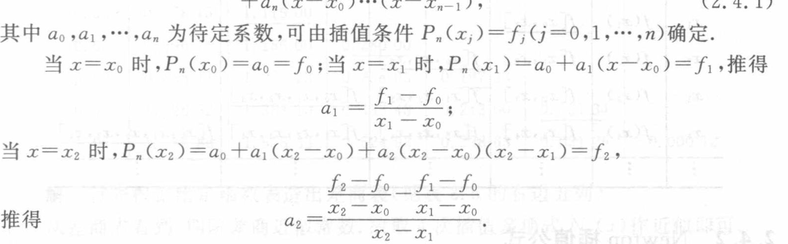

<!-- source-page: 36 -->

### 2.4.1 差商及其性质

Lagrange 插值公式可以看作直线方程两点式的推广，如果从点斜式直线方程

$$
P_1(x)=f_0+\frac{f_1-f_0}{x_1-x_0}(x-x_0)
$$

出发，将它推广到具有 $n+1$ 个插值点 $(x_0,f_0),(x_1,f_1),\cdots,(x_n,f_n)$ 的情况，则可把插值多项式表示为

$$
\begin{aligned}
P_n(x)={}&a_0+a_1(x-x_0)+a_2(x-x_0)(x-x_1)+\cdots\\
&+a_n(x-x_0)\cdots(x-x_{n-1}),
\end{aligned}
\tag{2.4.1}
$$

其中 $a_0,a_1,\cdots,a_n$ 为待定系数，可由插值条件 $P_n(x_j)=f_j\;(j=0,1,\cdots,n)$ 确定。

当 $x=x_0$ 时，$P_n(x_0)=a_0=f_0$；当 $x=x_1$ 时，$P_n(x_1)=a_0+a_1(x-x_0)=f_1$，推得

$$
a_1=\frac{f_1-f_0}{x_1-x_0};
$$

当 $x=x_2$ 时，$P_n(x_2)=a_0+a_1(x_2-x_0)+a_2(x_2-x_0)(x_2-x_1)=f_2$，

推得

$$
a_2=\frac{\dfrac{f_2-f_0}{x_2-x_0}-\dfrac{f_1-f_0}{x_1-x_0}}{x_2-x_1}.
$$

依此递推，可得到 $a_3,a_4,\cdots,a_n$。为写出系数 $a_k$ 的一般表达式，先引进如下差商定义。

**定义 2.3** 称 $f[x_0,x_k]=\dfrac{f(x_k)-f(x_0)}{x_k-x_0}$ 为函数 $f(x)$ 关于点 $x_0,x_k$ 的一阶差商，称

> 定义 2.3 续 PDF 37。

### 校注（agent 补充）：代入行的原书记号

上面“当 $x=x_1$ 时”一行，扫描原书实际写成 $a_0+a_1(x-x_0)$，其中 $x$ 没有下标 $1$，本转录予以保留。在该行已经限定的 $x=x_1$ 条件下，求系数时即代入 $x_1$；不将这一记号静默改写成原文没有印出的 $a_1(x_1-x_0)$。原页的 $a_2$ 分式有整体分母 $x_2-x_1$，OCR 漏掉了这一层分母，本转录已恢复。

<!-- source-page: 37 -->

[原页：书页 24／PDF 37](../../source-images/pdf-037.jpeg)

<!-- source-page: 37 -->

> 页首承接 PDF 36 的定义 2.3；页末递推式续 PDF 38。

$$
f[x_0,x_1,x_k]=\frac{f[x_0,x_k]-f[x_0,x_1]}{x_k-x_1}
$$

为 $f(x)$ 关于点 $x_0,x_1,x_k$ 的二阶差商。一般地，称

$$
f[x_0,x_1,\cdots,x_k]=\frac{f[x_0,x_1,\cdots,x_{k-2},x_k]-f[x_0,x_1,\cdots,x_{k-1}]}{x_k-x_{k-1}}
\tag{2.4.2}
$$

为 $f(x)$ 的 $k$ 阶差商。

差商有如下的基本性质：

（1）$k$ 阶差商可表示为函数值 $f(x_0),f(x_1),\cdots,f(x_k)$ 的线性组合，即

$$
f[x_0,x_1,\cdots,x_k]=\sum_{j=0}^{k}\frac{f(x_j)}{(x_j-x_0)\cdots(x_j-x_{j-1})(x_j-x_{j+1})\cdots(x_j-x_k)}.
\tag{2.4.3}
$$

这个性质可用归纳法证明。这个性质也表明差商与节点的排列次序无关，称为差商的对称性，即

$$
f[x_0,x_1,\cdots,x_k]=f[x_1,x_0,x_2,\cdots,x_k]=\cdots=f[x_1,x_2,\cdots,x_k,x_0].
$$

（2）由性质（1）及式（2.4.2）可得

$$
f[x_0,x_1,\cdots,x_k]=\frac{f[x_1,x_2,\cdots,x_k]-f[x_0,x_1,\cdots,x_{k-1}]}{x_k-x_0}.
\tag{2.4.4}
$$

（3）若 $f(x)$ 在 $[a,b]$ 上存在 $n$ 阶导数，且节点 $x_0,x_1,\cdots,x_n\in[a,b]$，则 $n$ 阶差商与导数关系为

$$
f[x_0,x_1,\cdots,x_n]=\frac{f^{(n)}(\xi)}{n!},\qquad\xi\in[a,b].
\tag{2.4.5}
$$

这个公式可直接用 Rolle 定理证明。

差商的其他性质还可见本章习题。差商计算可列差商表如表 2.4 所示。

**表 2.4**

| $x_k$ | $f(x_k)$ | 一阶差商 | 二阶差商 | 三阶差商 | 四阶差商 |
|---|---|---|---|---|---|
| $x_0$ | $\underline{f(x_0)}$ | | | | |
| $x_1$ | $f(x_1)$ | $\underline{f[x_0,x_1]}$ | | | |
| $x_2$ | $f(x_2)$ | $f[x_1,x_2]$ | $\underline{f[x_0,x_1,x_2]}$ | | |
| $x_3$ | $f(x_3)$ | $f[x_2,x_3]$ | $f[x_1,x_2,x_3]$ | $\underline{f[x_0,x_1,x_2,x_3]}$ | |
| $x_4$ | $f(x_4)$ | $f[x_3,x_4]$ | $f[x_2,x_3,x_4]$ | $f[x_1,x_2,x_3,x_4]$ | $\underline{f[x_0,x_1,x_2,x_3,x_4]}$ |
| $\vdots$ | $\vdots$ | $\vdots$ | $\vdots$ | $\vdots$ | $\vdots$ |

