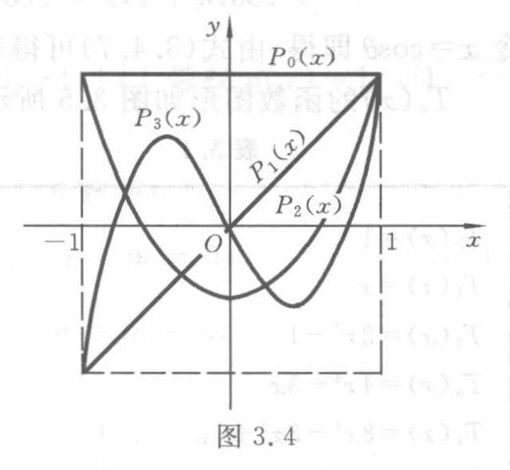

<!-- source-page: 70 -->

### 3.4.2 Legendre多项式

当区间为 $[-1, 1]$、权函数 $\rho(x) \equiv 1$ 时，由 $\{1, x, x^2, \cdots, x^n, \cdots\}$ 正交化得到的多

<!-- 本页末词“多项式”跨页续 PDF 71。 -->

> 校注（agent 补充，原书索引疑误）：本页正交化构造式末尾原印“$k=1,2,\cdots$”，而 $k$ 已是求和哑指标，外部序号应为 $n=1,2,\cdots$；转录保留原式。

> 校注（agent 补充，原书初值疑误）：递推初值原印 $g_{n-1}(x)=0$，按原文保留。若对一般 $n$ 成立，会与 $g_0(x)=1$ 冲突；递推通常应以 $g_{-1}(x)=0$ 开始。

<!-- source-page: 71 -->

[查看原页](../../source-images/pdf-071.jpeg)

<!-- source-page: 71 -->

项式就称为 Legendre 多项式, 并用 $P_0(x), P_1(x), \cdots, P_n(x), \cdots$ 表示. 这是 Legendre 于 1785 年引进的. 1814 年 Rodrigul 给出了简单的表达式

$$
P_0(x) = 1, \quad P_n(x) = \frac{1}{2^n n!} \frac{\mathrm{d}^n}{\mathrm{d}x^n} \{(x^2 - 1)^n\} \quad (n = 1, 2, \cdots). \tag{3.4.1}
$$

由于 $(x^2 - 1)^n$ 是 $2n$ 次多项式, 求 $n$ 阶导数后得

$$
P_n(x) = \frac{1}{2^2 n!} (2n)(2n - 1) \cdots (n + 1)x^n + a_{n-1}x^{n-1} + \cdots + a_0,
$$

于是得首项 $x^n$ 的系数 $a_n = \frac{(2n)!}{2^n (n!)^2}$. 显然最高项系数为 1 的 Legendre 多项式为

$$
\tilde{P}_n(x) = \frac{n!}{(2n)!} \frac{\mathrm{d}^n}{\mathrm{d}x^n} [(x^2 - 1)^n]. \tag{3.4.2}
$$

Legendre 多项式有以下几个重要性质.

性质 1 正交性

$$
\int_{-1}^{1} P_n(x) P_m(x) \mathrm{d}x = \begin{cases} 0, & m \neq n, \\ \frac{2}{2n + 1}, & m = n. \end{cases} \tag{3.4.3}
$$

证明 令 $\varphi(x) = (x^2 - 1)^n$, 则

$$
\varphi^{(k)}(\pm 1) = 0 \quad (k = 0, 1, \cdots, n - 1).
$$

设 $Q(x)$ 是区间 $[-1, 1]$ 上 $n$ 阶连续可微的函数, 由分部积分知

$$
\int_{-1}^{1} P_n(x) Q(x) \mathrm{d}x = \frac{1}{2^n n!} \int_{-1}^{1} Q(x) \varphi^{(n)}(x) \mathrm{d}x = -\frac{1}{2^n n!} \int_{-1}^{1} Q'(x) \varphi^{(n-1)}(x) \mathrm{d}x
$$

$$
= \cdots = \frac{(-1)^n}{2^n n!} \int_{-1}^{1} Q^{(n)}(x) \varphi(x) \mathrm{d}x.
$$

下面分两种情况讨论.

(1) 若 $Q(x)$ 是次数小于 $n$ 的多项式, 则 $Q^{(n)}(x) \equiv 0$, 故当 $m \neq n$ 时, 有

$$
\int_{-1}^{1} P_m(x) P_n(x) \mathrm{d}x = 0.
$$

(2) 若

$$
Q(x) = P_n(x) = \frac{1}{2^n n!} \varphi^{(n)}(x) = \frac{(2n)!}{2^n (n!)^2} x^n + \cdots,
$$

$$
Q^{(n)}(x) = P_n^{(n)}(x) = \frac{(2n)!}{2^n n!},
$$

则

$$
\int_{-1}^{1} P_n^2(x) \mathrm{d}x = \frac{(-1)^n (2n)!}{2^{2n} (n!)^2} \int_{-1}^{1} (x^2 - 1)^n \mathrm{d}x = \frac{(2n)!}{2^{2n} (n!)^2} \int_{-1}^{1} (1 - x^2)^n \mathrm{d}x.
$$

由于

$$
\int_{0}^{1} (1 - x^2)^n \mathrm{d}x = \int_{0}^{\frac{\pi}{2}} \cos^{2n+1} t \mathrm{d}t = \frac{2 \cdot 4 \cdots 2n}{1 \cdot 3 \cdots (2n+1)},
$$

故当 $m = n$ 时, 有

$$
\int_{-1}^{1} P_n^2(x) \mathrm{d}x = \frac{2}{2n+1}.
$$

证毕.

> 校注（agent 补充，原书系数疑误）：由 $(x^2-1)^n$ 求导后写出的 $P_n(x)$ 首项系数中，原分母明确印为 $2^2n!$，此处按原文保留。依据式 (3.4.1)，该处应为 $2^nn!$；这也与紧随其后的 $a_n=(2n)!/[2^n(n!)^2]$ 一致。

<!-- source-page: 72 -->

[查看原页](../../source-images/pdf-072.jpeg)

<!-- source-page: 72 -->

性质 2 奇偶性
$$
P_n(-x) = (-1)^n P_n(x). \tag{3.4.4}
$$

由于 $\varphi(x) = (x^2 - 1)^n$ 是偶次多项式，经过偶次求导仍为偶次多项式，经过奇次求导则为奇次多项式，故 $n$ 为偶数时 $P_n(x)$ 为偶函数，$n$ 为奇数时 $P_n(x)$ 为奇函数，于是式(3.4.4)成立.

性质 3 递推关系 考虑 $n+1$ 次多项式 $xP_n(x)$，它可表示为
$$
xP_n(x) = a_0P_0(x) + a_1P_1(x) + \cdots + a_{n+1}P_{n+1}(x),
$$
两边乘以 $P_k(x)$，并从 $-1$ 到 $1$ 积分，得
$$
\int_{-1}^{1} xP_n(x)P_k(x) \mathrm{d}x = a_k \int_{-1}^{1} P_k^2(x) \mathrm{d}x.
$$
当 $k \leqslant n-2$ 时，$xP_k(x)$ 次数不大于 $n-1$，上式左端积分为零，故得 $a_k = 0$. 当 $k=n$ 时 $xP_n^2(x)$ 为奇函数，左端积分仍为零，故 $a_n = 0$. 于是
$$
xP_n(x) = a_{n-1}P_{n-1}(x) + a_{n+1}P_{n+1}(x),
$$
其中
$$
a_{n-1} = \frac{2n-1}{2} \int_{-1}^{1} xP_n(x)P_{n-1}(x) \mathrm{d}x = \frac{2n-1}{2} \frac{2n}{4n^2-1} = \frac{n}{2n+1},
$$
$$
a_{n+1} = \frac{2n+3}{2} \int_{-1}^{1} xP_n(x)P_{n+1}(x) \mathrm{d}x = \frac{2n+3}{2} \frac{2(n+1)}{(2n+1)(2n+3)} = \frac{n+1}{2n+1},
$$
从而得到以下的递推公式：
$$
(n+1)P_{n+1}(x) = (2n+1)xP_n(x) - nP_{n-1}(x) \quad (n=1,2,\cdots). \tag{3.4.5}
$$
由 $P_0(x)=1$，$P_1(x)=x$，
利用式(3.4.5)就可推出
$$
P_2(x) = (3x^2 - 1)/2,
$$
$$
P_3(x) = (5x^3 - 3x)/2,
$$
$$
P_4(x) = (35x^4 - 30x^2 + 3)/8,
$$
$$
P_5(x) = (63x^5 - 70x^3 + 15x)/8,
$$
$$
P_6(x) = (231x^6 - 315x^4 + 105x^2 - 5)/16,
$$
$$
\vdots
$$
图 3.4给出了 $P_0(x), P_1(x), P_2(x), P_3(x)$ 的图形.

图 3.4（原图）。Legendre 多项式 $P_0(x)$、$P_1(x)$、$P_2(x)$、$P_3(x)$ 的图形。全部标签：$x$、$y$、$O$、$-1$、$1$、$P_0(x)$、$P_1(x)$、$P_2(x)$、$P_3(x)$；图中包含区间端点处的竖向及下边界虚线。

性质 4 在所有最高项系数为 1 的 $n$ 次多项式中，Legendre 多项式 $\widetilde{P}_n(x)$ 在 $[-1,1]$ 上与零的平方误差最小.

设 $Q_n(x)$ 是任意一个最高项系数为 1 的 $n$ 次多项式，它可表示为

<!-- 性质 4 的证明续 PDF 73。 -->

<!-- source-page: 73 -->

[查看原页](../../source-images/pdf-073.jpeg)

<!-- source-page: 73 -->

$$
Q_n(x) = \tilde{P}_n(x) + \sum_{k=0}^{n-1} a_k \tilde{P}_k(x) ,
$$
于是
$$
(Q_n, Q_n) = \int_{-1}^{1} Q_n^2(x) \mathrm{d}x = (\tilde{P}_n, \tilde{P}_n) + \sum_{k=0}^{n-1} a_k^2 (\tilde{P}_k, \tilde{P}_k) \geqslant (\tilde{P}_n, \tilde{P}_n)
$$
当且仅当 $a_0 = a_1 = \cdots = a_{n-1} = 0$ 时等号才成立，即当 $Q_n(x) \equiv \tilde{P}_n(x)$ 时平方误差最小.

性质 5 $P_n(x)$ 在区间 $(-1, 1)$ 内有 $n$ 个不同的实零点.

## 本节覆盖原页的校注记录

下列记录按原页关联，含同页相邻小节的校注；计算时同时读取上文校注和完整原页。

- `ch03a-E08`：原书 PDF 页 70
- `ch03a-E09`：原书 PDF 页 70
- `ch03a-E10`：原书 PDF 页 71
