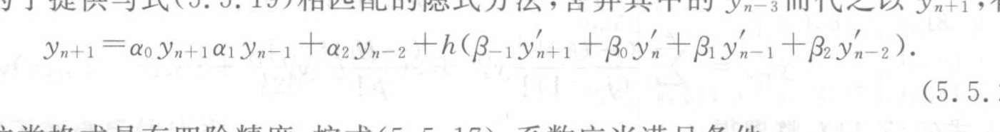

<!-- source-page: 143 -->

### 5.5.6 Milne 格式

与格式（5.5.19）不同的另一类格式是用 $y_{n-3}$ 而不用 $y'_{n-3}$，其形式为

$$
y_{n+1}=\alpha_0y_n+\alpha_1y_{n-1}+\alpha_2y_{n-2}+\alpha_3y_{n-3}+h(\beta_0y'_n+\beta_1y'_{n-1}+\beta_2y'_{n-2}).
\tag{5.5.23}
$$

类似于前面的讨论，运用 Taylor 展开方法不难导出形如式（5.5.23）的一类四阶方法。这类方法中包含有著名的 Milne 格式

$$
y_{n+1}=y_{n-3}+\frac{4h}{3}(2y'_n-y'_{n-1}+2y'_{n-2}),
\tag{5.5.24}
$$

其局部截断误差为

$$
y(x_{n+1})-y_{n+1}\approx\frac{14}{45}h^5y_n^{(5)}.
\tag{5.5.25}
$$

Milne 格式也可以通过数值积分的途径推导出来。事实上，从积分恒等式

$$
y(x_{n+1})=y(x_{n-3})+\int_{x_{n-3}}^{x_{n+1}}y'(x)\,\mathrm dx
\tag{5.5.26}
$$

着手，用数据点 $(x_n,y'_n),(x_{n-1},y'_{n-1}),(x_{n-2},y'_{n-2})$ 插出二次式 $P_2(x)$，然后用 $P_2(x)$ 替代 $y'(x)$ 计算式（5.5.26）中的积分项，即可得到上述格式（5.5.24）。

再在形如式（5.5.21）的四阶隐式方法中适当挑选一个与 Milne 格式相匹配。在式（5.5.22）中令 $\alpha_1=1,\alpha_2=0$，可定出下列四阶格式：

<!-- 公式续下页。 -->

> 校注（agent 补充，ch05b-E005）：式（5.5.21）右端开头在原图中印作 $\alpha_0y_{n+1}\alpha_1y_{n-1}$（“$+1$”下沉至下标位置，且两项之间无正常加号），上式按可见字形保留。由本页“舍弃 $y'_{n-3}$ 而代之以 $y'_{n+1}$”及式（5.5.19）、（5.5.22），此处疑为排印错误，预期应是 $\alpha_0y_n+\alpha_1y_{n-1}$。局部原图如下，仅用于保存这一排印疑误的可审计证据。

<!-- source-page: 144 -->

[原页](../../source-images/pdf-144.jpeg)

<!-- source-page: 144 -->

<!-- 接上页。 -->

$$
y_{n+1}=y_{n-1}+\frac h3(y'_{n+1}+4y'_n+y'_{n-1}).
\tag{5.5.27}
$$

上述格式通常称为 Simpson 格式，用数值积分的 Simpson 方法处理积分恒等式

$$
y(x_{n+1})=y(x_{n-1})+\int_{x_{n-1}}^{x_{n+1}}y'(x)\,\mathrm dx
$$

即可导出这一格式。

用 Simpson 格式（5.5.27）与 Milne 格式（5.5.24）匹配，构成下列预测-校正系统：

预测

$$
\bar y_{n+1}=y_{n-3}+\frac{4h}{3}(2y'_n-y'_{n-1}+2y'_{n-2}),\qquad
\bar y'_{n+1}=f(x_{n+1},\bar y_{n+1});
$$

校正

$$
y_{n+1}=y_{n-1}+\frac h3(\bar y'_{n+1}+4y'_n+y'_{n-1}),\qquad
y'_{n+1}=f(x_{n+1},y_{n+1}).
$$

## 本节覆盖原页的校注记录

下列记录按原页关联，含同页相邻小节的校注；计算时同时读取上文校注和完整原页。

- `ch05b-E005`：原书 PDF 页 143
