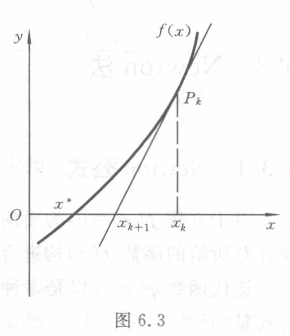

<!-- source-page: 162 -->

## 6.3 Newton 法

### 6.3.1 Newton 公式

对于方程 $f(x)=0$，为要应用迭代法，必须先将它改写成 $x=\varphi(x)$ 的形式，即需要针对所给的函数 $f(x)$ 构造合适的迭代函数 $\varphi(x)$。

迭代函数 $\varphi(x)$ 可以是多种多样的。例如，可令 $\varphi(x)=x+f(x)$，这时相应的迭代公式是

<!-- 本页正文续至 PDF163。 -->

<!-- source-page: 163 -->

[原页](../../source-images/pdf-163.jpeg)

<!-- source-page: 163 -->

<!-- 接 PDF162，6.3.1 Newton 公式。 -->

$$
x_{k+1}=x_k+f(x_k).
\tag{6.3.1}
$$

一般来说，这种迭代公式不一定收敛，或者收敛的速度缓慢。

运用前述加速技巧，对于迭代过程（6.3.1），其加速公式（6.2.10）具有以下形式：

$$
\begin{cases}
\bar{x}_{k+1}=x_k+f(x_k),\\
x_{k+1}=\bar{x}_{k+1}+\dfrac{L}{1-L}(\bar{x}_{k+1}-x_k).
\end{cases}
$$

记 $M=L-1$，上面两个式子可以合并写成

$$
x_{k+1}=x_k-\frac{f(x_k)}{M}.
$$

这种迭代公式通常称为简化的 Newton 公式，其相应的迭代函数是

$$
\varphi(x)=x-\frac{f(x)}{M}.
\tag{6.3.2}
$$

需要注意的是，由于 $L$ 是 $\varphi'(x)$ 的估计值，而 $\varphi(x)=x+f(x)$，这里的 $M=L-1$ 实际上是 $f'(x)$ 的估计值。如果用 $f'(x)$ 代替式（6.3.2）中的 $M$，则得到如下形式的迭代函数：

$$
\varphi(x)=x-\frac{f(x)}{f'(x)},
$$

其相应的迭代公式

$$
x_{k+1}=x_k-\frac{f(x_k)}{f'(x_k)}
\tag{6.3.3}
$$

就是著名的 Newton 公式。

### 6.3.2 Newton 法的几何解释

对于方程 $f(x)=0$，如果 $f(x)$ 是线性函数，则对它求根是容易的。Newton 法实质上是一种线性化方法，其基本思想是将非线性方程 $f(x)=0$ 逐步归结为某种线性方程来求解。

设已知方程 $f(x)=0$ 有近似根 $x_k$，将函数 $f(x)$ 在点 $x_k$ 展开，有

$$
f(x)\approx f(x_k)+f'(x_k)(x-x_k),
$$

于是方程 $f(x)=0$ 可近似地表示为

$$
f(x_k)+f'(x_k)(x-x_k)=0.
\tag{6.3.4}
$$

这是个线性方程，记其根为 $x_{k+1}$，则 $x_{k+1}$ 的计算公式就是 Newton 公式（6.3.3）。

Newton 法有明显的几何解释。方程 $f(x)=0$ 的根 $x^*$ 可解释为曲线 $y=f(x)$ 与 $x$ 轴的交点的横坐标（见图 6.3）。设 $x_k$ 是根 $x^*$ 的某个近似值，过曲

图 6.3

图意（agent 整理）：曲线 $f(x)$ 在 $P_k$ 处的切线与 $x$ 轴相交，其交点横坐标是 $x_{k+1}$。全部标签为 $x,y,O,x^*,x_{k+1},x_k,P_k,f(x)$。

<!-- 本页正文续至 PDF164。 -->

<!-- source-page: 164 -->

[原页](../../source-images/pdf-164.jpeg)

<!-- source-page: 164 -->

<!-- 接 PDF163，6.3.2 Newton 法的几何解释。 -->

线 $y=f(x)$ 上横坐标为 $x_k$ 的点 $P_k$ 引切线，并将该切线与 $x$ 轴的交点的横坐标 $x_{k+1}$ 作为 $x^*$ 的新的近似值。注意到切线方程为

$$
y=f(x_k)+f'(x_k)(x-x_k).
$$

这样求得的值 $x_{k+1}$ 必满足式（6.3.4），从而就是 Newton 公式（6.3.3）的计算结果。由于这种几何背景，Newton 法亦称切线法。

### 6.3.3 Newton 法的局部收敛性

对于一种迭代过程，为了保证它是有效的，需要肯定它的收敛性，同时考察它的收敛速度。所谓迭代过程的收敛速度，是指在接近收敛的过程中迭代误差的下降速度。

**定义 6.2** 设迭代过程 $x_{k+1}=\varphi(x_k)$ 收敛于方程 $x=\varphi(x)$ 的根 $x^*$，如果迭代误差 $e_k=x_k-x^*$ 当 $k\to\infty$ 时成立下列渐近关系式：

$$
\frac{e_{k+1}}{e_k^p}\to C\quad(C\ne0\text{ 为常数}),
$$

则称该迭代过程是 $p$ 阶收敛的。特别地，$p=1$ 时称为线性收敛，$p>1$ 时称为超线性收敛，$p=2$ 时称为平方收敛。

**定理 6.3** 对于迭代过程 $x_{k+1}=\varphi(x_k)$，如果 $\varphi^{(p)}(x)$ 在所求根 $x^*$ 的邻近连续，并且

$$
\begin{cases}
\varphi'(x^*)=\varphi''(x^*)=\cdots=\varphi^{(p-1)}(x^*)=0,\\
\varphi^{(p)}(x^*)\ne0,
\end{cases}
\tag{6.3.5}
$$

则该迭代过程在点 $x^*$ 邻近是 $p$ 阶收敛的。

**证明** 由于 $\varphi'(x^*)=0$，据定理 6.2 立即可以断定迭代过程 $x_{k+1}=\varphi(x_k)$ 具有局部收敛性。

再将 $\varphi(x_k)$ 在根 $x^*$ 处展开，利用条件（6.3.5），则有

$$
\varphi(x_k)=\varphi(x^*)+\frac{\varphi^{(p)}(\zeta)}{p!}(x_k-x^*)^p.
$$

注意到

$$
\varphi(x_k)=x_{k+1},\quad\varphi(x^*)=x^*,
$$

由上式得

$$
x_{k+1}-x^*=\frac{\varphi^{(p)}(\zeta)}{p!}(x_k-x^*)^p,
$$

因此对于迭代误差，有 $\dfrac{e_{k+1}}{e_k^p}\to\dfrac{\varphi^{(p)}(x^*)}{p!}$。这表明迭代过程 $x_{k+1}=\varphi(x_k)$ 确实是 $p$ 阶收敛的。证毕。

由上述定理可知，迭代过程的收敛速度依赖于迭代函数 $\varphi(x)$ 的选取。如果当 $x\in[a,b]$ 时 $\varphi'(x)\ne0$，则该迭代过程只可能是线性收敛的。

对于 Newton 公式（6.3.3），其迭代函数为

<!-- 本页正文续至 PDF165。 -->

<!-- source-page: 165 -->

[原页](../../source-images/pdf-165.jpeg)

<!-- source-page: 165 -->

<!-- 接 PDF164，6.3.3 Newton 法的局部收敛性。 -->

$$
\varphi(x)=x-\frac{f(x)}{f'(x)},\quad\varphi'(x)=\frac{f(x)f''(x)}{[f'(x)]^2}.
$$

假定 $x^*$ 是 $f(x)$ 的一个单根，即 $f(x^*)=0,f'(x^*)\ne0$，则由上式知 $\varphi'(x^*)=0$，于是依据定理 6.3 可以断定，Newton 法在根 $x^*$ 的邻近是平方收敛的。

**例 6.7** 用 Newton 法解方程

$$
x\mathrm{e}^x-1=0.
\tag{6.3.6}
$$

**解** 这里 Newton 公式为 $x_{k+1}=x_k-\dfrac{x_k-\mathrm{e}^{-x_k}}{1+x_k}$，取迭代初值 $x_0=0.5$，迭代结果列于表 6.7 中。

表 6.7

| $k$ | $x_k$ |
|---|---|
| $0$ | $0.5$ |
| $1$ | $0.571\,02$ |
| $2$ | $0.567\,16$ |
| $3$ | $0.567\,14$ |

所给方程（6.3.6）实际上是方程 $x=\mathrm{e}^{-x}$ 的等价形式。比较例 6.7 与例 6.5 的计算结果可以看出，Newton 法的收敛速度是很快的。

下面列出 Newton 法的计算步骤：

**步 1** 准备。选定初始近似值 $x_0$，计算 $f_0=f(x_0),f'_0=f'(x_0)$。

**步 2** 迭代。按公式 $x_1=x_0-f_0/f'_0$ 迭代一次，得新的近似值 $x_1$，计算

$$
f_1=f(x_1),\quad f'_1=f'(x_1).
$$

**步 3** 控制。如果 $x_1$ 满足 $|\delta|<\varepsilon_1$ 或 $|f_1|<\varepsilon_2$，则终止迭代，以 $x_1$ 作为所求的根；否则转步 4。此处 $\varepsilon_1,\varepsilon_2$ 是允许误差，而

$$
\delta=\begin{cases}
|x_1-x_0|,&\text{当 }|x_1|<C\text{ 时},\\
\dfrac{|x_1-x_0|}{|x_1|},&\text{当 }|x_1|\geqslant C\text{ 时},
\end{cases}
$$

其中 $C$ 是取绝对误差或相对误差的控制常数，一般可取 $C=1$。

**步 4** 修改。如果迭代次数达到预先指定的次数 $N$ 或者 $f'_1=0$，则方法失败，否则以 $(x_1,f_1,f')$ 代替 $(x_0,f_0,f'_0)$ 转步 2 继续迭代。

### 6.3.4 Newton 法应用举例

对于给定正数 $a$，应用 Newton 法解二次方程 $x^2-a=0$，可导出求开方值 $\sqrt{a}$ 的计算程序

$$
x_{k+1}=\frac{1}{2}\left(x_k+\frac{a}{x_k}\right).
\tag{6.3.7}
$$

下面证明这种迭代公式对于任意初值 $x_0>0$ 都是收敛的。

事实上，对式（6.3.7）施行配方手续，易知

$$
x_{k+1}-\sqrt{a}=\frac{1}{2x_k}(x_k-\sqrt{a})^2,\quad
x_{k+1}+\sqrt{a}=\frac{1}{2x_k}(x_k+\sqrt{a})^2.
$$

将以上两式相除得

<!-- 本页正文续至 PDF166。 -->

> 校注（agent 补充）：原页步 4 的替换三元组印为 $(x_1,f_1,f')$，第三项未印下标 $1$，转录保留原式。结合步 2 的定义及被替换的 $f'_0$，这里疑应为 $f'_1$。这是原扫描上的疑似漏印，非 OCR 改写；局部原图见 [步 4 裁切](../assets/ch06/detail-p165-step4.png)。

> 校注（agent 补充）：本页首段“单根”推出“平方收敛”的原文亦予保留。若按前页定义 6.2 要求精确收敛阶的极限常数非零，则还需 $f''(x^*)\ne0$ 才能断言恰为二阶；在通常光滑性条件下，单根保证的是局部至少二阶收敛。例如 $f(x)=x+x^3$ 在单根 $0$ 附近的 Newton 迭代为 $x_{k+1}=2x_k^3/(1+3x_k^2)$，实际为三阶。这是原文收敛阶表述的适用条件说明。

<!-- source-page: 166 -->

[原页](../../source-images/pdf-166.jpeg)

<!-- source-page: 166 -->

<!-- 接 PDF165，6.3.4 Newton 法应用举例。 -->

$$
\frac{x_{k+1}-\sqrt{a}}{x_{k+1}+\sqrt{a}}=\left[\frac{x_k-\sqrt{a}}{x_k+\sqrt{a}}\right]^2.
$$

据此反复递推，有

$$
\frac{x_k-\sqrt{a}}{x_k+\sqrt{a}}=\left[\frac{x_0-\sqrt{a}}{x_0+\sqrt{a}}\right]^{2^k},
\tag{6.3.8}
$$

记 $q=\dfrac{x_0-\sqrt{a}}{x_0+\sqrt{a}}$，整理式（6.3.8），得

$$
x_k-\sqrt{a}=2\sqrt{a}\frac{q^{2^k}}{1-q^{2^k}}.
$$

对于任意 $x_0>0$，总有 $|q|<1$，故由上式推知，当 $k\to\infty$ 时 $x_k\to\sqrt{a}$，即迭代过程恒收敛。

**例 6.8** 求 $\sqrt{115}$。

**解** 取初值 $x_0=10$，对 $a=115$ 按式（6.3.7）迭代 3 次便得到精度为 $10^{-6}$ 的结果（见表 6.8）。

表 6.8

| $k$ | $x_k$ |
|---|---|
| $0$ | $10$ |
| $1$ | $10.750\,000$ |
| $2$ | $10.723\,837$ |
| $3$ | $10.723\,805$ |
| $4$ | $10.723\,805$ |

由于式（6.3.7）对于任意初值 $x_0>0$ 均收敛，并且收敛的速度很快，因此，可取确定的初值如 $x_0=1$ 编制通用程序。用这个通用程序求 $\sqrt{115}$，也只要迭代 7 次便得到了上面的结果 $10.723\,805$。

再举一个例子。

对于给定的正数 $a$，应用 Newton 法于方程 $1/x-a=0$，可导出求 $1/a$ 而不用除法的计算程序，即

$$
x_{k+1}=x_k(2-ax_k).
$$

这个算法有实际意义，早期设计电子计算机时，为节省硬件设备，曾运用这种技术避开除法操作的设置。

下面证明这一算法当初值 $x_0$ 满足 $0<x_0<2/a$ 时是收敛的。事实上，由于

$$
x_{k+1}-\frac{1}{a}=x_k(2-ax_k)-\frac{1}{a}=-a\left(x_k-\frac{1}{a}\right)^2,
$$

因而，对 $r_k=1-ax_k$ 有递推公式 $r_{k+1}=r_k^2$。据此反复递推，有

$$
r_k=r_0^{2^k}.
$$

若初值满足 $0<x_0<\dfrac{2}{a}$，则对 $r_0=1-ax_0$ 有 $|r_0|<1$。这时将有 $r_k\to0$，从而迭代收敛。

### 6.3.5 Newton 下山法

前面已经讨论过 Newton 法的局部收敛性。一般来说，Newton 法的收敛性依赖

<!-- 本页正文续至 PDF167。 -->

<!-- source-page: 167 -->

[原页](../../source-images/pdf-167.jpeg)

<!-- source-page: 167 -->

<!-- 接 PDF166，6.3.5 Newton 下山法。 -->

于初值 $x_0$ 的选取，如果 $x_0$ 偏离所求的根 $x^*$ 比较远，则 Newton 法可能发散。

例如，用 Newton 法求方程

$$
x^3-x-1=0,
\tag{6.3.9}
$$

在 $x=1.5$ 附近的一个根 $x^*$。设取迭代初值 $x_0=1.5$，用 Newton 公式

$$
x_{k+1}=x_k-\frac{x_k^3-x_k-1}{3x_k^2-1}
\tag{6.3.10}
$$

计算，得

$$
x_1=1.347\,83,\quad x_2=1.325\,20,\quad x_3=1.324\,72.
$$

迭代三次得到的结果 $x_3$ 有六位有效数字。

但是，如果改用 $x_0=0.6$ 作为迭代初值，则依 Newton 公式（6.3.10）迭代一次得

$$
x_1=17.9.
$$

这个结果反而比 $x_0=0.6$ 更偏离了所求的根 $x^*=1.324\,72$。

为了防止迭代发散，对迭代过程再附加一项要求，即具有单调性

$$
|f(x_{k+1})|<|f(x_k)|.
\tag{6.3.11}
$$

满足这项要求的算法称为下山法。

将 Newton 法与下山法结合起来使用，即可在下山法保证函数值稳定下降的前提下，用 Newton 法加快收敛速度。为此，将 Newton 法的计算结果 $\bar{x}_{k+1}=x_k-\dfrac{f(x_k)}{f'(x_k)}$ 与前一步的近似值 $x_k$ 适当加权平均作为新的改进值，即

$$
x_{k+1}=\lambda\bar{x}_{k+1}+(1-\lambda)x_k,
\tag{6.3.12}
$$

其中 $\lambda\ (0<\lambda\leqslant1)$ 称为下山因子。在希望挑选下山因子时，希望使单调性条件（6.3.11）成立。

下山因子的选择是个逐步探索的过程。设从 $\lambda=1$ 开始反复将 $\lambda$ 减半进行试算，如果能定出值 $\lambda$ 使单调性条件（6.3.11）成立，则称“下山成功”。与此相反，如果在上述过程中找不到使条件（6.3.11）成立的下山因子 $\lambda$，则称“下山失败”，这时需另选初值 $x_0$ 重算。

## 本节覆盖原页的校注记录

下列记录按原页关联，含同页相邻小节的校注；计算时同时读取上文校注和完整原页。

- `ch06-E002`：原书 PDF 页 165
- `ch06-E008`：原书 PDF 页 165
